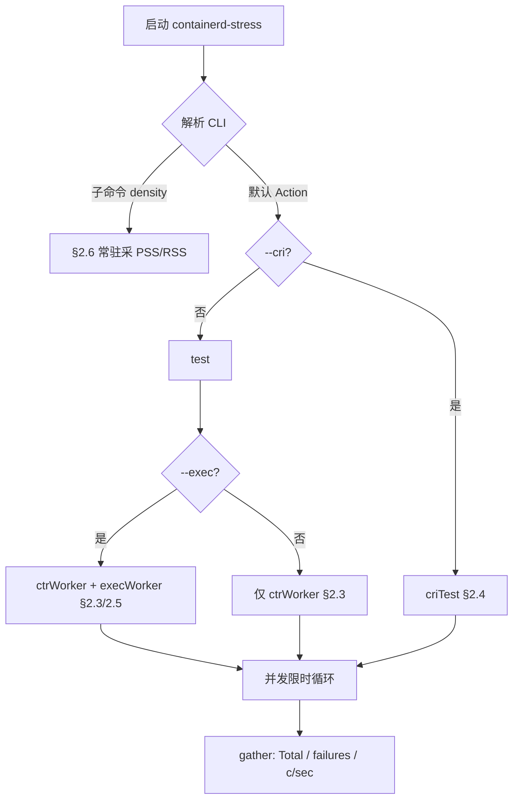
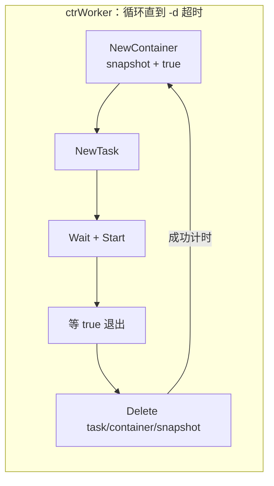
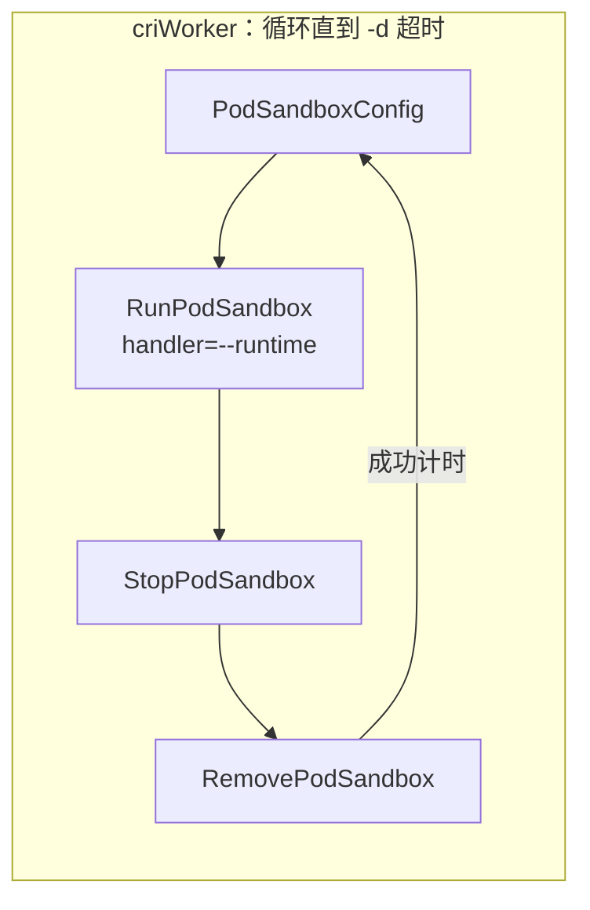
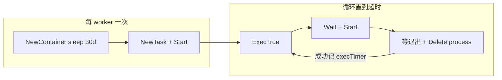
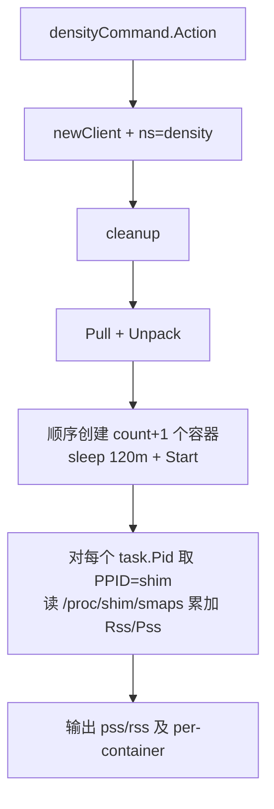
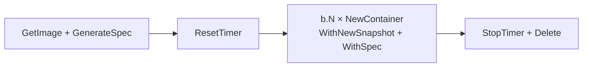
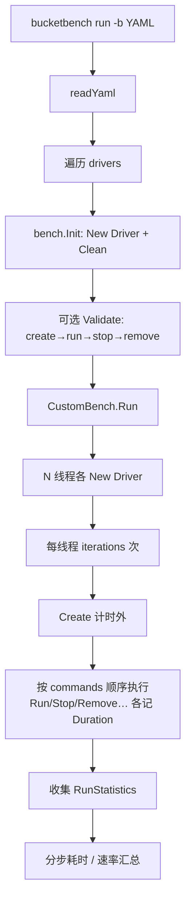

# containerd 代码中的现成压测工具

## 1. 概述

本文梳理 containerd 源码内**现成**的性能/压测相关能力，以及官方文档（`BUILDING.md`）明确推荐的外部工具。

| 类别 | 工具 | 定位 |
|------|------|------|
| 端到端加压 | `containerd-stress`（`cmd/containerd-stress`） | 对运行中 daemon 做并发生命周期加压 |
| 组件微基准 | `go test -bench` | Create/Start、snapshot、GC 等热点 |
| Snapshotter 环境 | `contrib/aws/snapshotter_bench_*` | 在 AWS 上跑 snapshotter benchsuite |
| 外部（文档推荐） | [bucketbench](https://github.com/estesp/bucketbench) | 跨引擎生命周期对比，偏逐步耗时统计 |

`containerd-stress` 详见 §2（编译见 §2.7）；Go 微基准详见 §3；外部工具 bucketbench 详见 §5。

---

## 2. `containerd-stress`

### 2.1 定位与模式总览

对**已运行**的 containerd，在 `-d` 限时、`-c` 并发下反复打生命周期负载，得到粗吞吐（containers/sec）与失败数。本身是**客户端**，不启动 daemon。

**不测什么：** 不是 `go test -bench` 微基准；默认路径不是长驻业务负载。

三者关系见代码：§2.2 的 Action（`--cri` ↔ `test` 互斥）；§2.3 `test()` 内起 worker（默认必有 `ctrWorker`，`--exec` 再并行附加）。

| 主入口 | 变体 | Worker | 单次负载（计时约等于） |
|--------|------|--------|------------------------|
| `test`（client） | 默认 | `ctrWorker` | NewContainer→Task→等 `true`→Delete |
| `test`（client） | + `--exec`（并行附加，不替换） | `ctrWorker` + `execWorker` | 另：长驻容器上循环 `Exec(true)` |
| `criTest`（CRI） | — | `criWorker` | RunPodSandbox→Stop→Remove |
| `density` 子命令 | — | （顺序创建） | 常驻后采 shim PSS/RSS |

**模式选择总览（仅此一张总图）：**



---

### 2.2 公共骨架

各模式共用同一套「清理 → 起 worker → 限时循环 → 汇总」。

**1）CLI 分支（默认 vs `--cri` 互斥；`--exec` 不在此层）** — `app.Action`：

```go
// cmd/containerd-stress/main.go
app.Action = func(cliContext *cli.Context) error {
    config := config{ /* address/duration/concurrent/cri/exec/runtime/... */ }
    // --cri 与 client 路径二选一；同一进程只会进入其中一个
    if config.CRI {
        return criTest(config) // → §2.4；此处无 --exec 逻辑
    }
    return test(config) // → §2.3；若带 --exec，在 test() 内并行附加
}
```

`density` 注册在 `app.Commands`，不走上述 Action。

**2）统一加压模型** — 编排与 worker 循环在 `test` / `criTest` 同构（差异只在 client 种类与单次负载函数）。

编排侧（摘自 `criTest`；`test` 在 Pull 之后同样如此）：

```go
// cmd/containerd-stress/main.go — criTest / test 共用形态
tctx, cancel := context.WithTimeout(ctx, c.Duration)
// ... SIGTERM/SIGINT → cancel ...

for i := 0; i < c.Concurrency; i++ {
    wg.Add(1)
    w := &criWorker{ /* 或 ctrWorker */ id: i, wg: &wg, client: client, ... }
    workers = append(workers, w)
}

r.start()
for _, w := range workers {
    go w.run(ctx, tctx)
}
wg.Wait()
r.end()
results := r.gather(workers)
```

Worker 循环（`ctrWorker.run` / `criWorker.run` 同构；单次负载分别为 `runContainer` / `runSandbox`）：

```go
// cmd/containerd-stress/worker.go（cri_worker.go 中 criWorker.run 相同结构）
func (w *ctrWorker) run(ctx, tctx context.Context) {
    defer w.wg.Done()
    for {
        select {
        case <-tctx.Done():
            return
        default:
        }
        w.count++
        id := w.getID()
        start := time.Now()
        if err := w.runContainer(ctx, id); err != nil {
            if err != context.DeadlineExceeded ||
                !strings.Contains(err.Error(), context.DeadlineExceeded.Error()) {
                w.failures++
            }
            continue // 失败不计耗时
        }
        ct.WithValues(w.commit).UpdateSince(start) // 仅成功计时
    }
}
```

**3）计时约定** — 两层时间：单次负载耗时（metrics）与整轮墙钟（吞吐分母）。

单次负载（`ctrWorker.run` / `criWorker.run` / `execWorker` 循环同构）：

```go
// cmd/containerd-stress/worker.go
start := time.Now()
if err := w.runContainer(ctx, id); err != nil { // 含函数内 defer Delete
    if err != context.DeadlineExceeded ||
        !strings.Contains(err.Error(), context.DeadlineExceeded.Error()) {
        w.failures++ // 非纯超时才记失败
    }
    continue // 失败：不 UpdateSince，避免失败过快抬高吞吐观感
}
ct.WithValues(w.commit).UpdateSince(start) // 仅成功：区间 = 整次负载（含 defer 清理）
```

整轮墙钟（编排侧；`gather` 用其算 c/sec）：

```go
// cmd/containerd-stress/main.go
func (r *run) start() { r.started = time.Now() }
func (r *run) end()   { r.ended = time.Now() }
func (r *run) seconds() float64 {
    return r.ended.Sub(r.started).Seconds()
}
```

**4）汇总**

```go
// cmd/containerd-stress/main.go
func (r *run) gather(workers []worker) *result {
    for _, w := range workers {
        r.total += w.getCount()
        r.failures += w.getFailures()
    }
    sec := r.seconds()
    return &result{
        Total:               r.total,
        Seconds:             sec,
        ContainersPerSecond: float64(r.total) / sec,
        SecondsPerContainer: sec / float64(r.total),
    }
}
```

---

### 2.3 默认路径（client API）

**目标：** 压 containerd **client API** 的短命容器全生命周期。

**单次迭代：**



**准备** — `func test(c config) error`（完整）：

```go
// cmd/containerd-stress/main.go
func test(c config) error {
	var (
		wg  sync.WaitGroup
		ctx = namespaces.WithNamespace(context.Background(), "stress")
	)

	client, err := c.newClient()
	if err != nil {
		return err
	}
	defer client.Close()
	if err := cleanup(ctx, client); err != nil {
		return err
	}

	log.L.Infof("pulling %s", c.Image)
	image, err := client.Pull(ctx, c.Image, containerd.WithPullUnpack, containerd.WithPullSnapshotter(c.Snapshotter))
	if err != nil {
		return err
	}
	v, err := client.Version(ctx)
	if err != nil {
		return err
	}

	tctx, cancel := context.WithTimeout(ctx, c.Duration)
	go func() {
		s := make(chan os.Signal, 1)
		signal.Notify(s, syscall.SIGTERM, syscall.SIGINT)
		<-s
		cancel()
	}()

	var (
		workers []worker
		r       = &run{}
	)
	log.L.Info("starting stress test run...")
	// 必有：N 个 ctrWorker（默认生命周期路径，始终启动）
	for i := 0; i < c.Concurrency; i++ {
		wg.Add(1)

		w := &ctrWorker{
			id:          i,
			wg:          &wg,
			image:       image,
			client:      client,
			commit:      v.Revision,
			snapshotter: c.Snapshotter,
		}
		workers = append(workers, w)
	}
	var exec *execWorker
	// 可选附加：再并行 +N 个 execWorker（不替换上面的 ctrWorker；详见 §2.5）
	if c.Exec {
		for i := c.Concurrency; i < c.Concurrency+c.Concurrency; i++ {
			wg.Add(1)
			exec = &execWorker{
				ctrWorker: ctrWorker{
					id:          i,
					wg:          &wg,
					image:       image,
					client:      client,
					commit:      v.Revision,
					snapshotter: c.Snapshotter,
				},
			}
			go exec.exec(ctx, tctx)
		}
	}

	// start the timer and run the worker
	r.start()
	for _, w := range workers {
		go w.run(ctx, tctx) // 默认路径始终跑
	}
	// wait and end the timer
	wg.Wait()
	r.end()

	results := r.gather(workers)
	if c.Exec {
		results.ExecTotal = exec.count
		results.ExecFailures = exec.failures
	}
	log.L.Infof("ending test run in %0.3f seconds", results.Seconds)

	log.L.WithField("failures", r.failures).Infof(
		"create/start/delete %d containers in %0.3f seconds (%0.3f c/sec) or (%0.3f sec/c)",
		results.Total,
		results.Seconds,
		results.ContainersPerSecond,
		results.SecondsPerContainer,
	)
	if c.JSON {
		if err := json.NewEncoder(os.Stdout).Encode(results); err != nil {
			return err
		}
	}
	return nil
}
```

**Worker 循环** — `func (w *ctrWorker) run(ctx, tctx context.Context)`：

```go
// cmd/containerd-stress/worker.go
func (w *ctrWorker) run(ctx, tctx context.Context) {
    defer w.wg.Done()
    for {
        select {
        case <-tctx.Done():
            return
        default:
        }
        w.count++
        id := w.getID()
        start := time.Now()
        if err := w.runContainer(ctx, id); err != nil {
            // 非纯超时 → failures++
            continue
        }
        ct.WithValues(w.commit).UpdateSince(start) // 仅成功计时
    }
}
```

**单次负载** — `func (w *ctrWorker) runContainer(ctx context.Context, id string) (err error)`：

```go
// cmd/containerd-stress/worker.go
func (w *ctrWorker) runContainer(ctx context.Context, id string) (err error) {
    c, err := w.client.NewContainer(ctx, id,
        containerd.WithSnapshotter(w.snapshotter),
        containerd.WithNewSnapshot(id, w.image),
        containerd.WithNewSpec(
            oci.WithImageConfig(w.image),
            oci.WithUsername("games"),
            oci.WithProcessArgs("true"), // 写死：快速退出
        ),
    )
    defer c.Delete(ctx, containerd.WithSnapshotCleanup)
    task, err := c.NewTask(ctx, cio.NullIO)
    defer task.Delete(ctx, containerd.WithProcessKill)
    statusC, err := task.Wait(ctx)
    if err := task.Start(ctx); err != nil {
        return err
    }
    status := <-statusC
    _, _, err = status.Result()
    return err
}
```

**计时边界：** 整次 `runContainer`（含 defer Delete）。  
**参数：** `-a/-c/-d/-i/--runtime/--snapshotter` 生效。进程/`games` 写死 → **pause 镜像不能直接作 `-i`**（无 `true`、无 `games` 用户）。  
**与其它模式差：** 走 client 而非 CRI；会 `Pull(-i)`。

---

### 2.4 `--cri` 路径

**目标：** 压 **CRI** `RunPodSandbox` 全链路（含 Stop/Remove）。

**单次迭代：**



**入口** — `func criTest(c config) error`：

```go
// cmd/containerd-stress/main.go
func criTest(c config) error {
    client, err := remote.NewRuntimeService(c.Address, timeout) // CRI，非 containerd.New
    if err := criCleanup(ctx, client); err != nil {
        return err
    }
    tctx, cancel := context.WithTimeout(ctx, c.Duration)
    for i := 0; i < c.Concurrency; i++ {
        w := &criWorker{
            runtimeHandler: c.Runtime, // --runtime = CRI handler 名
            snapshotter:    c.Snapshotter, // 赋值但 runSandbox 未用
            // ...
        }
        go w.run(ctx, tctx)
    }
    // wait + gather
    return nil
}
```

**清理** — `func criCleanup(ctx context.Context, client *remote.RuntimeService) error`：按 label `pod.namespace=stress` List → Stop → Remove。

**Worker** — `func (w *criWorker) run(ctx, tctx context.Context)`：与默认相同的限时循环，调用 `runSandbox`，成功才 `UpdateSince`。

**单次负载** — `func (w *criWorker) runSandbox(tctx, ctx context.Context, id string) (err error)`（完整）：

```go
// cmd/containerd-stress/cri_worker.go
func (w *criWorker) runSandbox(tctx, ctx context.Context, id string) (err error) {

	sbConfig := &runtime.PodSandboxConfig{
		Metadata: &runtime.PodSandboxMetadata{
			Name: id,
			// Using random id as uuid is good enough for local
			// integration test.
			Uid:       util.GenerateID(),
			Namespace: "stress",
		},
		Labels: map[string]string{podNamespaceLabel: stressNs},
		Linux:  &runtime.LinuxPodSandboxConfig{},
	}

	sb, err := w.client.RunPodSandbox(sbConfig, w.runtimeHandler)
	if err != nil {
		w.failures++
		return err
	}
	defer func() {
		w.client.StopPodSandbox(sb)
		w.client.RemovePodSandbox(sb)
	}()

	// verify it is running ?

	ticker := time.NewTicker(250 * time.Millisecond)
	go func() {
		for {
			select {
			case <-tctx.Done():
				ticker.Stop()
				return
			case <-ticker.C:
				// do stuff
				status, err := w.client.PodSandboxStatus(sb)
				if err != nil && status.GetState() == runtime.PodSandboxState_SANDBOX_READY {
					ticker.Stop()
					return
				}
			}
		}
	}()

	return nil
}
```

要点：`RunPodSandbox` 成功后立刻 `return nil`，`defer` 随即 `Stop`/`Remove`；后台 `PodSandboxStatus` 轮询**不阻塞**返回，且条件为 `err != nil && READY`（几乎无效）。

**计时边界：** 整次 `runSandbox` ≈ RunPodSandbox + Stop + Remove。  
**参数：** `-a/-c/-d/--runtime`（handler 名）生效；**`-i`、`--snapshotter` 不生效**。镜像 = CRI 配置的 sandbox（如 pause）。  
**与默认差：** API 是 CRI；镜像不来自 `-i`；`--runtime` 是 handler 名不是 `io.containerd.runc.v2`。

```bash
containerd-stress --cri -a /run/containerd/containerd.sock --runtime runc -c 4 -d 5m
```

---

### 2.5 `--exec` 路径

**关系：** 不是第三条主路径。入口仍是 §2.3 的 `test()`；本节展开其中的 `if c.Exec { ... go exec.exec }`——在已有 N 个 `ctrWorker` 之外再并行 +N 个 `execWorker`。与 `--cri` 互斥（`criTest` 内无此分支）。

**目标：** 在已运行 task 上压 **`Exec`**（仅非 CRI / client API）。

**用法示例：**

```bash
containerd-stress --exec -a /run/containerd/containerd.sock -c 4 -d 5m -i docker.io/library/alpine:latest
```

`-c N` → N 个 `ctrWorker`（默认生命周期）+ N 个 `execWorker`。镜像需有 `sleep`/`true` 且含用户 `games`（默认 alpine 一般可用；pause 不行）。

**单次迭代：**



**编排侧（`test()` 内附加 exec worker）** — 完整片段：

```go
// cmd/containerd-stress/main.go — test() 中 if c.Exec 分支
var exec *execWorker
if c.Exec {
	for i := c.Concurrency; i < c.Concurrency+c.Concurrency; i++ {
		wg.Add(1)
		exec = &execWorker{
			ctrWorker: ctrWorker{
				id:          i,
				wg:          &wg,
				image:       image,
				client:      client,
				commit:      v.Revision,
				snapshotter: c.Snapshotter,
			},
		}
		go exec.exec(ctx, tctx) // 立刻启动；不进入 workers 切片
	}
}

r.start()
for _, w := range workers {
	go w.run(ctx, tctx) // 默认 ctrWorker 仍跑
}
wg.Wait()
r.end()

results := r.gather(workers) // 只汇总 ctrWorker
if c.Exec {
	results.ExecTotal = exec.count       // 注意：循环复用 exec 变量，只保留最后一个 worker
	results.ExecFailures = exec.failures
}
```

类型嵌入 `ctrWorker`（复用 `count`/`failures`/`getID` 等）：

```go
// cmd/containerd-stress/exec_worker.go
type execWorker struct {
	ctrWorker
}
```

**Worker 入口** — `func (w *execWorker) exec(ctx, tctx context.Context)`（完整）：

```go
// cmd/containerd-stress/exec_worker.go
func (w *execWorker) exec(ctx, tctx context.Context) {
	defer func() {
		w.wg.Done()
		log.L.Infof("worker %d finished", w.id)
	}()
	id := fmt.Sprintf("exec-container-%d", w.id)
	c, err := w.client.NewContainer(ctx, id,
		containerd.WithNewSnapshot(id, w.image),
		containerd.WithSnapshotter(w.snapshotter),
		containerd.WithNewSpec(oci.WithImageConfig(w.image), oci.WithUsername("games"), oci.WithProcessArgs("sleep", "30d")),
	)
	if err != nil {
		log.L.WithError(err).Error("create exec container")
		return
	}
	defer c.Delete(ctx, containerd.WithSnapshotCleanup)

	task, err := c.NewTask(ctx, cio.NullIO)
	if err != nil {
		log.L.WithError(err).Error("create exec container's task")
		return
	}
	defer task.Delete(ctx, containerd.WithProcessKill)

	statusC, err := task.Wait(ctx)
	if err != nil {
		log.L.WithError(err).Error("wait exec container's task")
		return
	}

	if err := task.Start(ctx); err != nil {
		log.L.WithError(err).Error("exec container start failure")
		return
	}

	spec, err := c.Spec(ctx)
	if err != nil {
		log.L.WithError(err).Error("failed to get spec")
		return
	}

	pspec := spec.Process
	pspec.Args = []string{"true"}

	for {
		select {
		case <-tctx.Done():
			if err := task.Kill(ctx, syscall.SIGKILL); err != nil {
				log.L.WithError(err).Error("kill exec container's task")
			}
			<-statusC
			return
		default:
		}

		w.count++
		id := w.getID()
		log.L.Debugf("starting exec %s", id)
		start := time.Now()

		if err := w.runExec(ctx, task, id, pspec); err != nil {
			if err != context.DeadlineExceeded ||
				!strings.Contains(err.Error(), context.DeadlineExceeded.Error()) {
				w.failures++
				log.L.WithError(err).Errorf("running exec %s", id)
				errCounter.WithValues(err.Error()).Inc()
			}
			continue // 失败不计时
		}
		execTimer.WithValues(w.commit).UpdateSince(start) // 仅成功：单次 runExec
	}
}
```

**单次 Exec** — `func (w *execWorker) runExec(...)`（完整）：

```go
// cmd/containerd-stress/exec_worker.go
func (w *execWorker) runExec(ctx context.Context, task containerd.Task, id string, spec *specs.Process) (err error) {
	process, err := task.Exec(ctx, id, spec, cio.NullIO)
	if err != nil {
		return err
	}
	defer func() {
		if _, derr := process.Delete(ctx, containerd.WithProcessKill); err == nil {
			err = derr
		}
	}()
	statusC, err := process.Wait(ctx)
	if err != nil {
		return err
	}
	if err := process.Start(ctx); err != nil {
		return err
	}
	status := <-statusC
	_, _, err = status.Result()
	if err != nil {
		if err == context.DeadlineExceeded || err == context.Canceled {
			return nil
		}
		w.failures++
		errCounter.WithValues(err.Error()).Inc()
	}
	return nil
}
```

**计时边界：** 单次 `runExec`（Exec→Wait→Start→等退出→Delete）；成功才 `execTimer.UpdateSince`。结果额外 `ExecTotal` / `ExecFailures`（实现上只取**最后一个** `execWorker`，见上）。  
**与默认差：** 测二次进程创建，不是反复建/删容器；默认 `ctrWorker` 路径仍并行运行。

---

### 2.6 `density` 子命令

**关系：** 注册在 `app.Commands`（`main.go`），**不走**默认 Action / `--cri` / `--exec`。入口是 `densityCommand.Action`（`density.go`）。走 **client API**（`config.newClient()` → `-a` sock），namespace 固定为 `density`。

**目标：** 测**同时存活**时 shim 的内存密度（PSS/RSS），不是吞吐循环；无 `-d` 限时 worker。

**用法：**

```bash
containerd-stress density --count 100 \
  -a /run/containerd/containerd.sock \
  -i docker.io/library/alpine:latest \
  --snapshotter overlayfs
```

`--count` 默认 10；镜像需有 `sleep` 且含用户 `games`。输出**始终 JSON**（不依赖 `-j`）。

**流程：**



**命令定义与入口：**

```go
// cmd/containerd-stress/density.go
var densityCommand = &cli.Command{
	Name:  "density",
	Usage: "Stress tests density of containers running on a system",
	Flags: []cli.Flag{
		&cli.IntFlag{
			Name:  "count",
			Usage: "Number of containers to run",
			Value: 10,
		},
	},
	Action: func(cliContext *cli.Context) error {
		// ... 见下
	},
}
```

**准备与顺序建容器** — `Action` 主体（完整关键路径）：

```go
// cmd/containerd-stress/density.go — densityCommand.Action
var (
	pids  []uint32
	count = cliContext.Int("count")
)
if count < 1 {
	return errors.New("count cannot be less than one")
}

config := config{
	Address:     cliContext.String("address"),
	// Duration/Concurrency/Exec 会读全局 flag，但本 Action 未使用
	Image:       cliContext.String("image"),
	Snapshotter: cliContext.String("snapshotter"),
	// ...
}
client, err := config.newClient()
defer client.Close()
ctx := namespaces.WithNamespace(context.Background(), "density")
if err := cleanup(ctx, client); err != nil {
	return err
}
image, err := client.Pull(ctx, config.Image, containerd.WithPullUnpack, containerd.WithPullSnapshotter(config.Snapshotter))

s := make(chan os.Signal, 1)
signal.Notify(s, syscall.SIGTERM, syscall.SIGINT)

loop:
for i := 0; i < count+1; i++ { // 实际创建 count+1 个
	select {
	case <-s:
		break loop
	default:
		id := fmt.Sprintf("density-%d", i)
		c, err := client.NewContainer(ctx, id,
			containerd.WithSnapshotter(config.Snapshotter),
			containerd.WithNewSnapshot(id, image),
			containerd.WithNewSpec(
				oci.WithImageConfig(image),
				oci.WithProcessArgs("sleep", "120m"),
				oci.WithUsername("games"),
			),
		)
		defer c.Delete(ctx, containerd.WithSnapshotCleanup)

		t, err := c.NewTask(ctx, cio.NullIO)
		defer t.Delete(ctx, containerd.WithProcessKill)
		if err := t.Start(ctx); err != nil {
			return err
		}
		pids = append(pids, t.Pid()) // 容器 init 的 PID
	}
}
```

要点：循环上界是 `count+1`（`--count 10` 会起 **11** 个）；中途 SIGINT/SIGTERM 可提前跳出，已建容器靠 `defer` 清理。

**采内存并输出：**

```go
// cmd/containerd-stress/density.go — Action 续
var results struct {
	PSS             int `json:"pss"`
	RSS             int `json:"rss"`
	PSSPerContainer int `json:"pssPerContainer"`
	RSSPerContainer int `json:"rssPerContainer"`
}

for _, pid := range pids {
	shimPid, err := getppid(int(pid)) // /proc/<taskPid>/stat → PPID（shim）
	smaps, err := getMaps(shimPid)    // 读 /proc/<shimPid>/smaps，累加各映射的 Rss:/Pss:
	results.RSS += smaps["Rss:"]
	results.PSS += smaps["Pss:"]
}
results.PSSPerContainer = results.PSS / count // 分母是 --count，不是 len(pids)
results.RSSPerContainer = results.RSS / count

return json.NewEncoder(os.Stdout).Encode(results)
```

**辅助函数：**

```go
// cmd/containerd-stress/density.go
func getMaps(pid int) (map[string]int, error) {
	f, err := os.Open(fmt.Sprintf("/proc/%d/smaps", pid))
	// 逐行 Fields：name=fields[0]，值=fields[1]（kB），同名键累加
	// ...
}

func getppid(pid int) (int, error) {
	bytes, err := os.ReadFile(filepath.Join("/proc", strconv.Itoa(pid), "stat"))
	s, err := parseStat(string(bytes)) // 解析 PPID 字段
	return int(s.PPID), nil
}
```

假设 task 父进程即 shim：对每个容器 init PID 取 PPID，再对 **shim** 的 smaps 求和。若多个容器共享同一 shim，同一 shim 的 RSS/PSS 会被**重复累加**（实现未按 shimPid 去重）。

**输出示例字段：** `pss` / `rss`（总和，单位与 smaps 一致，一般为 kB）、`pssPerContainer` / `rssPerContainer`（总和 / `--count`）。

**与默认 / `--cri` / `--exec` 差：** 不限时循环、不报 c/sec；顺序建常驻 `sleep 120m`；只采 shim 内存 JSON。`-c`/`-d`/`--exec`/`--cri` 对本子命令无加压语义（全局 flag 虽被读入 `config`，Action 未用）。

---

### 2.7 编译方法

源码：`cmd/containerd-stress/`。`Makefile` 将 `containerd-stress` 列入 `COMMANDS`，规则 `bin/%: cmd/%` 产出 `bin/containerd-stress`。

```bash
make bin/containerd-stress   # 推荐
make binaries                # 同时编 ctr / containerd / containerd-stress
make install                 # 安装到 $(DESTDIR)$(BINDIR)，默认常为 /usr/local/bin
go build -o bin/containerd-stress ./cmd/containerd-stress  # 不经 Makefile
```

依赖：可用 Go 工具链（见 `BUILDING.md`）。运行前需已有可连接的 containerd/CRI daemon。

---

### 2.8 参数说明

#### `--runtime`

| 场景 | 含义 | 典型值 |
|------|------|--------|
| 默认 / `--exec` / `density` | OCI runtime type（`WithDefaultRuntime`） | `io.containerd.runc.v2`（默认）；Windows：`io.containerd.runhcs.v1` |
| `--cri` | CRI **RuntimeHandler** 名（`runtimes.<name>` 的 key） | `runc`、`kata` 等；勿与 `runtime_type` 字段混淆 |

#### `--snapshotter`

默认 `overlayfs`。作为插件 ID，用于 client 路径的 `Pull` / `NewContainer`。

| ID | 说明 |
|----|------|
| `overlayfs` | 默认 |
| `native` | 目录拷贝 |
| `devmapper` | thin-pool |
| `btrfs` / `erofs` / `blockfile` | 对应实现 |

另有 `windows` / `lcow` 等。须已在 daemon 启用且环境就绪。**`--cri` 下本 flag 不参与 `runSandbox`。**

#### 参数速查（是否生效）

| 参数 | 默认 | density | `--exec` | `--cri` | 含义 |
|------|------|---------|----------|---------|------|
| `-c` | ✓ | — | ✓ | ✓ | 并发 worker 数（默认 1） |
| `-d` | ✓ | — | ✓ | ✓ | 时长（默认 1m） |
| `-a` | ✓ | ✓ | ✓ | ✓ | socket |
| `-i` | ✓ | ✓ | ✓ | ✗ | 镜像（默认 alpine） |
| `--runtime` | type | type | type | **handler** | 见上表 |
| `--snapshotter` | ✓ | ✓ | ✓ | ✗ | 见上表 |
| `--cri` | | | | ✓ | 走 CRI |
| `--exec` | | | ✓ | ✗ | 额外 exec worker |
| `-j` / `-m` | ✓ | ✓ | ✓ | ✓ | JSON / metrics 地址 |
| `density --count` | | ✓ | | | 同时存活容器数 |

```bash
containerd-stress -c 5 -d 120m
containerd-stress --cri --runtime runc -c 4 -d 30m
containerd-stress --snapshotter native -c 2 -d 10m
containerd-stress density --count 100
```

---

## 3. Go 微基准（`go test -bench`）

组件级 / 集成级 `testing.B` 基准，产出 ns/op、MB/s 等，用于热点优化与回归对比，**不是**长时间 daemon 加压。按包跑法见 §3.1；机制细节见 §3.2–3.8。

| 场景 | 基准 | 位置 | 说明 |
|------|------|------|------|
| 空容器 + 根快照创建 | `BenchmarkContainerCreate` | `integration/client` | 计时 NewContainer + snapshot，不含 Task/Start |
| 已有容器的 task 启动 | `BenchmarkContainerStart` | `integration/client` | 计时外先 Create，计时内 NewTask→Start |
| Snapshotter 多层增删改 | `BenchmarkNative` / `Overlay` / `DeviceMapper` | `core/snapshots/benchsuite` | 16 层 Prepare/写/Commit，对比各 snapshotter |
| Snapshot 元数据（BoltDB） | `BenchmarkSuite`（Stat/Create/Remove/Commit/…） | `core/snapshots/storage` | 只压 MetaStore，不走真实 FS 层 |
| Content store 写入 | `BenchmarkIngests` | `plugins/content/local` | 1KiB–1MiB blob 写入吞吐 |
| 镜像层解压 | `BenchmarkDecompression` | `pkg/archive/compression` | gzip/zstd（及可选 igzip/unpigz）在 32–256MiB 上的吞吐 |
| 元数据 GC 全量扫描 | `BenchmarkGarbageCollect` | `core/metadata` | 随对象规模（10–10000 Sets）的 GC 耗时 |
| GC 图算法 | `BenchmarkTricolor` | `pkg/gc` | 三色标记本身，不经 metadata |
| Unpack chainID 计算 | `BenchmarkUnpackWithChainID(s)` | `core/unpack` | 旧逐层 ChainID vs 新一次 ChainIDs |
| idmapped userns FD | `BenchmarkBatchRunGetUsernsFD_Concurrent{1,10}` | `core/mount` | 并发获取 userns FD |
| Overlay 文件系统探测 | `BenchmarkOverlaySupportedOn*` | `overlayutils` | 临时 mkfs（ext4/XFS/FAT）上探测是否支持 overlay |

### 3.1 用途与跑法

以下命令均在 containerd 源码根目录执行。`-run '^$'` / `-run Benchmark` 用于跳过普通单元测试；`-benchmem` 输出 allocs/op、B/op。基准分散在各子包，需按包跑下面的 `go test`。

**写法约定：** 包路径放在 `go test` 之后、自定义 flag 之前（或对布尔 flag 写 `-test.root=true`）。若写成 `-test.root ./integration/client/`，`go test` 可能把包路径当成 flag 值，变成只测根目录（`no Go files`）。已是 root 时可去掉 `sudo`。

#### 客户端 Create / Start（§3.2）

默认 `TestMain` 会起临时 daemon，需 root（`-test.root`）：

```bash
sudo go test ./integration/client/ -bench='BenchmarkContainer(Create|Start)' -benchmem -run '^$' -test.root

# 只跑其中一个
sudo go test ./integration/client/ -bench=BenchmarkContainerCreate -benchmem -run '^$' -test.root
sudo go test ./integration/client/ -bench=BenchmarkContainerStart  -benchmem -run '^$' -test.root
```

连已有 daemon（不自启）：

```bash
sudo go test ./integration/client/ -bench=BenchmarkContainerCreate -benchmem -run '^$' -test.root \
  -no-daemon -address /run/containerd/containerd.sock
```

镜像默认 BusyBox，需能 `GetImage`（自启路径会先 Pull）。

**已知问题：** 基准在 `NewContainer` 前用 `GenerateSpec(..., WithImageConfig, withTrue())`，容器尚无 snapshot/`Root.Path` 时会报 `rootfs absolute path is required` 并 FAIL（正常集成测试走 `WithNewSpec`，在建 snapshot 之后才解析镜像用户）。当前上游基准本身如此，不一定是环境问题。

#### Snapshotter 套件（§3.3）

必须传 root 目录，否则 `Skip`；overlay/native 实际要 mount，建议 root：

```bash
sudo go test ./core/snapshots/benchsuite/ -bench=BenchmarkOverlay -benchmem -run '^$' \
  -overlay.rootPath=/tmp/ovl-bench

sudo go test ./core/snapshots/benchsuite/ -bench=BenchmarkNative -benchmem -run '^$' \
  -native.rootPath=/tmp/native-bench

# device mapper（需预先准备 thin-pool；未传 flag 会 Skip）
sudo go test ./core/snapshots/benchsuite/ -bench=BenchmarkDeviceMapper -benchmem -run '^$' \
  -dm.thinPoolDev=<pool名> -dm.rootPath=/tmp/dm-bench
```

#### MetaStore / BoltDB（§3.4）

一般不需 root：

```bash
go test ./core/snapshots/storage/ -bench=BenchmarkSuite -benchmem -run '^$'

# 只跑某个子项，例如 CreateActive
go test ./core/snapshots/storage/ -bench='BenchmarkSuite/BoltDBBench/CreateActive' -benchmem -run '^$'
```

#### Content ingest（§3.5）

```bash
go test ./plugins/content/local/ -bench=BenchmarkIngests -benchmem -run '^$'

# 指定大小子基准（名称是字节数）
go test ./plugins/content/local/ -bench='BenchmarkIngests/1024' -benchmem -run '^$'      # 1KiB
go test ./plugins/content/local/ -bench='BenchmarkIngests/1048576' -benchmem -run '^$'   # 1MiB
```

#### 解压（§3.6）

源码写死样本 URL `https://git.io/fADcl`（git.io 短链，可能超时或不可达）。原始数据在 [gist](https://gist.github.com/mxpv/d9c87748d729afc915adecfecce101b0) 的 `test.json`；短链不通时可临时改 `benchmarkTestDataURL` 指向可下载地址再跑。

```bash
go test ./pkg/archive/compression/ -bench=BenchmarkDecompression -benchmem -run '^$'

# 例如只跑 64MiB 的 zstd
go test ./pkg/archive/compression/ -bench='BenchmarkDecompression/size=64MiB/zstd' -benchmem -run '^$'
```

#### 元数据 GC（§3.7）

```bash
go test ./core/metadata/ -bench=BenchmarkGarbageCollect -benchmem -run '^$'

go test ./core/metadata/ -bench='BenchmarkGarbageCollect/100-Sets' -benchmem -run '^$'
```

#### 其它（§3.8）

```bash
go test ./pkg/gc/ -bench=BenchmarkTricolor -benchmem -run '^$'

go test ./core/unpack/ -bench='BenchmarkUnpackWithChainID'  -benchmem -run '^$'
go test ./core/unpack/ -bench='BenchmarkUnpackWithChainIDs' -benchmem -run '^$'

# userns FD（Linux；一般不需 -test.root）
go test ./core/mount/ -bench='BenchmarkBatchRunGetUsernsFD' -benchmem -run '^$'

# overlay 探测（需 root + mkfs.ext4/xfs/fat + loop）
sudo go test ./plugins/snapshots/overlay/overlayutils/ -bench='BenchmarkOverlay' -benchmem -run '^$' -test.root
```

#### 常用附加参数

| 参数 | 作用 |
|------|------|
| `-benchtime=3s` / `-benchtime=100x` | 控制每基准时长或次数 |
| `-count=5` | 重复跑，便于对比 |
| `-cpu=1,4` | 多 GOMAXPROCS |
| `-benchmem` | 输出 allocs/op、B/op |

对比两次结果可用 `benchstat`：

```bash
go test ./core/metadata/ -bench=BenchmarkGarbageCollect -count=5 -run '^$' | tee old.txt
# …改代码后再跑…
benchstat old.txt new.txt
```

### 3.2 客户端集成：`integration/client/benchmark_test.go`

**关系：** 集成测试包；`TestMain` 默认可自启临时 containerd（或 `-no-daemon` 连已有）。连 sock 用 `newClient`，镜像为 BusyBox（`testImage`）。

**单次 Create 计时段：**



**`BenchmarkContainerCreate`（完整）：**

```go
// integration/client/benchmark_test.go
func BenchmarkContainerCreate(b *testing.B) {
	client, err := newClient(b, address)
	defer client.Close()
	ctx, cancel := testContext(b)
	defer cancel()

	image, err := client.GetImage(ctx, testImage)
	spec, err := oci.GenerateSpec(ctx, client, &containers.Container{ID: b.Name()},
		oci.WithImageConfig(image), withTrue()) // withTrue = ProcessArgs("true")
	// 注意：此处容器尚无 SnapshotKey/Root.Path，WithImageConfig 解析用户可能报
	// "rootfs absolute path is required"（见 §3.1 已知问题）

	var containers []Container
	defer func() {
		for _, c := range containers {
			c.Delete(ctx, WithSnapshotCleanup)
		}
	}()

	b.ResetTimer()
	for i := 0; i < b.N; i++ {
		id := fmt.Sprintf("%s-%d", b.Name(), i)
		container, err := client.NewContainer(ctx, id,
			WithNewSnapshot(id, image), WithSpec(spec))
		containers = append(containers, container)
	}
	b.StopTimer()
}
```

计时段：**元数据创建 + 新 snapshot**，不含 `NewTask`/`Start`。

**`BenchmarkContainerStart`（完整）：**

```go
// integration/client/benchmark_test.go
func BenchmarkContainerStart(b *testing.B) {
	// 同样 newClient / GetImage / GenerateSpec …
	var containers []Container
	defer /* Delete each WithSnapshotCleanup */

	for i := 0; i < b.N; i++ { // 计时外：先建齐 b.N 个容器+snapshot
		id := fmt.Sprintf("%s-%d", b.Name(), i)
		container, err := client.NewContainer(ctx, id, WithNewSnapshot(id, image), WithSpec(spec))
		containers = append(containers, container)
	}

	b.ResetTimer()
	for _, c := range containers {
		task, err := c.NewTask(ctx, empty())
		defer task.Delete(ctx)
		if err := task.Start(ctx); err != nil {
			b.Error(err)
			return
		}
	}
	b.StopTimer()
}
```

计时段：**仅 NewTask→Start**。与 Create 刻意拆开，避免创建成本混进启动数字。

---

### 3.3 Snapshotter 套件：`core/snapshots/benchsuite`

**关系：** 三个入口各自 `NewSnapshotter` 后调用同一套 `benchmarkSnapshotter`；flag 未传则 `Skip`。不经 containerd daemon，直接压 snapshotter 插件。

**入口形态（以 Overlay 为例）：**

```go
// core/snapshots/benchsuite/benchmark_test.go
func BenchmarkOverlay(b *testing.B) {
	if overlayRootPath == "" {
		b.Skip("overlay root dir must be provided")
	}
	snapshotter, err := overlay.NewSnapshotter(overlayRootPath)
	defer func() {
		snapshotter.Close()
		os.RemoveAll(overlayRootPath)
	}()
	benchmarkSnapshotter(b, snapshotter)
}
```

`BenchmarkNative` / `BenchmarkDeviceMapper` 同构；后者还需 `-dm.thinPoolDev`，结束时 `ResetPool`。

**核心循环 `benchmarkSnapshotter`（完整关键路径）：**

```go
// core/snapshots/benchsuite/benchmark_test.go
func benchmarkSnapshotter(b *testing.B, snapshotter snapshots.Snapshotter) {
	const layerCount = 16
	const fileSizeBytes = int64(1 << 20) // 1MiB

	// 预构造 16 层 Applier：按层索引 %3/%2 交替「全新建 / 局部改 4 字节 / 删除」
	layers := make([]fstest.Applier, 0, layerCount)
	for i := 1; i <= layerCount; i++ {
		layers = append(layers, fstest.Apply(makeApplier(i, fileSizeBytes)...))
	}

	b.Run("run", func(b *testing.B) {
		var parent, current string
		b.SetBytes(int64(total) * fileSizeBytes)
		for i := 0; i < b.N; i++ {
			for l := range layerCount {
				current = fmt.Sprintf("prepare-layer-%d", layerIndex.Add(1))
				mounts, err := snapshotter.Prepare(ctx, current, parent) // → prepareDuration
				err = mount.WithTempMount(ctx, mounts, layers[l].Apply)  // → writeDuration
				parent = fmt.Sprintf("committed-%d", layerIndex.Add(1))
				err = snapshotter.Commit(ctx, parent, current)           // → commitDuration
			}
		}
	})
	// 额外打印 BenchmarkXxx/prepare|write|commit 分段结果
}
```

`updateFile` 只改文件中段 **4 字节**，刻意拉开 overlay（全文件 copy-up）与 block-based（devmapper）差异。

---

### 3.4 MetaStore：`core/snapshots/storage`

**入口：**

```go
// core/snapshots/storage/bolt_test.go
func BenchmarkSuite(b *testing.B) {
	Benchmarks(b, "BoltDBBench", func(root string) (*MetaStore, error) {
		return NewMetaStore(filepath.Join(root, "metadata.db"))
	})
}
```

**套件注册与事务包装：**

```go
// core/snapshots/storage/metastore_bench_test.go
func Benchmarks(b *testing.B, name string, metaFn metaFactory) {
	b.Run("StatActive", makeBench(b, name, metaFn, statActiveBenchmark))
	b.Run("StatCommitted", makeBench(b, name, metaFn, statCommittedBenchmark))
	b.Run("CreateActive", makeBench(b, name, metaFn, createActiveBenchmark))
	b.Run("Remove", makeBench(b, name, metaFn, removeBenchmark))
	b.Run("Commit", makeBench(b, name, metaFn, commitBenchmark))
	b.Run("GetActive", makeBench(b, name, metaFn, getActiveBenchmark))
	b.Run("WriteTransaction", openCloseWritable(b, name, metaFn))
	b.Run("ReadTransaction", openCloseReadonly(b, name, metaFn))
}

func makeBench(..., fn) func(b *testing.B) {
	return func(b *testing.B) {
		ms, _ := metaFn(b.TempDir())
		ctx, t, _ := ms.TransactionContext(ctx, true) // 可写事务包住整个子基准
		defer t.Commit()
		b.ResetTimer()
		fn(ctx, b, ms)
	}
}
```

**各子项机制（源码要点）：**

```go
// StatActive：预置 active，循环 GetInfo
func statActiveBenchmark(ctx context.Context, b *testing.B, ms *MetaStore) {
	createActiveFromBase(ctx, ms, "active", "base")
	b.ResetTimer()
	for i := 0; i < b.N; i++ {
		GetInfo(ctx, "active")
	}
}

// CreateActive：计时 CreateSnapshot；StopTimer 后 Remove 再 StartTimer
func createActiveBenchmark(...) {
	for i := 0; i < b.N; i++ {
		CreateSnapshot(ctx, snapshots.KindActive, "active", "")
		b.StopTimer()
		Remove(ctx, "active")
		b.StartTimer()
	}
}

// Remove：StopTimer 建 active，StartTimer 后 Remove
// Commit：建 active → 计时 CommitActive → 计时外 Remove committed
// GetActive：先叠 10 层 parent 链，再循环 GetSnapshot("active")
// WriteTransaction / ReadTransaction：循环 TransactionContext(true)+Commit / (false)+Rollback
```

测的是 **BoltDB MetaStore**，不经真实 FS snapshotter。

---

### 3.5 Content ingest：`plugins/content/local`

**`BenchmarkIngests`（完整）：**

```go
// plugins/content/local/store_test.go
func BenchmarkIngests(b *testing.B) {
	ctx, _, cs, cleanup := contentStoreEnv(b)
	defer cleanup()

	for _, size := range []int64{1 << 10, 4 << 10, 512 << 10, 1 << 20} {
		b.Run(fmt.Sprint(size), func(b *testing.B) {
			b.StopTimer()
			blobs := generateBlobs(b, int64(b.N), size) // 随机内容；同 blob 挂 SHA256+SHA512 两个 key
			b.SetBytes(/* 所有 blob 总字节 */)
			b.StartTimer()
			for dgst, p := range blobs {
				checkWrite(ctx, b, cs, dgst, p) // content.WriteBlob(...)
			}
		})
	}
}

func checkWrite(ctx context.Context, t checker, cs content.Store, dgst digest.Digest, p []byte) digest.Digest {
	content.WriteBlob(ctx, cs, dgst.String(), bytes.NewReader(p),
		ocispec.Descriptor{Size: int64(len(p)), Digest: dgst})
	return dgst
}
```

注释写明约数毫秒级插入开销（syscall/文件协调）。测 **local content store 写入吞吐**。

---

### 3.6 解压：`pkg/archive/compression`

**`BenchmarkDecompression`（完整）：**

```go
// pkg/archive/compression/benchmark_test.go
const benchmarkTestDataURL = "https://git.io/fADcl"

func BenchmarkDecompression(b *testing.B) {
	resp, err := http.Get(benchmarkTestDataURL)
	data, err := io.ReadAll(resp.Body)

	for _, sizeInMiB := range []int{32, 64, 128, 256} {
		// 把样本扩展/截到目标大小，预先压成 gzip / zstd
		gz := testCompress(b, data, Gzip)
		zstd := testCompress(b, data, Zstd)

		b.Run(fmt.Sprintf("size=%dMiB", sizeInMiB), func(b *testing.B) {
			b.Run("zstd", func(b *testing.B) { testDecompress(b, zstd) })

			gzipPath = ""
			b.Run("gzipPureGo", func(b *testing.B) { testDecompress(b, gz) })

			if p, err := exec.LookPath("igzip"); err == nil {
				gzipPath = p
				b.Run("igzip", func(b *testing.B) { testDecompress(b, gz) })
			}
			if p, err := exec.LookPath("unpigz"); err == nil {
				gzipPath = p
				b.Run("unpigz", func(b *testing.B) { testDecompress(b, gz) })
			}
		})
	}
}
```

对比镜像层解压路径上不同实现的吞吐；短链不可达时见 §3.1。

---

### 3.7 元数据 GC：`core/metadata`

**入口与规模：**

```go
// core/metadata/db_test.go
func BenchmarkGarbageCollect(b *testing.B) {
	b.Run("10-Sets", benchmarkTrigger(10))
	b.Run("100-Sets", benchmarkTrigger(100))
	b.Run("1000-Sets", benchmarkTrigger(1000))
	b.Run("10000-Sets", benchmarkTrigger(10000))
}
```

**`benchmarkTrigger`（完整关键路径）：**

```go
func benchmarkTrigger(n int) func(b *testing.B) {
	return func(b *testing.B) {
		mdb, cs, sn, cleanup := newStores(b)
		defer cleanup()

		objects := []object{}
		for i := range n { // 每「套」：
			objects = append(objects,
				blob(...), image(...),
			)
			for j := 0; j <= 6; j++ { // 7 层 snapshot 链
				objects = append(objects, newSnapshot(...))
			}
			objects = append(objects, container(...)) // 挂最深层 snapshot
		}

		mdb.Update(func(tx *bolt.Tx) error {
			for _, obj := range objects {
				create(obj, tx, mdb, cs, sn)
			}
			return nil
		})

		b.ResetTimer()
		for i := 0; i < b.N; i++ {
			mdb.GarbageCollect(ctx) // TODO: 循环内未掺删除对象 → 主要压全量扫描
		}
	}
}
```

测 **metadata GC** 随对象规模的耗时，而非真实回收吞吐。

---

### 3.8 其它微基准

#### `pkg/gc` — `BenchmarkTricolor`

```go
// pkg/gc/gc_test.go
func BenchmarkTricolor(b *testing.B) {
	roots := []string{"A", "C"}
	refs := map[string][]string{ /* A/B/C/... 引用图；再挂 100 个 X_i→D */ }
	for i := 0; i < b.N; i++ {
		Tricolor(toNodes(roots), lookup(refs))
	}
}
```

只测三色标记图算法，不经 Bolt/metadata。

#### `core/unpack` — ChainID 旧 vs 新

```go
// core/unpack/unpacker_test.go
func BenchmarkUnpackWithChainID(b *testing.B) {
	// 旧：每层反复 identity.ChainID(chain)
	unpackWithChainID := func(diffIDs []digest.Digest) {
		var chain []digest.Digest
		for i := range diffIDs {
			_ = identity.ChainID(chain)
			chain = append(chain, diffIDs[i])
			_ = identity.ChainID(chain).String()
		}
	}
	for _, sz := range []int{5, 10, 25, 50} {
		b.Run(fmt.Sprintf("num of layers: %d", sz), ...)
	}
}

func BenchmarkUnpackWithChainIDs(b *testing.B) {
	// 新：一次 identity.ChainIDs，再取各层 String()
	chainIDs := identity.ChainIDs(copy(diffIDs))
	// ...
}
```

纯 CPU 模拟 unpack 时 chainID 计算，无真实解压/snapshot。

#### `core/mount` — userns FD

```go
// core/mount/mount_idmapped_linux_test.go
func BenchmarkBatchRunGetUsernsFD_Concurrent1(b *testing.B) {
	for range b.N {
		benchmarkBatchRunGetUsernsFD(1)
	}
}
func BenchmarkBatchRunGetUsernsFD_Concurrent10(b *testing.B) {
	for range b.N {
		benchmarkBatchRunGetUsernsFD(10)
	}
}

func benchmarkBatchRunGetUsernsFD(n int) {
	var wg sync.WaitGroup
	wg.Add(n)
	for range n {
		go func() {
			defer wg.Done()
			fd, err := getUsernsFD(testUIDMaps, testGIDMaps) // 固定 UID/GID map
			fd.Close()
		}()
	}
	wg.Wait()
}
```

测 idmapped mount 场景下并发取 userns FD。

#### `overlayutils` — 文件系统探测

```go
// plugins/snapshots/overlay/overlayutils/check_test.go
func testOverlaySupported(t testing.TB, expected bool, mkfs ...string) {
	testutil.RequiresRoot(t)
	loop, _ := loopback.New(100 << 20)
	exec.Command(mkfs[0], append(mkfs[1:], loop.Device)...).Run()
	exec.Command("mount", loop.Device, mnt).Run()
	defer testutil.Unmount(t, mnt)

	workload := func() {
		err = Supported(mnt) // 期望 supported / unsupported
	}
	if b, ok := t.(*testing.B); ok {
		b.ResetTimer()
		for i := 0; i < b.N; i++ {
			workload()
		}
	}
}

func BenchmarkOverlaySupportedOnExt4(b *testing.B) {
	testOverlaySupported(b, true, "mkfs.ext4", "-F")
}
// FType0 XFS → false；FType1 XFS → true；FAT → false
```

计时段主要是反复 `Supported(mnt)`；mkfs/mount 在计时外（ResetTimer 之后才循环）。

### 3.9 示例

完整按包跑法见 §3.1。速查（包路径在前）：

```bash
sudo go test ./integration/client/ -bench=. -benchmem -run '^$' -test.root
sudo go test ./core/snapshots/benchsuite/ -bench=BenchmarkOverlay -benchmem -run '^$' \
  -overlay.rootPath=/tmp/ovl
go test ./core/metadata/ -bench=BenchmarkGarbageCollect -benchmem -run '^$'
```

---

## 4. AWS Snapshotter 基准环境（contrib）

`contrib/aws/snapshotter_bench_readme.md` + CloudFormation 模板：起带 EBS/thin-pool 的实例，再跑 §3.3 的 benchsuite。属于环境辅助，不是独立压测二进制。

---

## 5. 外部工具：bucketbench

源码不在 containerd 仓库内（[estesp/bucketbench](https://github.com/estesp/bucketbench)；本地可参考 `/home/nathan/bucketbench`）。`BUILDING.md` 推荐。下文路径均相对 bucketbench 仓库根目录。

### 5.1 定位与模式总览

用 YAML 定义 **命令序列**（`run`/`stop`/`remove`/…）与 **threads × iterations**，通过统一 `driver.Driver` 接口驱动 Docker / containerd / runc / crun / youki / CRI 等，输出**逐步耗时**统计。偏跨引擎对比与分步明细，不是 `containerd-stress` 那种限时吞吐加压。

**不测什么：** 不是 `go test -bench`；默认也不做「只报 containers/sec」的粗吞吐循环（虽可从耗时反推速率）。

| 层次 | 位置 | 作用 |
|------|------|------|
| CLI | `cmd/run.go` | 读 YAML → 按 driver 跑 → 汇总输出 |
| 编排 | `benches/custom.go` | threads 并发 × iterations；每步计时 |
| 引擎 | `driver/*.go` | 实现 `Create`/`Run`/`Stop`/`Remove`/… |



**用法：**

```bash
# 在 bucketbench 源码树
sudo ./bucketbench --log-level=debug run -b examples/ctrd.yaml
sudo ./bucketbench run -b examples/cri-containerd.yaml
sudo ./bucketbench run -b examples/basic.yaml   # 含 Runc，需 YAML rootfs
```

YAML 示例形态（`examples/ctrd.yaml`）：

```yaml
name: CtrdOnly
image: alpine
command: date
detached: true
drivers:
  - type: Containerd
    threads: 5
    iterations: 10
commands:
  - run
  - stop
  - delete
```

---

### 5.2 公共骨架：接口与编排

**1）Driver 接口** — `driver/common.go`：

```go
// driver/common.go
type Driver interface {
	Type() Type
	Info(ctx context.Context) (string, error)
	Path() string
	Create(ctx context.Context, name, image, cmdOverride string, detached bool, trace bool) (Container, error)
	Clean(ctx context.Context) error
	Run(ctx context.Context, ctr Container) (string, time.Duration, error)
	Stop(ctx context.Context, ctr Container) (string, time.Duration, error)
	Remove(ctx context.Context, ctr Container) (string, time.Duration, error)
	Pause / Unpause / Wait / Stats / Close / PID / ProcNames …
}

func New(ctx context.Context, config *Config) (Driver, error) {
	switch config.DriverType {
	case Containerd:
		return NewContainerdDriver(config)
	case Runc:
		return NewRuncDriver(config.Path)
	case CRI:
		return NewCRIDriver(config.Path)
	// Docker / Ctr / CRun / Youki …
	}
}
```

容器名前缀常量：`ContainerNamePrefix = "bb-ctr"`。

**2）CLI 跑一轮** — `cmd/run.go`：

```go
// cmd/run.go — runCmd
benchmark, err := readYaml(yamlFile)
for _, driverEntry := range benchmark.Drivers {
	result, err := runBenchmark(ctx, benchType, driverEntry, benchmark, legacy)
	results = append(results, result)
}
outputRunDetails(...)
```

`runBenchmarkOnce` 里：Runc/Ctr/CRun/Youki 用 YAML 的 `rootfs` 作 `imageInfo`；Containerd/CRI/Docker 用 `image` 镜像名。`clientpath` 传给 Driver 的 Path（sock 或二进制路径）。

**3）并发迭代** — `CustomBench.Run` / `runThread`（完整关键路径）：

```go
// benches/custom.go
func (cb *CustomBench) Run(ctx context.Context, threads, iterations int, commands []string) error {
	var wg sync.WaitGroup
	for i := 0; i < threads; i++ {
		drv, err := driver.New(ctx, &cb.Config) // 每线程独立 Driver（避免 gRPC client 非线程安全）
		wg.Add(1)
		go func(index int) {
			defer wg.Done()
			cb.runThread(ctx, drv, index, iterations, commands, statChan[index])
		}(i)
	}
	wg.Wait()
	// 汇总 statChan → cb.stats；最后 Clean
}

func (cb *CustomBench) runThread(..., commands []string, stats chan RunStatistics) {
	for i := 0; i < iterations; i++ {
		name := fmt.Sprintf("%s-%d-%d", driver.ContainerNamePrefix, threadNum, i)
		ctr, err := runner.Create(ctx, name, cb.imageInfo, cb.cmdOverride, true, cb.trace)
		// Create 耗时不进入 durations

		durations := make(map[string]time.Duration)
		for _, cmd := range commands {
			switch strings.ToLower(cmd) {
			case "run", "start":
				_, runElapsed, err := runner.Run(ctx, ctr)
				durations["run"] = runElapsed
			case "stop", "kill":
				_, stopElapsed, err := runner.Stop(ctx, ctr)
				durations["stop"] = stopElapsed
			case "remove", "erase", "delete":
				_, rmElapsed, err := runner.Remove(ctx, ctr)
				durations["delete"] = rmElapsed
			case "pause", "unpause", "resume", "wait", "stats", "metrics":
				// …
			}
		}
		stats <- RunStatistics{Durations: durations, Errors: errors, Timestamp: time.Now().UTC()}
	}
}
```

要点：**Create 在计时外**；YAML 每个 command 各记一段 `Duration`；默认模式一次跑满 `threads`，`-l/--legacy` 则从 1…N 线程递增重跑。

---

### 5.3 Containerd 驱动（`type: Containerd`）

**连接：** `containerd.New(path)`，默认 sock `/run/containerd/containerd.sock`；namespace 固定 **`bb`**。

```go
// driver/containerd.go
const (
	defaultContainerdPath = "/run/containerd/containerd.sock"
	containerdNamespace   = "bb"
)

func NewContainerdDriver(config *Config) (*ContainerdDriver, error) {
	path := config.Path
	if path == "" {
		path = defaultContainerdPath
	}
	client, err := containerd.New(path)
	return &ContainerdDriver{ctrdAddress: path, client: client, ...}, nil
}
```

**Create：** 构造 `ContainerdContainer` 元数据（name/image/command）；镜像 Pull 在准备阶段（`Info`/环境准备）完成。

**Run（计时内，完整）：**

```go
// driver/containerd.go
func (r *ContainerdDriver) Run(ctx context.Context, ctr Container) (string, time.Duration, error) {
	start := time.Now()
	ctx = namespaces.WithNamespace(ctx, containerdNamespace)

	image, err := r.client.GetImage(ctx, ctr.Image())
	var container containerd.Container
	if ctr.Command() != "" {
		container, err = r.client.NewContainer(ctx, ctr.Name(),
			containerd.WithNewSnapshot(ctr.Name(), image),
			containerd.WithNewSpec(oci.WithImageConfig(image),
				oci.WithProcessArgs(strings.Split(ctr.Command(), " ")...)))
	} else {
		container, err = r.client.NewContainer(ctx, ctr.Name(),
			containerd.WithNewSnapshot(ctr.Name(), image),
			containerd.WithNewSpec(oci.WithImageConfig(image)))
	}
	task, err := container.NewTask(ctx, cio.NewCreator(...))
	if err := task.Start(ctx); err != nil {
		task.Delete(ctx)
		return "", 0, err
	}
	return stdouterr.String(), time.Since(start), nil
}
```

单次 `run` ≈ **NewContainer + Snapshot + NewTask + Start**（client API，同族于 `containerd-stress` 默认路径，但逐步拆开计时）。

**Stop / Remove：**

```go
func (r *ContainerdDriver) Stop(ctx context.Context, ctr Container) (..., time.Duration, error) {
	container, _ := r.client.LoadContainer(ctx, ctr.Name())
	stopTask(ctx, container) // Running → Kill(SIGKILL) → Wait → task.Delete
	return "", time.Since(start), nil
}

func (r *ContainerdDriver) Remove(ctx context.Context, ctr Container) (..., time.Duration, error) {
	container, _ := r.client.LoadContainer(ctx, ctr.Name())
	stopTask(ctx, container)
	container.Delete(ctx, containerd.WithSnapshotCleanup)
	return "", time.Since(start), nil
}
```

另支持 Pause/Resume、Wait、Stats（拉 task Metrics）。示例：`examples/ctrd.yaml`、`examples/ctrd-run.yaml`。

---

### 5.4 Runc 驱动（`type: Runc`）

**无 daemon：** 直接执行本机 `runc` 二进制。YAML 必须提供 **`rootfs:`**（展开的 OCI bundle），不用镜像名。

```go
// driver/runc.go
func NewRuncDriver(binaryPath string) (Driver, error) {
	if binaryPath == "" {
		binaryPath = "runc"
	}
	resolvedBinPath, err := utils.ResolveBinary(binaryPath)
	return &RuncDriver{runcBinary: resolvedBinPath}, nil
}

func (r *RuncDriver) Create(_ context.Context, name, image, _ string, detached bool, trace bool) (Container, error) {
	return newRuncContainer(name, image /* = bundle path */, detached, trace), nil
}
```

**Run / Stop / Remove（完整）：**

```go
func (r *RuncDriver) Run(ctx context.Context, ctr Container) (string, time.Duration, error) {
	// 可选 --detach、--trace /tmp/<name>.trace
	args := fmt.Sprintf("%srun %s --bundle %s %s", trace, detached, ctr.Image(), ctr.Name())
	return utils.ExecTimedCmdNoOut(ctx, r.runcBinary, args) // stdio→/dev/null，返回耗时
}

func (r *RuncDriver) Stop(ctx context.Context, ctr Container) (string, time.Duration, error) {
	return utils.ExecTimedCmd(ctx, r.runcBinary, "kill "+ctr.Name()+" KILL")
}

func (r *RuncDriver) Remove(ctx context.Context, ctr Container) (string, time.Duration, error) {
	return utils.ExecTimedCmd(ctx, r.runcBinary, "delete "+ctr.Name())
}
```

**Clean：** `runc list` 解析，只处理名字含 `bb-` 的项，按 state 做 stop/unpause/delete。测的是 **裸 OCI runtime**，无 containerd/CRI 编排层。示例见 `examples/basic.yaml` 的 Runc 段。

---

### 5.5 CRI 驱动（`type: CRI`）

**连接：** gRPC Unix dial 到 `clientpath`（如 `/var/run/cri-containerd.sock`）。加载 `contrib/sandbox_config.json`、`contrib/container_config.json`。

```go
// driver/cri.go
func NewCRIDriver(path string) (Driver, error) {
	conn, err := getGRPCConn(path, 10*time.Second) // unix dial
	runtimeClient := pb.NewRuntimeServiceClient(conn)
	imageClient := pb.NewImageServiceClient(conn)
	pconfig, _ := loadPodSandboxConfig(defaultSandboxConfig)
	cconfig, _ := loadContainerConfig(defaultContainerConfig)
	return &CRIDriver{criSocketAddress: path, runtimeClient: &runtimeClient, ...}, nil
}
```

**Create（计时外，但含 RunPodSandbox）：**

```go
func (c *CRIDriver) Create(ctx context.Context, name, image, cmdOverride string, _ bool, trace bool) (Container, error) {
	// 必要时 PullImage（业务镜像 + pause registry.k8s.io/pause:3.5）
	pconfig.Metadata.Name = defaultPodNamePrefix + name
	podInfo, err := (*c.runtimeClient).RunPodSandbox(ctx, &pb.RunPodSandboxRequest{Config: &pconfig})
	return &CRIContainer{name: name, imageName: image, podID: podInfo.GetPodSandboxId(), ...}, nil
}
```

**Run（计时内）——仅 CreateContainer，无 StartContainer：**

```go
func (c *CRIDriver) Run(ctx context.Context, ctr Container) (string, time.Duration, error) {
	start := time.Now()
	cconfig.Metadata.Name = ctr.Name()
	_, err = (*c.runtimeClient).CreateContainer(ctx,
		&pb.CreateContainerRequest{
			PodSandboxId: ctr.GetPodID(),
			Config:       &cconfig,
			SandboxConfig: &pconfig,
		})
	return "", time.Since(start), err
	// 注意：未调用 StartContainer
}
```

**Stop / Remove：**

```go
func (c *CRIDriver) Stop(ctx context.Context, ctr Container) (..., time.Duration, error) {
	// ListContainers(PodSandboxId) → StopContainer → StopPodSandbox
}

func (c *CRIDriver) Remove(ctx context.Context, ctr Container) (..., time.Duration, error) {
	// ListContainers → RemoveContainer → RemovePodSandbox
}
```

Pause/Unpause 为空实现。示例：`examples/cri-containerd.yaml`。

**与 `crictl` / `containerd-stress --cri` 的语义差：**

| 步骤 | bucketbench CRI | 常见完整 CRI 链路 |
|------|-----------------|-------------------|
| Create | 已 `RunPodSandbox` | `runp` |
| Run | 仅 `CreateContainer` | `create` + **`start`** |
| Stop/Remove | Stop/Remove 容器+Pod | `stop`/`rm` + `stopp`/`rmp` |

因此 YAML 的 `run` **不等于**「容器进程已 Start」。

---

### 5.6 三引擎对照与选型

| | Containerd | Runc | CRI |
|--|------------|------|-----|
| 通道 | containerd client gRPC（ns=`bb`） | 本地 `runc` 进程 | CRI Runtime/Image gRPC |
| YAML 输入 | `image:` 镜像名 | **`rootfs:`** bundle | `image:` + `clientpath` sock |
| Create | 轻量元数据 | 轻量元数据 | **含 RunPodSandbox** |
| Run 实际 | NewContainer+Snapshot+Task+Start | `runc run --bundle` | **仅 CreateContainer** |
| 计时粒度 | YAML 各 command | 同左 | 同左（语义见表） |

与 `containerd-stress`：

| | bucketbench | containerd-stress |
|--|-------------|-------------------|
| 目标 | 跨引擎、**分步**耗时 | 单 daemon **吞吐**（c/sec） |
| 并发 | threads × iterations | `-c` × `-d` 限时循环 |
| CRI | 有；Create/Run 切分见上 | `--cri`：RunPodSandbox→Stop→Remove 循环 |
| 配置 | YAML 命令序列 | CLI flag |

---

## 6. 选型小结

| 目标 | 选用 |
|------|------|
| daemon 长时间加压 / 粗吞吐 | `containerd-stress` |
| 已运行 task 上的 exec 加压 | `containerd-stress --exec` |
| CRI Pod 加压 | `containerd-stress --cri`（`--runtime`=handler 名） |
| 同时存活内存密度 | `containerd-stress density` |
| 创建 vs 启动拆分微基准 | `integration/client` 的 Create/Start |
| snapshotter / content / GC 热点 | 对应包内 `Benchmark*` |
| 跨引擎生命周期分步耗时 | bucketbench（§5；注意 CRI 的 Run≠Start） |
