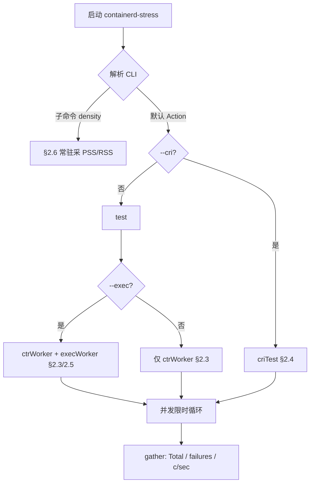
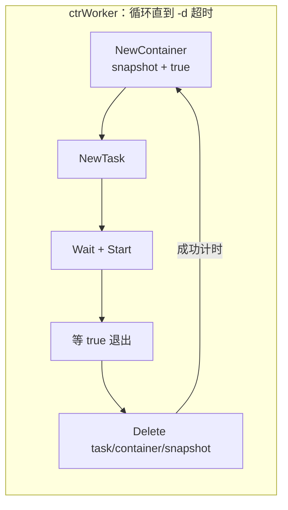
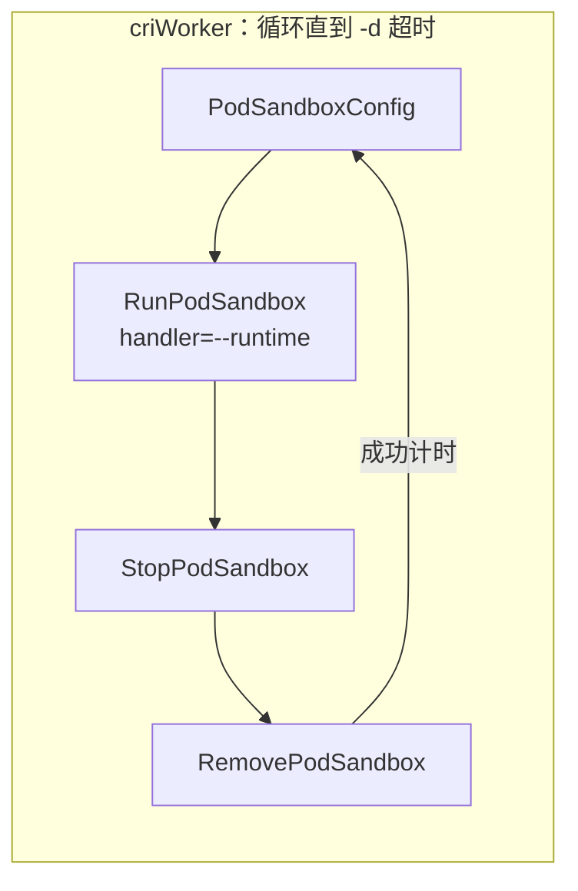
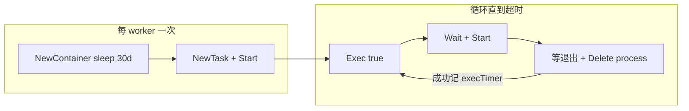

# containerd 代码中的现成压测工具

## 1. 概述

本文梳理 containerd 源码内**现成**的性能/压测相关能力，以及官方文档（`BUILDING.md`）明确推荐的外部工具。

| 类别 | 工具 | 定位 |
|------|------|------|
| 端到端加压 | `containerd-stress`（`cmd/containerd-stress`） | 对运行中 daemon 做并发生命周期加压 |
| 组件微基准 | `make benchmark` / `go test -bench` | Create/Start、snapshot、GC 等热点 |
| Snapshotter 环境 | `contrib/aws/snapshotter_bench_*` | 在 AWS 上跑 snapshotter benchsuite |
| 外部（文档推荐） | [bucketbench](https://github.com/estesp/bucketbench) | 跨引擎生命周期对比，偏逐步耗时统计 |

`containerd-stress` 详见 §2（编译见 §2.7）；`make benchmark` 跑 Go 微基准（§3）。

---

## 2. `containerd-stress`

### 2.1 定位与模式总览

对**已运行**的 containerd，在 `-d` 限时、`-c` 并发下反复打生命周期负载，得到粗吞吐（containers/sec）与失败数。本身是**客户端**，不启动 daemon。

**不测什么：** 不是 `go test -bench` 微基准；默认路径不是长驻业务负载。

三者关系见代码：§2.2 的 Action（`--cri` ↔ `test` 互斥）；§2.3 `test()` 内起 worker（默认必有 `ctrWorker`，`--exec` 再并行附加）。

| 主入口 | 变体 | Worker | 单次负载（计时约等于） |
|--------|------|--------|------------------------|
| `test`（client） | 默认 | `ctrWorker` | NewContainer→Task→等 `true`→Delete |
| `test`（client） | + `--exec`（并行附加，不替换） | `ctrWorker` + `execWorker` | 另：长驻容器上循环 `Exec(true)` |
| `criTest`（CRI） | — | `criWorker` | RunPodSandbox→Stop→Remove |
| `density` 子命令 | — | （顺序创建） | 常驻后采 shim PSS/RSS |

**模式选择总览（仅此一张总图）：**



---

### 2.2 公共骨架

各模式共用同一套「清理 → 起 worker → 限时循环 → 汇总」。

**1）CLI 分支（默认 vs `--cri` 互斥；`--exec` 不在此层）** — `app.Action`：

```go
// cmd/containerd-stress/main.go
app.Action = func(cliContext *cli.Context) error {
    config := config{ /* address/duration/concurrent/cri/exec/runtime/... */ }
    // --cri 与 client 路径二选一；同一进程只会进入其中一个
    if config.CRI {
        return criTest(config) // → §2.4；此处无 --exec 逻辑
    }
    return test(config) // → §2.3；若带 --exec，在 test() 内并行附加
}
```

`density` 注册在 `app.Commands`，不走上述 Action。

**2）统一加压模型** — 编排与 worker 循环在 `test` / `criTest` 同构（差异只在 client 种类与单次负载函数）。

编排侧（摘自 `criTest`；`test` 在 Pull 之后同样如此）：

```go
// cmd/containerd-stress/main.go — criTest / test 共用形态
tctx, cancel := context.WithTimeout(ctx, c.Duration)
// ... SIGTERM/SIGINT → cancel ...

for i := 0; i < c.Concurrency; i++ {
    wg.Add(1)
    w := &criWorker{ /* 或 ctrWorker */ id: i, wg: &wg, client: client, ... }
    workers = append(workers, w)
}

r.start()
for _, w := range workers {
    go w.run(ctx, tctx)
}
wg.Wait()
r.end()
results := r.gather(workers)
```

Worker 循环（`ctrWorker.run` / `criWorker.run` 同构；单次负载分别为 `runContainer` / `runSandbox`）：

```go
// cmd/containerd-stress/worker.go（cri_worker.go 中 criWorker.run 相同结构）
func (w *ctrWorker) run(ctx, tctx context.Context) {
    defer w.wg.Done()
    for {
        select {
        case <-tctx.Done():
            return
        default:
        }
        w.count++
        id := w.getID()
        start := time.Now()
        if err := w.runContainer(ctx, id); err != nil {
            if err != context.DeadlineExceeded ||
                !strings.Contains(err.Error(), context.DeadlineExceeded.Error()) {
                w.failures++
            }
            continue // 失败不计耗时
        }
        ct.WithValues(w.commit).UpdateSince(start) // 仅成功计时
    }
}
```

**3）计时约定** — 两层时间：单次负载耗时（metrics）与整轮墙钟（吞吐分母）。

单次负载（`ctrWorker.run` / `criWorker.run` / `execWorker` 循环同构）：

```go
// cmd/containerd-stress/worker.go
start := time.Now()
if err := w.runContainer(ctx, id); err != nil { // 含函数内 defer Delete
    if err != context.DeadlineExceeded ||
        !strings.Contains(err.Error(), context.DeadlineExceeded.Error()) {
        w.failures++ // 非纯超时才记失败
    }
    continue // 失败：不 UpdateSince，避免失败过快抬高吞吐观感
}
ct.WithValues(w.commit).UpdateSince(start) // 仅成功：区间 = 整次负载（含 defer 清理）
```

整轮墙钟（编排侧；`gather` 用其算 c/sec）：

```go
// cmd/containerd-stress/main.go
func (r *run) start() { r.started = time.Now() }
func (r *run) end()   { r.ended = time.Now() }
func (r *run) seconds() float64 {
    return r.ended.Sub(r.started).Seconds()
}
```

**4）汇总**

```go
// cmd/containerd-stress/main.go
func (r *run) gather(workers []worker) *result {
    for _, w := range workers {
        r.total += w.getCount()
        r.failures += w.getFailures()
    }
    sec := r.seconds()
    return &result{
        Total:               r.total,
        Seconds:             sec,
        ContainersPerSecond: float64(r.total) / sec,
        SecondsPerContainer: sec / float64(r.total),
    }
}
```

---

### 2.3 默认路径（client API）

**目标：** 压 containerd **client API** 的短命容器全生命周期。

**单次迭代：**



**准备** — `func test(c config) error`（完整）：

```go
// cmd/containerd-stress/main.go
func test(c config) error {
	var (
		wg  sync.WaitGroup
		ctx = namespaces.WithNamespace(context.Background(), "stress")
	)

	client, err := c.newClient()
	if err != nil {
		return err
	}
	defer client.Close()
	if err := cleanup(ctx, client); err != nil {
		return err
	}

	log.L.Infof("pulling %s", c.Image)
	image, err := client.Pull(ctx, c.Image, containerd.WithPullUnpack, containerd.WithPullSnapshotter(c.Snapshotter))
	if err != nil {
		return err
	}
	v, err := client.Version(ctx)
	if err != nil {
		return err
	}

	tctx, cancel := context.WithTimeout(ctx, c.Duration)
	go func() {
		s := make(chan os.Signal, 1)
		signal.Notify(s, syscall.SIGTERM, syscall.SIGINT)
		<-s
		cancel()
	}()

	var (
		workers []worker
		r       = &run{}
	)
	log.L.Info("starting stress test run...")
	// 必有：N 个 ctrWorker（默认生命周期路径，始终启动）
	for i := 0; i < c.Concurrency; i++ {
		wg.Add(1)

		w := &ctrWorker{
			id:          i,
			wg:          &wg,
			image:       image,
			client:      client,
			commit:      v.Revision,
			snapshotter: c.Snapshotter,
		}
		workers = append(workers, w)
	}
	var exec *execWorker
	// 可选附加：再并行 +N 个 execWorker（不替换上面的 ctrWorker；详见 §2.5）
	if c.Exec {
		for i := c.Concurrency; i < c.Concurrency+c.Concurrency; i++ {
			wg.Add(1)
			exec = &execWorker{
				ctrWorker: ctrWorker{
					id:          i,
					wg:          &wg,
					image:       image,
					client:      client,
					commit:      v.Revision,
					snapshotter: c.Snapshotter,
				},
			}
			go exec.exec(ctx, tctx)
		}
	}

	// start the timer and run the worker
	r.start()
	for _, w := range workers {
		go w.run(ctx, tctx) // 默认路径始终跑
	}
	// wait and end the timer
	wg.Wait()
	r.end()

	results := r.gather(workers)
	if c.Exec {
		results.ExecTotal = exec.count
		results.ExecFailures = exec.failures
	}
	log.L.Infof("ending test run in %0.3f seconds", results.Seconds)

	log.L.WithField("failures", r.failures).Infof(
		"create/start/delete %d containers in %0.3f seconds (%0.3f c/sec) or (%0.3f sec/c)",
		results.Total,
		results.Seconds,
		results.ContainersPerSecond,
		results.SecondsPerContainer,
	)
	if c.JSON {
		if err := json.NewEncoder(os.Stdout).Encode(results); err != nil {
			return err
		}
	}
	return nil
}
```

**Worker 循环** — `func (w *ctrWorker) run(ctx, tctx context.Context)`：

```go
// cmd/containerd-stress/worker.go
func (w *ctrWorker) run(ctx, tctx context.Context) {
    defer w.wg.Done()
    for {
        select {
        case <-tctx.Done():
            return
        default:
        }
        w.count++
        id := w.getID()
        start := time.Now()
        if err := w.runContainer(ctx, id); err != nil {
            // 非纯超时 → failures++
            continue
        }
        ct.WithValues(w.commit).UpdateSince(start) // 仅成功计时
    }
}
```

**单次负载** — `func (w *ctrWorker) runContainer(ctx context.Context, id string) (err error)`：

```go
// cmd/containerd-stress/worker.go
func (w *ctrWorker) runContainer(ctx context.Context, id string) (err error) {
    c, err := w.client.NewContainer(ctx, id,
        containerd.WithSnapshotter(w.snapshotter),
        containerd.WithNewSnapshot(id, w.image),
        containerd.WithNewSpec(
            oci.WithImageConfig(w.image),
            oci.WithUsername("games"),
            oci.WithProcessArgs("true"), // 写死：快速退出
        ),
    )
    defer c.Delete(ctx, containerd.WithSnapshotCleanup)
    task, err := c.NewTask(ctx, cio.NullIO)
    defer task.Delete(ctx, containerd.WithProcessKill)
    statusC, err := task.Wait(ctx)
    if err := task.Start(ctx); err != nil {
        return err
    }
    status := <-statusC
    _, _, err = status.Result()
    return err
}
```

**计时边界：** 整次 `runContainer`（含 defer Delete）。  
**参数：** `-a/-c/-d/-i/--runtime/--snapshotter` 生效。进程/`games` 写死 → **pause 镜像不能直接作 `-i`**（无 `true`、无 `games` 用户）。  
**与其它模式差：** 走 client 而非 CRI；会 `Pull(-i)`。

---

### 2.4 `--cri` 路径

**目标：** 压 **CRI** `RunPodSandbox` 全链路（含 Stop/Remove）。

**单次迭代：**



**入口** — `func criTest(c config) error`：

```go
// cmd/containerd-stress/main.go
func criTest(c config) error {
    client, err := remote.NewRuntimeService(c.Address, timeout) // CRI，非 containerd.New
    if err := criCleanup(ctx, client); err != nil {
        return err
    }
    tctx, cancel := context.WithTimeout(ctx, c.Duration)
    for i := 0; i < c.Concurrency; i++ {
        w := &criWorker{
            runtimeHandler: c.Runtime, // --runtime = CRI handler 名
            snapshotter:    c.Snapshotter, // 赋值但 runSandbox 未用
            // ...
        }
        go w.run(ctx, tctx)
    }
    // wait + gather
    return nil
}
```

**清理** — `func criCleanup(ctx context.Context, client *remote.RuntimeService) error`：按 label `pod.namespace=stress` List → Stop → Remove。

**Worker** — `func (w *criWorker) run(ctx, tctx context.Context)`：与默认相同的限时循环，调用 `runSandbox`，成功才 `UpdateSince`。

**单次负载** — `func (w *criWorker) runSandbox(tctx, ctx context.Context, id string) (err error)`（完整）：

```go
// cmd/containerd-stress/cri_worker.go
func (w *criWorker) runSandbox(tctx, ctx context.Context, id string) (err error) {

	sbConfig := &runtime.PodSandboxConfig{
		Metadata: &runtime.PodSandboxMetadata{
			Name: id,
			// Using random id as uuid is good enough for local
			// integration test.
			Uid:       util.GenerateID(),
			Namespace: "stress",
		},
		Labels: map[string]string{podNamespaceLabel: stressNs},
		Linux:  &runtime.LinuxPodSandboxConfig{},
	}

	sb, err := w.client.RunPodSandbox(sbConfig, w.runtimeHandler)
	if err != nil {
		w.failures++
		return err
	}
	defer func() {
		w.client.StopPodSandbox(sb)
		w.client.RemovePodSandbox(sb)
	}()

	// verify it is running ?

	ticker := time.NewTicker(250 * time.Millisecond)
	go func() {
		for {
			select {
			case <-tctx.Done():
				ticker.Stop()
				return
			case <-ticker.C:
				// do stuff
				status, err := w.client.PodSandboxStatus(sb)
				if err != nil && status.GetState() == runtime.PodSandboxState_SANDBOX_READY {
					ticker.Stop()
					return
				}
			}
		}
	}()

	return nil
}
```

要点：`RunPodSandbox` 成功后立刻 `return nil`，`defer` 随即 `Stop`/`Remove`；后台 `PodSandboxStatus` 轮询**不阻塞**返回，且条件为 `err != nil && READY`（几乎无效）。

**计时边界：** 整次 `runSandbox` ≈ RunPodSandbox + Stop + Remove。  
**参数：** `-a/-c/-d/--runtime`（handler 名）生效；**`-i`、`--snapshotter` 不生效**。镜像 = CRI 配置的 sandbox（如 pause）。  
**与默认差：** API 是 CRI；镜像不来自 `-i`；`--runtime` 是 handler 名不是 `io.containerd.runc.v2`。

```bash
containerd-stress --cri -a /run/containerd/containerd.sock --runtime runc -c 4 -d 5m
```

---

### 2.5 `--exec` 路径

**关系：** 不是第三条主路径。入口仍是 §2.3 的 `test()`；本节展开其中的 `if c.Exec { ... go exec.exec }`——在已有 N 个 `ctrWorker` 之外再并行 +N 个 `execWorker`。与 `--cri` 互斥（`criTest` 内无此分支）。

**目标：** 在已运行 task 上压 **`Exec`**（仅非 CRI）。

**单次迭代：**



```go
// cmd/containerd-stress/exec_worker.go
func (w *execWorker) exec(ctx, tctx context.Context) {
    // NewContainer(..., ProcessArgs("sleep","30d")) → NewTask → Start
    // 循环：runExec → 成功则 execTimer.UpdateSince
}

func (w *execWorker) runExec(ctx context.Context, task containerd.Task, id string, spec *specs.Process) (err error) {
    process, err := task.Exec(ctx, id, spec, cio.NullIO) // Args 已改为 true
    defer process.Delete(ctx, containerd.WithProcessKill)
    statusC, err := process.Wait(ctx)
    if err := process.Start(ctx); err != nil {
        return err
    }
    status := <-statusC
    _, _, err = status.Result()
    return err
}
```

**计时：** 单次 `runExec`；结果额外 `ExecTotal` / `ExecFailures`。  
**与默认差：** 测二次进程创建，不是反复建容器。

---

### 2.6 `density` 子命令

**目标：** 测**同时存活**时的 shim 内存密度，不是吞吐循环。

**流程：** Pull → 顺序创建 `count+1` 个 `sleep 120m` 并 Start → 对 task 父进程（shim）读 `/proc/<pid>/smaps` → JSON：`pss`/`rss` 及 per-container。

入口为 `densityCommand` 的 `Action: func(cliContext *cli.Context) error`（`density.go`）。

**与默认差：** 不循环销毁；输出内存指标而非 c/sec。

```bash
containerd-stress density --count 100
```

---

### 2.7 编译方法

源码：`cmd/containerd-stress/`。`Makefile` 将 `containerd-stress` 列入 `COMMANDS`，规则 `bin/%: cmd/%` 产出 `bin/containerd-stress`。

```bash
make bin/containerd-stress   # 推荐
make binaries                # 同时编 ctr / containerd / containerd-stress
make install                 # 安装到 $(DESTDIR)$(BINDIR)，默认常为 /usr/local/bin
go build -o bin/containerd-stress ./cmd/containerd-stress  # 不经 Makefile
```

依赖：可用 Go 工具链（见 `BUILDING.md`）。运行前需已有可连接的 containerd/CRI daemon。

---

### 2.8 参数说明

#### `--runtime`

| 场景 | 含义 | 典型值 |
|------|------|--------|
| 默认 / `--exec` / `density` | OCI runtime type（`WithDefaultRuntime`） | `io.containerd.runc.v2`（默认）；Windows：`io.containerd.runhcs.v1` |
| `--cri` | CRI **RuntimeHandler** 名（`runtimes.<name>` 的 key） | `runc`、`kata` 等；勿与 `runtime_type` 字段混淆 |

#### `--snapshotter`

默认 `overlayfs`。作为插件 ID，用于 client 路径的 `Pull` / `NewContainer`。

| ID | 说明 |
|----|------|
| `overlayfs` | 默认 |
| `native` | 目录拷贝 |
| `devmapper` | thin-pool |
| `btrfs` / `erofs` / `blockfile` | 对应实现 |

另有 `windows` / `lcow` 等。须已在 daemon 启用且环境就绪。**`--cri` 下本 flag 不参与 `runSandbox`。**

#### 参数速查（是否生效）

| 参数 | 默认 | density | `--exec` | `--cri` | 含义 |
|------|------|---------|----------|---------|------|
| `-c` | ✓ | — | ✓ | ✓ | 并发 worker 数（默认 1） |
| `-d` | ✓ | — | ✓ | ✓ | 时长（默认 1m） |
| `-a` | ✓ | ✓ | ✓ | ✓ | socket |
| `-i` | ✓ | ✓ | ✓ | ✗ | 镜像（默认 alpine） |
| `--runtime` | type | type | type | **handler** | 见上表 |
| `--snapshotter` | ✓ | ✓ | ✓ | ✗ | 见上表 |
| `--cri` | | | | ✓ | 走 CRI |
| `--exec` | | | ✓ | ✗ | 额外 exec worker |
| `-j` / `-m` | ✓ | ✓ | ✓ | ✓ | JSON / metrics 地址 |
| `density --count` | | ✓ | | | 同时存活容器数 |

```bash
containerd-stress -c 5 -d 120m
containerd-stress --cri --runtime runc -c 4 -d 30m
containerd-stress --snapshotter native -c 2 -d 10m
containerd-stress density --count 100
```

---

## 3. Go 微基准（`make benchmark`）

### 3.1 用途与跑法

组件级 / 集成级 `testing.B` 基准，产出 ns/op、MB/s 等，用于热点优化与回归对比，**不是**长时间 daemon 加压。

```bash
make benchmark
# 等价于：go test … -bench . -run Benchmark -test.root
```

### 3.2 客户端集成：`integration/client/benchmark_test.go`

**`BenchmarkContainerCreate`**

1. 连上已运行的 containerd，`GetImage(testImage)`，预生成 OCI `spec`（含 `withTrue()`）
2. `b.ResetTimer()` 后循环 `b.N` 次：`NewContainer(id, WithNewSnapshot(id, image), WithSpec(spec))`
3. 结束后统一 `Delete(..., WithSnapshotCleanup)`

计时段覆盖：**元数据创建 + 新 snapshot**，**不含** `NewTask`/`Start`。用于衡量「空容器对象+根快照」创建成本。

**`BenchmarkContainerStart`**

1. 同样准备 image/spec
2. **计时外**先循环创建 `b.N` 个 container（含 snapshot）
3. `ResetTimer()` 后对每个容器：`NewTask` → `Start`

计时段覆盖：**task 创建与启动**。与 Create 基准刻意拆开，避免创建成本混进启动数字。

### 3.3 Snapshotter 套件：`core/snapshots/benchsuite`

**入口：** `BenchmarkNative` / `BenchmarkOverlay` / `BenchmarkDeviceMapper`  
分别 `NewSnapshotter` 后调用同一套 `benchmarkSnapshotter`；未传 root/设备 flag 则 `Skip`。

**机制（`benchmarkSnapshotter`）：**

1. 构造 **16 层** `fstest.Applier`：按层索引交替「全新建文件 / 局部改中段 4 字节 / 删除」——刻意制造 overlay 全文件 copy-up 与 block-based（devmapper）局部写的差异
2. 每层文件约 **1MiB**；`b.SetBytes` 按总写入量报告吞吐
3. 每轮 `b.N`：对 16 层依次  
   - `Prepare(current, parent)` → 累加 `prepareDuration`  
   - `mount.WithTempMount` + Apply 写数据 → `writeDuration`  
   - `Commit(parent', current)` → `commitDuration`
4. 除整体 `BenchmarkResult` 外，额外打印 prepare/write/commit 分段耗时

用途：对比不同 snapshotter 在多层增删改下的 Prepare/IO/Commit 成本。

### 3.4 MetaStore：`core/snapshots/storage`

`bolt_test.go` 的 `BenchmarkSuite` 调用 `Benchmarks(...)`，在可写事务里跑子基准：

| 子项 | 机制 |
|------|------|
| `StatActive` / `StatCommitted` | 预先 Create/Commit 出 active 或 committed，循环 `GetInfo` |
| `CreateActive` | 循环 `CreateSnapshot(KindActive)`，计时外 `Remove` |
| `Remove` | 计时外 Create，计时内 Remove |
| `Commit` | active → `CommitActive` |
| `GetActive` | 查询 active 快照 |
| `WriteTransaction` / `ReadTransaction` | 反复开事务 Commit / Rollback |

测的是 **snapshot 元数据（BoltDB）** 路径，不经过真实文件系统层实现。

### 3.5 Content ingest：`plugins/content/local`

**`BenchmarkIngests`：**

1. 对 blob 大小 `1KiB / 4KiB / 512KiB / 1MiB` 分子基准
2. 计时外 `generateBlobs`（随机内容，SHA256+SHA512 digest）
3. `SetBytes` 后循环 `checkWrite` 写入 content store

注释写明存在约数毫秒级插入开销（syscall/文件协调），用于衡量 **content store 写入吞吐**。

### 3.6 解压：`pkg/archive/compression`

**`BenchmarkDecompression`：**

1. 下载样本数据，扩展到 32/64/128/256 MiB
2. 预先压成 gzip / zstd
3. 子基准：`zstd`、`gzipPureGo`，若系统有 `igzip`/`unpigz` 再测外部分解压器

对比不同解压实现在镜像层解压场景下的吞吐。

### 3.7 元数据 GC：`core/metadata`

**`BenchmarkGarbageCollect`：** 子规模 `10/100/1000/10000-Sets`。

每「套」预置：1 blob + 1 image + 7 层 snapshot 链 + 1 container，全部写入 Bolt 元数据后 `ResetTimer`，循环调用 `mdb.GarbageCollect(ctx)`。

测 **GC 扫描/回收** 随对象规模的耗时（当前实现未在循环内掺删除对象，主要压全量扫描路径）。

### 3.8 其它微基准

| 位置 | 机制要点 |
|------|----------|
| `pkg/gc` `BenchmarkTricolor` | 构造引用图，循环跑三色标记 `Tricolor`，测 GC 图算法本身 |
| `core/unpack` `BenchmarkUnpackWithChainID(s)` | 模拟 unpack 时 chainID：旧路径每层反复 `identity.ChainID`；新路径一次 `ChainIDs`；层数 5/10/25/50 |
| `core/mount` `BenchmarkBatchRunGetUsernsFD_Concurrent{1,10}` | 并发调用 `getUsernsFD`（固定 UID/GID map），测 idmapped mount 获取 userns FD |
| `plugins/snapshots/overlay/overlayutils` `BenchmarkOverlaySupportedOn*` | 在临时 mkfs（ext4 / XFS ftype0/1 / FAT）上循环探测 overlay 是否支持 |

### 3.9 示例

```bash
go test -bench=. -benchmem ./integration/client/
go test -bench=. ./core/snapshots/benchsuite/ -overlay.rootPath=/tmp/ovl
go test -bench=BenchmarkGarbageCollect ./core/metadata/
```

---

## 4. AWS Snapshotter 基准环境（contrib）

`contrib/aws/snapshotter_bench_readme.md` + CloudFormation 模板：起带 EBS/thin-pool 的实例，再跑 §3.3 的 benchsuite。属于环境辅助，不是独立压测二进制。

---

## 5. 文档推荐的外部工具：bucketbench

`BUILDING.md` 推荐，不在 containerd 仓库内：

- YAML 配置 lifecycle（run/stop/remove/…）与 threads×iterations
- 支持 Docker / containerd / runc / crun / youki / CRI 等
- 输出逐步耗时统计；官方称其比 `containerd-stress` 更偏性能明细

与 `containerd-stress`：前者可配置命令序列、跨引擎；后者专注给运行中的 containerd 诱导负载并报 containers/sec。

---

## 6. 选型小结

| 目标 | 选用 |
|------|------|
| daemon 长时间加压 / 粗吞吐 | `containerd-stress` |
| 已运行 task 上的 exec 加压 | `containerd-stress --exec` |
| CRI Pod 加压 | `containerd-stress --cri`（`--runtime`=handler 名） |
| 同时存活内存密度 | `containerd-stress density` |
| 创建 vs 启动拆分微基准 | `integration/client` 的 Create/Start |
| snapshotter / content / GC 热点 | 对应包内 `Benchmark*` |
| 跨引擎生命周期明细 | bucketbench（外部） |
