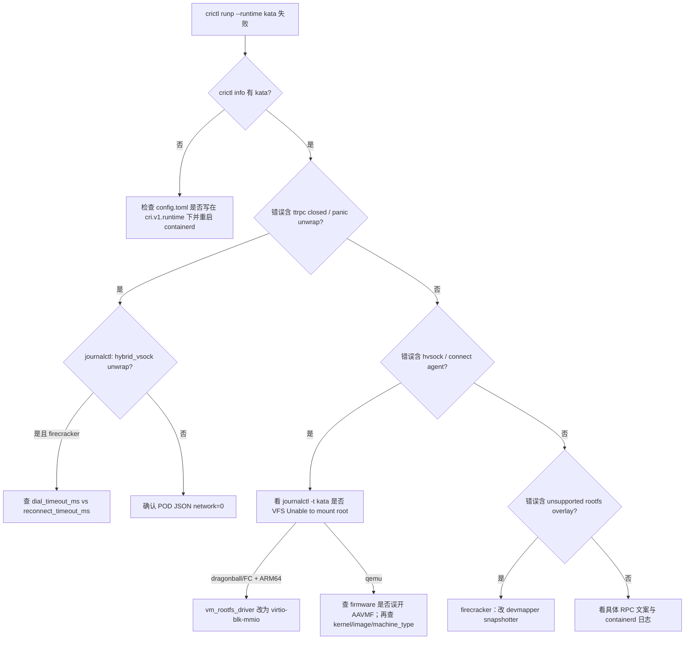

# Kata Containers：环境准备与启动失败分析

## 1. 文档概述

### 1.1 背景

本仓库用 `scripts/setup/setup.sh` 切换 runtime（`runc` / `kata`）与 hypervisor（`qemu` / `dragonball` / …），再用 `cold_start_bench.py`、`throughput_sweep.sh`、`config_matrix_sweep.sh` 做沙箱冷启动压测。

2026-07 配置矩阵与手工 setup 过程中，kata 侧连续踩到多类「看起来像启动失败、实际根因不同」的问题。本文汇总：

| 现象 | 真实根因 | 影响面 |
|------|----------|--------|
| `no runtime for "kata" is configured` | kata 写进 **旧 CRI 插件路径**，containerd v2 不读 | 矩阵 `bridge_kata_qemu` 等全部 RunPodSandbox 失败 |
| setup 报 `BPF_CGROUP_DEVICE → EINVAL` | **探测脚本 UAPI 常量错误**（假阳性） | setup 误判失败；内核实际已支持 |
| 试跑 `ttrpc: closed` / shim panic | CRI `network: 2` + kata 3.22.0 `unwrap()` | 仅错误网络模式；bench 用 `network: 0` 不受影响 |
| dragonball warmup：`kata.hvsock` ENOENT | guest **挂不上根盘**（PCI blk 在 ARM64 不可见） | `--hypervisor dragonball` 冷启动全失败 |
| firecracker：`can not support 128 vCPUs` | `default_maxvcpus=0` → 解析成宿主机 CPU 数，超过 **MAX=32** | warmup / RunPodSandbox 配置校验失败 |
| firecracker：`After 500 attempts` / FC API 400 | runtime-rs 把 `default_vcpus`（f32）序列化成 JSON `1.0`，FC 要 **u8 整数** | kata **3.22.0** + Firecracker 1.12；**4.0.0 已含** `ceil() as u8` |
| firecracker：`unsupported rootfs ... overlay` | FC **无 virtio-fs**，只能挂块设备；overlayfs snapshotter 不可用 | 必须改用 **devmapper** snapshotter |
| firecracker：shim 已起但 RunPodSandbox 失败 | 上一条；guest agent 可连上，create container 时挂 rootfs 失败 | 看起来像「半成功」 |
| firecracker 4.0.0：`ttrpc: closed` + `hybrid_vsock` unwrap panic | 静态包 `dial_timeout_ms=45000`，`reconnect` 默认 3000 → **retry_times=0** | 未真正重试就 `last_err.unwrap()` panic |
| firecracker：根盘 / jailer 路径异常 | 默认 `vm_rootfs_driver=virtio-blk-pci`；jailer 改路径 | ARM64 上应强制 **mmio**；本机默认关 jailer |
| qemu 4.0.0 冷启动 ~2.3s（3.22 约 0.9s） | 默认 `firmware=AAVMF_CODE.fd`（64MB UEFI）；已有 `-kernel` 仍加载 BIOS | 清空 `firmware` 后回到 ~0.9–1.0s |
| dragonball 4.0.0：`Firmware for dragonball hypervisor should be empty` | 静态包 `configuration-dragonball.toml` 同样写入了 AAVMF | setup 强制 `firmware=""` |

### 1.2 相关路径

| 组件 | 路径 |
|------|------|
| setup | `scripts/setup/setup.sh` |
| 冷启动 bench | `scripts/bench/cold_start_bench.py` |
| 配置矩阵 | `scripts/bench/config_matrix_sweep.sh` |
| containerd 配置 | `/etc/containerd/config.toml` |
| kata shim（runtime-rs） | `/opt/kata/runtime-rs/bin/containerd-shim-kata-v2` |
| kata shim（Go 静态，stratovirt） | `/opt/kata/bin/containerd-shim-kata-v2-go-static`（源自 `install/go-shim-static/`；构建说明见 `config/kata/go-shim-static/README.md`） |
| 仓库内 kata 配置 | `config/kata/`（如 `configuration-clh-runtime-rs.toml`） |
| kata 默认配置（runtime-rs symlink） | `/opt/kata/share/defaults/kata-containers/runtime-rs/configuration.toml` |
| kata 默认配置（Go symlink） | `/opt/kata/share/defaults/kata-containers/configuration.toml` |
| QEMU 配置 | `.../runtime-rs/configuration-qemu-runtime-rs.toml` |
| Dragonball 配置 | `.../runtime-rs/configuration-dragonball.toml` |
| Firecracker 配置 | `.../runtime-rs/configuration-rs-fc.toml` |
| CLH 配置 | `.../runtime-rs/configuration-clh-runtime-rs.toml` |
| StratoVirt 配置 | `.../configuration-stratovirt.toml`（Go） |
| kata 静态包（本仓库） | `install/kata-static-{3.22.0,4.0.0}-arm64.tar.zst` |
| kata 源码（本机） | `/home/nathan/kata-containers`（曾用 3.22.0；现对齐 tag **4.0.0**） |
| cgroup BPF（runc） | `doc/runc-cgroup-v2-bpf-device-analysis.md` |
| Ready / 时延 | `doc/sandbox-ready-and-startup-latency.md` |

### 1.3 本机关键环境（排查时）

| 项 | 值 |
|----|-----|
| 架构 | aarch64 |
| 内核 | `5.10.229+debug+`，cmdline 含 `systemd.unified_cgroup_hierarchy=1` |
| containerd | v2.3.x（CRI 插件 `io.containerd.cri.v1.runtime`） |
| kata（当前） | runtime-rs shim **4.0.0**（`io.containerd.kata.v2`，commit `cf82bb35…`）；早先踩坑时为 **3.22.0** |
| Firecracker | `/opt/kata/bin/firecracker` **v1.12.1** |
| 典型 CNI | bridge / ipvlan-l3，`10.0.0.0/12` |
| FC snapshotter | **devmapper** thin-pool（如 `devpool4`） |

---

## 2. 问题 A：containerd v2 未真正注册 kata

### 2.1 现象

矩阵目录示例：

`results/config_matrix/<ts>/bridge_kata_qemu/runs/run0004_...`

- `cold_start_report.json`：`success_runs: 0`
- 错误：

```text
unable to get OCI runtime for sandbox "...": no runtime for "kata" is configured
```

- 单 worker 日志：`成功: 0/N`，`sandbox_id: "FAIL"`
- `summary.csv` 仍可能标 `ok` / `failed=0`（汇总口径看的是 multi 进程退出，**不是**沙箱成功数）

`crictl info` 当时只有 `runc`，没有 `kata`。

### 2.2 根因

containerd **v2** 生效的 runtime 段是：

```toml
[plugins.'io.containerd.cri.v1.runtime'.containerd.runtimes.runc]
```

旧版 `setup.sh` 把 kata **追加到文件末尾**，写的是：

```toml
[plugins."io.containerd.grpc.v1.cri".containerd.runtimes.kata]
  runtime_type = 'io.containerd.kata.v2'
  runtime_path = '/opt/kata/runtime-rs/bin/containerd-shim-kata-v2'
  ...
```

v2 **不加载** `io.containerd.grpc.v1.cri` 下的 runtimes。  
脚本仅用 `grep io.containerd.kata.v2` 判断「已注册」→ **误报成功**。

### 2.3 修复（`setup.sh`）

1. 探测活动 CRI 插件：若存在 `io.containerd.cri.v1.runtime` 则用之，否则回退 `io.containerd.grpc.v1.cri`
2. 写入对应路径的 `runtimes.kata` 段；删除任意路径下的陈旧 kata 段
3. 用 `crictl info` 是否出现 `"kata"` 作为最终校验（必要时重启 containerd）

修复后期望：

```text
crictl info → runtimes: ['kata', 'runc']
```

手工验证（POD 网络）：

```bash
bash scripts/setup/setup.sh --cni-type bridge --runtime kata --hypervisor qemu
python3 scripts/bench/cold_start_bench.py --runtime kata --runs 3
```

### 2.4 和「矩阵数字看起来正常」的关系

失败时 `t_runp` 仍可能有 ~100ms 量级（RPC 快速返回错误）。  
吞吐汇总若把失败 attempt 当完成量，会出现「吞吐很高、成功为 0」的假象。解读 kata 矩阵时务必看：

- worker `成功: x/y`
- JSON `summary.success` / `sandbox_id == FAIL`
- cold-start `success_runs`

---

## 3. 问题 B：setup 的 BPF_CGROUP_DEVICE 探测假阳性

### 3.1 现象

```bash
bash scripts/setup/setup.sh --cni-type ipvlan-l3 --runtime kata --hypervisor qemu
```

报错类似：

```text
✗ 内核不支持 cgroup BPF device（bpf_prog_query BPF_CGROUP_DEVICE → EINVAL）
  典型原因: CONFIG_CGROUP_BPF 未开启
```

但同时：

- `zgrep CONFIG_CGROUP_BPF /proc/config.gz` → `=y`
- `bpftool feature` → `eBPF program_type cgroup_device is available`
- `crictl runp --runtime runc` / `kata`（在 kata 已注册前提下）可创建沙箱

### 3.2 根因

旧探测硬编码了**较新 UAPI**常量：

```python
BPF_PROG_QUERY, BPF_CGROUP_DEVICE = 17, 15
```

本机 5.10 BTF（`/sys/kernel/btf/vmlinux`）实际为：

| 符号 | 本机 5.10 | 脚本旧值 |
|------|-----------|----------|
| `BPF_PROG_QUERY` | **16** | 17 |
| `BPF_CGROUP_DEVICE` | **6** | 15 |

命令号错误 → `bpf(2)` 返回 `EINVAL` → 误判「内核不支持」。

> 说明：历史上确实存在「内核未开 `CONFIG_CGROUP_BPF`」导致 runc 真失败的情况，见 `doc/runc-cgroup-v2-bpf-device-analysis.md`。  
> **本次报错与那篇文档的真缺配置不是同一件事**；当前 debug 内核已开启该选项，失败来自探测常量。

### 3.3 修复

`_cgroup_bpf_device_ok` 依次尝试候选 `(16,6)`、`(17,15)`，并以 128 字节 `bpf_attr` 缓冲（对齐 libbpf/bpftool）。任一成功即视为支持。

---

## 4. 问题 C：错误网络模式触发 kata 3.22.0 panic

### 4.1 现象

手工 smoke 若使用：

```json
"linux": { "security_context": { "namespace_options": { "network": 2 } } }
```

可能看到：

```text
failed to create shim task: ttrpc: closed
```

dmesg / journal：

```text
A panic occurred at .../runtime-rs/crates/runtimes/src/manager.rs:393:
called `Option::unwrap()` on a `None` value
```

### 4.2 CRI `network` 取值

| 值 | 含义 | 典型 OCI |
|----|------|----------|
| `0` | POD 网络 | 有独立 netns + CNI，`linux.namespaces` 含带 `path` 的 network |
| `2` | NODE（宿主机网络） | 往往 **没有**可用的 netns 路径 |

本仓库 bench 使用 **`network: 0`**（见 `cold_start_bench.py` → `prepare_pod_config`）。

### 4.3 源码（kata 3.22.0）

`src/runtime-rs/crates/runtimes/src/manager.rs`（commit `a164693e` 附近）：

```rust
spec.annotations_mut().as_mut().unwrap().insert(
    "nerdctl/network-namespace".to_string(),
    netns.clone().unwrap(),
);
```

`annotations` 或 `netns` 为 `None` 时直接 panic → shim 退出 → containerd 报 `ttrpc: closed`。

上游 main 已改为在 `netns` 存在时再插入，并对空 `annotations` 做初始化，避免 unwrap。

### 4.4 结论

- **不是** QEMU/Dragonball 本身「起不来」的根因描述；是 shim 在坏输入下崩溃。
- 矩阵 / bench 路径用 POD 网络，**不依赖**该 bug 也能工作（在 runtime 已正确注册的前提下）。
- 手工验证请与 bench 对齐：`network: 0`。

---

## 5. 问题 D：Dragonball（ARM64）根盘驱动错误

### 5.1 现象

```bash
bash scripts/setup/setup.sh --cni-type ipvlan-l3 --runtime kata --hypervisor dragonball
```

前置检查可全部通过，但 **warmup**（内部调 `cold_start_bench.py`）失败。表层错误：

```text
hybrid vsock: failed to connect to .../kata.hvsock
No such file or directory (os error 2)
```

### 5.2 真实 guest 日志

VM / vCPU 能起来，随后：

```text
/dev/root: Can't open blockdev
VFS: Cannot open root device "/dev/vda1" or unknown-block(0,0): error -6
Kernel panic - not syncing: VFS: Unable to mount root fs on unknown-block(0,0)
```

guest 未完成启动 → agent 未监听 → 宿主机 `kata.hvsock` 连不上 → 表象为 hvsock ENOENT。

默认 `configuration-dragonball.toml`：

```toml
vm_rootfs_driver = "virtio-blk-pci"
block_device_driver = "virtio-blk-pci"
kernel = ".../vmlinux-dragonball-experimental.container"
image = ".../kata-containers.img"
```

在本机 aarch64 上，PCI virtio-blk 根盘 **guest 侧不可见**；改为 mmio 后设备以 `driver_option: "mmioblk"`、`virt_path: "/dev/vda"` 挂上，沙箱 `SANDBOX_READY`。

### 5.3 修复（`setup.sh`）

当 `--hypervisor dragonball` 且架构为 aarch64/arm64 时：

```toml
vm_rootfs_driver = "virtio-blk-mmio"
block_device_driver = "virtio-blk-mmio"
```

（对 `configuration-dragonball.toml` 做 sed；该文件由 `configuration.toml` symlink 指向。）

验证：

```bash
bash scripts/setup/setup.sh --cni-type ipvlan-l3 --runtime kata --hypervisor dragonball
# warmup 期望 3/3 成功；本机约 1.6–1.7s / 次
```

### 5.4 与 QEMU ARM 修补的对比

| Hypervisor | ARM64 setup 修补 |
|------------|------------------|
| qemu | `machine_type=virt`；**清空 firmware**（避免 AAVMF）；`virtio-pmem`→`virtio-blk-pci` |
| dragonball | **清空 firmware**；**`virtio-blk-pci`→`virtio-blk-mmio`（根盘/块设备）** |
| firecracker | **`maxvcpus≤32`**；强制 **devmapper**；**mmio 根盘**；关 jailer；修 **dial/reconnect**；3.22 另需 `vcpu_count` 整型 shim |
| clh（cloud-hypervisor） | 安装捆绑 `configuration-clh-runtime-rs.toml`；段名 **`[hypervisor.clh]`**；清空 firmware；避免 virtio-pmem |
| stratovirt | 切换到 **Go shim**（静态捆绑）+ `configuration-stratovirt.toml`；校验 `/opt/kata/bin/stratovirt` |

QEMU 路径在相同环境下用 PCI blk 可工作；Dragonball / Firecracker 需 mmio。不要假定「kata 默认 toml 开箱即用」。

### Cloud Hypervisor / StratoVirt

- **cloud-hypervisor（CLI 别名）→ 内部名 `clh`**：Kata **4.0.0** runtime-rs 把插件/配置段从 `cloud-hypervisor` 改成了 **`clh`**。用旧段名会报 `Can not find plugin for hypervisor cloud-hypervisor`。
- **aarch64 静态包缺 CLH 配置**：`arch/aarch64-options.mk` 未定义 `CLHCMD`，安装包里通常没有 `runtime-rs/configuration-clh-runtime-rs.toml`。`setup.sh` 从 `config/kata/` 补齐。
- **本机实测**（`--hypervisor cloud-hypervisor`，3 runs）：`t_runp` 约 **0.83–0.93s**（与清 firmware 后的 qemu 同量级）。
- **stratovirt**：runtime-rs **无** 后端；须用 **Go** `containerd-shim-kata-v2` + 顶层 `configuration-stratovirt.toml`。官方动态链接 Go shim 需要 **GLIBC≥2.32**，本机 2.28 不可用 → `setup.sh` 安装 `install/go-shim-static/` 下的静态 shim 到 `/opt/kata/bin/containerd-shim-kata-v2-go-static`（构建见 `config/kata/go-shim-static/README.md`）。

### 5.4.1 为何各 hypervisor 冷启动差这么大

本机量级（`t_runp`，清 firmware / 修好 FC 之后）：

| Hypervisor | 约 `t_runp` | 主因 |
|------------|-------------|------|
| clh / qemu | **0.8–1.0s** | `-kernel` 直启 + **virtio-fs** |
| stratovirt（Go） | **1.0–1.1s** | microvm + virtio-fs；Go shim 路径 |
| firecracker | **1.3–1.4s** | **无 virtio-fs** → demapper 块设备 rootfs |
| dragonball | **~1.5s** | experimental kernel + **inline-virtio-fs** + mmio |

`t_ready`（约 20–25ms）各 HV 接近，差距几乎全在起 VM / 连 agent。

### 5.4.2 可调配置项（冷启动相关）

改当前 symlink 指向的 toml（runtime-rs：`.../runtime-rs/configuration.toml`；stratovirt：顶层 `.../configuration.toml`）。

**收益大 / 已验证**

| 项 | 说明 |
|----|------|
| `firmware = ""` | qemu/clh 有 `-kernel` 时不要 AAVMF（曾差约 **1.3s**）；dragonball 必须空 |
| `vm_rootfs_driver` / `block_device_driver` | qemu/clh：`virtio-blk-pci`；FC/DB ARM64：`virtio-blk-mmio` |
| firecracker → **devmapper** snapshotter | 功能必需，非可选性能开关 |

**可试、需自测**

| 项 | 说明 |
|----|------|
| `default_memory` / `default_vcpus` | 减小可略降 footprint；本机对「清 firmware 前」几乎无收益 |
| `enable_mem_prealloc = false` | 保持 false 利于冷启动 |
| `static_sandbox_resource_mgmt = true` | 少热插拔（已默认 true） |
| `virtio_fs_cache` / `virtio_fs_extra_args` | 多影响运行期共享 FS |
| `dial_timeout_ms` / `reconnect_timeout_ms` | 配错会失败或空等，不是加速旋钮 |
| `enable_debug = false` | 关 debug 略减开销 |

**架构上很难追上 qemu/clh 的**

- firecracker 无法开 virtio-fs
- dragonball 换标准 kernel / 关 inline-fs 等于换产品路径

**选型**：最短冷启动用 **clh 或 qemu**；要 FC 生态则接受多约 0.4–0.5s；dragonball 适合内嵌 VMM，本机 ARM64 不是最快路径。

---

## 5.5 问题 E：Firecracker 冷启动失败链

按时间线：先是 3.22.0 上的 maxvcpus / `vcpu_count` / overlay；升级 **4.0.0** 静态包后又踩到 dial_timeout 误配。当前推荐：`install/kata-static-4.0.0-arm64.tar.zst` + `setup.sh --hypervisor firecracker`。

### 5.5.1 `default_maxvcpus` 超限

本机 128+ CPU 时，`default_maxvcpus = 0` 会解析为宿主机核数，触发：

```text
Firecracker hypervisor can not support 128 vCPUs
```

`setup.sh` 在 `--hypervisor firecracker` 时把该值钳到 **32**（`MAX_FIRECRACKER_VCPUS`）。

### 5.5.2 `vcpu_count` JSON 浮点（shim bug，3.22.0）

kata **3.22.0** runtime-rs 把 `default_vcpus`（f32）直接塞进 Firecracker API，得到 `"vcpu_count": 1.0`，FC 要 u8 整数 → HTTP 400 / `After 500 attempts`。

上游修复：对 vcpu 做 `ceil() as u8`（commit `02c82b174` 一带）。本机曾对 3.22 打补丁重装 shim（备份 `*.bak-3.22.0`）。**tag 4.0.0 已包含该修复**，装官方 `kata-static-4.0.0-arm64.tar.zst` 无需再打此补丁。

### 5.5.3 overlay rootfs 不受支持

Firecracker **没有** virtio-fs / inline-virtio-fs。runtime-rs 在 `shared_fs = None` 时只能走 **block rootfs**。用默认 overlayfs 会报：

```text
unsupported rootfs Mount { source: "overlay", fs_type: "overlay", ... }
```

官方要求 containerd **devmapper** snapshotter。`setup.sh` 在 firecracker 下会：

1. 强制 `SNAPSHOTTER=devmapper`
2. 创建 thin-pool（默认 `devpool4`）并写插件配置
3. 安装 `devmapper-reload.service`（重启后恢复 pool）
4. 把 CRI / kata runtime 的 `snapshotter` 指到 devmapper
5. 确保 pause 已 unpack 到 devmapper

强杀 / `rmp` 卡住后 thin-pool 可能 wedged（`device or resource busy`、`Buffer I/O error`）；历史上 pool 名从 `devpool` → `devpool2` … → **`devpool4`**。必要时 `systemctl kill -s SIGKILL containerd` 后重建 pool 并重新 unpack pause。

### 5.5.4 根盘驱动与 jailer（ARM64）

未写 `vm_rootfs_driver` 时默认常为 **`virtio-blk-pci`**，Firecracker / 本机 guest 路径下不可靠。`setup.sh` 强制：

```toml
block_device_driver = "virtio-blk-mmio"
vm_rootfs_driver = "virtio-blk-mmio"
#jailer_path = "..."   # 注释掉：非 jail 启动，避免路径/挂载异常
```

### 5.5.5 4.0.0：`dial_timeout_ms` 误配 → hybrid_vsock panic

**现象**（装 4.0.0 后、devmapper/mmio 已就绪）：

```text
failed to create shim task: ttrpc: closed
```

`journalctl -t kata`：

```text
A panic occurred at .../hybrid_vsock.rs:65: called `Option::unwrap()` on a `None` value
begin to connect agent "hvsock:///run/kata/.../kata.hvsock"
```

**根因**：静态包 `configuration-rs-fc.toml` 把模板里旧字段 `dial_timeout = 45`（**秒**）写成了：

```toml
dial_timeout_ms = 45000
```

而 `reconnect_timeout_ms` 未写出时默认 **3000**。runtime-rs 重试次数为：

```text
retry_times = reconnect_timeout_ms / dial_timeout_ms   # 3000/45000 = 0
```

`hybrid_vsock.rs` 在 `0..retry_times` 循环外对 `last_err.unwrap()`：循环一次都没跑 → **`None` unwrap panic**（看起来像 agent 连不上，实际是配置算术错误）。

对比：QEMU 配置默认 `dial_timeout_ms = 10`、`reconnect_timeout_ms = 3000` → 300 次重试，同机 4.0.0 QEMU 可正常冷启动。

**修复**（`setup.sh` 已固化）：

```toml
dial_timeout_ms = 10
reconnect_timeout_ms = 45000
```

### 5.5.6 安装与验证

```bash
# 静态包（本机 tar 可能无 --zstd）
zstd -d install/kata-static-4.0.0-arm64.tar.zst -o /tmp/kata.tar
sudo tar -C / -xf /tmp/kata.tar
# 使用 runtime-rs shim；Go kata-runtime 可能依赖更高 GLIBC

bash scripts/setup/setup.sh --cni-type ipvlan-l3 --runtime kata --hypervisor firecracker

ctr plugins ls | grep devmapper    # 应为 ok
dmsetup ls | grep dempool
/opt/kata/runtime-rs/bin/containerd-shim-kata-v2 --version
# version: 4.0.0, ...
```

本机 firecracker 冷启动量级约 **1.3–1.4s**（`t_runp`）；4.0.0 warmup 实测 **3/3**。

**说明**：日志里可能出现先 `guest_cid: 3` 再被写成 `4294967295`（`VMADDR_CID_ANY`）的 PUT `/vsock`；在修好 dial/reconnect 后本机仍可成功，暂不作为阻塞项。

---


## 5.6 问题 F：QEMU 4.0.0 冷启动时延偏高（AAVMF）

### 5.6.1 现象

同机、同 bench（`cold_start_bench.py --runtime kata --runs 3`）：

| 版本 / 配置 | `t_runp`（约） |
|-------------|----------------|
| kata **3.22.0** + qemu | **0.85–0.96s**（`/tmp/kata_smoke_cold_start.json`） |
| kata **4.0.0** 默认 qemu | **2.2–2.3s** |
| 4.0.0 + `firmware = ""` | **0.91–0.97s**（与 3.22 同量级） |
| 4.0.0 clh（cloud-hypervisor） | **0.83–0.93s** |
| 4.0.0 stratovirt（Go shim） | **0.99–1.11s** |
| 4.0.0 firecracker（对照） | **1.3–1.4s** |

用户体感「升到 4.0 后 qemu 变慢」成立；不是 CNI / pause 就绪阶段（`t_ready` 仍约 20–25ms）。

### 5.6.2 根因

4.0.0 静态包 `configuration-qemu-runtime-rs.toml` 默认：

```toml
firmware = "/opt/kata/share/aavmf/AAVMF_CODE.fd"   # ~64MB EDK2/AAVMF
```

而 3.22.0 同文件为 `firmware = ""`。

QEMU 实际命令行仍是 **`-kernel vmlinux-…` 直启**，同时又加 `-bios AAVMF_CODE.fd`。每次冷启动加载这份 UEFI 大约多出 **~1.3s**。

对照实验：

| 改动 | 结果 |
|------|------|
| `default_memory` 2048→512 | **几乎无收益**（仍 ~2.3s） |
| 仅清空 `firmware`（内存仍 2048） | **立刻回到 ~0.95s** |

因此主因是 **firmware/AAVMF**，不是默认 2G 内存、也不是 guest 镜像体积差异（noble rootfs 两版本同为 256M）。

次要差异（非本问题主因）：guest kernel `6.12.47`→`6.18.35`；`vm_rootfs_driver` `virtio-pmem`→`virtio-blk-pci`（ARM64 上 setup 本就会改 pmem）。

### 5.6.3 修复（`setup.sh`）

ARM64 + qemu 且配置里已有 `-kernel` 时：**强制 `firmware = ""`**，不再注入 edk2/AAVMF。

```toml
firmware = ""
machine_type = "virt"
vm_rootfs_driver = "virtio-blk-pci"   # 由 virtio-pmem 改来
```

验证：

```bash
bash scripts/setup/setup.sh --cni-type ipvlan-l3 --runtime kata --hypervisor qemu
rg -n '^firmware' /opt/kata/share/defaults/kata-containers/runtime-rs/configuration.toml
# 期望: firmware = ""
python3 scripts/bench/cold_start_bench.py --runtime kata --runs 3
# 期望 t_runp ~0.9–1.0s
```

若业务必须走 UEFI 启动（无 `-kernel` / 特殊机密计算路径），可手动改回 AAVMF，并接受冷启动多约 1s+。

### 5.6.4 同源问题：Dragonball 拒绝非空 firmware

4.0.0 的 `configuration-dragonball.toml` 同样默认：

```toml
firmware = "/opt/kata/share/aavmf/AAVMF_CODE.fd"
```

runtime-rs 加载配置时直接失败：

```text
Firmware for dragonball hypervisor should be empty
```

`setup.sh` 在 `--hypervisor dragonball` 时强制 `firmware = ""`（与 qemu 清 firmware 同源，但 DB 是硬校验而非仅性能问题）。清空后本机 warmup **3/3**，`t_runp` 约 **1.5s**。

---

## 6. 推荐排查顺序



常用命令：

```bash
# 1) runtime 是否对 CRI 可见
crictl info | python3 -c "import sys,json;print(list(json.load(sys.stdin)['config']['containerd']['runtimes']))"

# 2) 当前 hypervisor 配置
readlink -f /opt/kata/share/defaults/kata-containers/runtime-rs/configuration.toml
rg -n '^(kernel|image|vm_rootfs_driver|block_device_driver|machine_type|firmware|dial_timeout|reconnect_timeout|default_maxvcpus|jailer_path) ' \
  /opt/kata/share/defaults/kata-containers/runtime-rs/configuration.toml

# 3) 一次失败后的 guest/shim 日志
journalctl -t kata --since '2 min ago' --no-pager
dmesg | tail -50

# 4) BPF 探测（可选）
bpftool feature | rg cgroup_device
zgrep CONFIG_CGROUP_BPF /proc/config.gz
```

---

## 7. setup / 压测使用注意

1. **切换 hypervisor 必须走 setup**（或手动改 symlink + 驱动字段），否则仍指向上一轮配置。
2. **stratovirt ↔ 其它 HV** 还会切换 Go shim / runtime-rs 与 ConfigPath，务必用 `setup.sh`。
3. **不要用 `network: 2` 验证 kata**；与 bench 保持 `network: 0`。
4. 解读矩阵结果时看 **success 计数**，不要只看吞吐或 `summary.csv` 的 `ok`。
5. dragonball 在 aarch64 上依赖 experimental guest kernel；失败时先查根盘，再查 vsock。
6. setup 的 BPF 检查失败时，先确认是否假阳性（config.gz / bpftool），再决定是否改内核或回 cgroup v1。
7. firecracker 必须 **devmapper**；强杀 VM 后若出现 `Buffer I/O error` / snapshot busy，重建 thin-pool 并重新 unpack pause。
8. kata **3.22.0** 官方 shim 的 FC `vcpu_count` 浮点 bug 需补丁版 shim；**4.0.0 已修复**，优先用 `install/kata-static-4.0.0-arm64.tar.zst`。
9. 4.0.0 FC 静态包若仍见 `hybrid_vsock` unwrap，核对 `dial_timeout_ms=10` 与 `reconnect_timeout_ms=45000`（勿留 `dial_timeout_ms=45000`）。
10. 默认用 **runtime-rs**；**stratovirt** 例外走 Go 静态 shim（官方 Go 二进制需 GLIBC≥2.32）。
11. qemu 4.0 若冷启动突然慢到 ~2s+，先查 `firmware` 是否指向 AAVMF/EDK2；有 `-kernel` 时应清空。
12. 切到 **clh** 时确认配置段是 `[hypervisor.clh]`，不是旧名 `cloud-hypervisor`。

---

## 8. 代码改动摘要（本仓库）

文件：`scripts/setup/setup.sh`（`KATA_VERSION=4.0.0`）

| 改动 | 目的 |
|------|------|
| 按活动 CRI 插件路径注册 / 迁移 kata | 修复 containerd v2「假注册」 |
| `crictl info` 校验 kata | 避免仅 grep 配置误报 |
| BPF 探测多常量 + 128B attr | 修复 5.10 上 EINVAL 假阳性 |
| dragonball ARM64 → `virtio-blk-mmio` | 修复 guest 无法挂根盘 |
| dragonball：强制 `firmware = ""` | 4.0 静态包带 AAVMF 会校验失败 |
| firecracker：`default_maxvcpus` 钳到 32 | 避免宿主机大核数触发 MAX=32 |
| firecracker：自动准备 devmapper thin-pool | FC 无 virtio-fs，必须块设备 rootfs |
| `--snapshotter devmapper` | 允许显式选择；firecracker 会强制 |
| firecracker：`vm_rootfs_driver=virtio-blk-mmio` | ARM64 根盘可见 |
| firecracker：注释 `jailer_path` | 避免 jail 路径/挂载异常 |
| firecracker：`dial_timeout_ms=10` + `reconnect_timeout_ms=45000` | 修 4.0.0 静态包 retry_times=0 panic |
| qemu ARM64：强制 `firmware = ""` | 避免 4.0 默认 AAVMF 拖慢冷启动 ~1.3s |
| clh：捆绑 `config/kata/configuration-clh-runtime-rs.toml`（段名 `clh`） | 4.0 aarch64 包缺 CLH runtime-rs 配置 |
| stratovirt：切换 Go 静态 shim + `configuration-stratovirt.toml` | runtime-rs 无 StratoVirt；官方 Go shim 需 GLIBC≥2.32 |

相关提交 / 变更示例：

- `fix(setup): 按 containerd v2 CRI 路径注册 kata，并修正 BPF 探测误报`
- dragonball ARM64 mmio 根盘修补
- firecracker：maxvcpus + devmapper + mmio + jailer off + dial/reconnect
- qemu：清空 AAVMF firmware（冷启动时延）
- clh / stratovirt：runtime-rs `clh` 配置 + Go 静态 shim

---

## 9. 参考

- Kata runtime-rs `manager.rs`（3.22.0 中 annotations/netns unwrap；上游后续有防护）
- Kata runtime-rs `agent/src/sock/hybrid_vsock.rs`（`retry_times = reconnect/dial`；为 0 时 unwrap panic）
- Firecracker API：`vcpu_count` 须为整数；vsock `guest_cid` 合法范围
- QEMU ARM64：已有 `-kernel` 时无需 `-bios` AAVMF；4.0 默认 `firmware=AAVMF_CODE.fd` 会显著拉高冷启动
- StratoVirt：仅 Go runtime；`config/kata/go-shim-static/README.md`
- containerd CRI v1 runtime 配置：`plugins.'io.containerd.cri.v1.runtime'.containerd.runtimes.*`
- 本仓库：`doc/runc-cgroup-v2-bpf-device-analysis.md`、`doc/sandbox-ready-and-startup-latency.md`
- 安装包：`install/kata-static-4.0.0-arm64.tar.zst`
