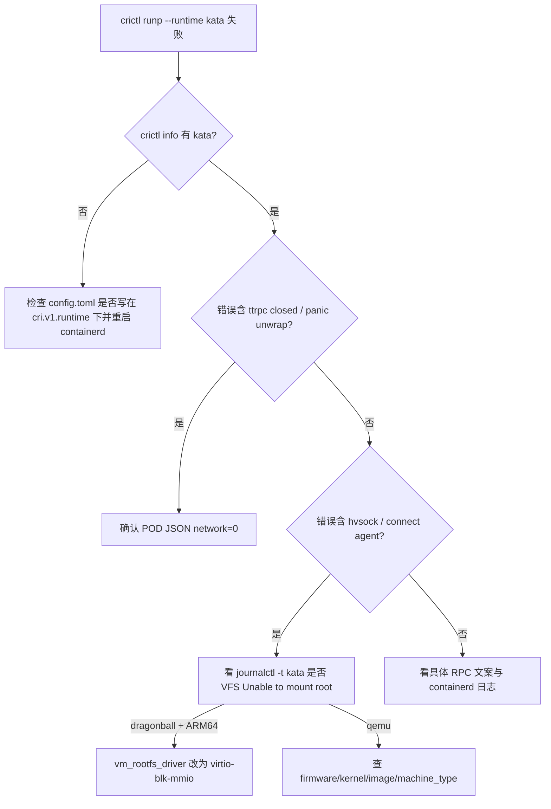

# Kata Containers：环境准备与启动失败分析

## 1. 文档概述

### 1.1 背景

本仓库用 `scripts/setup/setup.sh` 切换 runtime（`runc` / `kata`）与 hypervisor（`qemu` / `dragonball` / …），再用 `cold_start_bench.py`、`throughput_sweep.sh`、`config_matrix_sweep.sh` 做沙箱冷启动压测。

2026-07 配置矩阵与手工 setup 过程中，kata 侧连续踩到多类「看起来像启动失败、实际根因不同」的问题。本文汇总：

| 现象 | 真实根因 | 影响面 |
|------|----------|--------|
| `no runtime for "kata" is configured` | kata 写进 **旧 CRI 插件路径**，containerd v2 不读 | 矩阵 `bridge_kata_qemu` 等全部 RunPodSandbox 失败 |
| setup 报 `BPF_CGROUP_DEVICE → EINVAL` | **探测脚本 UAPI 常量错误**（假阳性） | setup 误判失败；内核实际已支持 |
| 试跑 `ttrpc: closed` / shim panic | CRI `network: 2` + kata 3.22.0 `unwrap()` | 仅错误网络模式；bench 用 `network: 0` 不受影响 |
| dragonball warmup：`kata.hvsock` ENOENT | guest **挂不上根盘**（PCI blk 在 ARM64 不可见） | `--hypervisor dragonball` 冷启动全失败 |

### 1.2 相关路径

| 组件 | 路径 |
|------|------|
| setup | `scripts/setup/setup.sh` |
| 冷启动 bench | `scripts/bench/cold_start_bench.py` |
| 配置矩阵 | `scripts/bench/config_matrix_sweep.sh` |
| containerd 配置 | `/etc/containerd/config.toml` |
| kata shim（runtime-rs） | `/opt/kata/runtime-rs/bin/containerd-shim-kata-v2` |
| kata 默认配置（symlink） | `/opt/kata/share/defaults/kata-containers/runtime-rs/configuration.toml` |
| QEMU 配置 | `.../configuration-qemu-runtime-rs.toml` |
| Dragonball 配置 | `.../configuration-dragonball.toml` |
| kata 源码（本机） | `/home/nathan/kata-containers`（tag / commit 约 3.22.0） |
| cgroup BPF（runc） | `doc/runc-cgroup-v2-bpf-device-analysis.md` |
| Ready / 时延 | `doc/sandbox-ready-and-startup-latency.md` |

### 1.3 本机关键环境（排查时）

| 项 | 值 |
|----|-----|
| 架构 | aarch64 |
| 内核 | `5.10.229+debug+`，cmdline 含 `systemd.unified_cgroup_hierarchy=1` |
| containerd | v2.3.x（CRI 插件 `io.containerd.cri.v1.runtime`） |
| kata | runtime-rs shim **3.22.0**（`io.containerd.kata.v2`） |
| 典型 CNI | bridge / ipvlan-l3，`10.0.0.0/12` |

---

## 2. 问题 A：containerd v2 未真正注册 kata

### 2.1 现象

矩阵目录示例：

`results/config_matrix/<ts>/bridge_kata_qemu/runs/run0004_...`

- `cold_start_report.json`：`success_runs: 0`
- 错误：

```text
unable to get OCI runtime for sandbox "...": no runtime for "kata" is configured
```

- 单 worker 日志：`成功: 0/N`，`sandbox_id: "FAIL"`
- `summary.csv` 仍可能标 `ok` / `failed=0`（汇总口径看的是 multi 进程退出，**不是**沙箱成功数）

`crictl info` 当时只有 `runc`，没有 `kata`。

### 2.2 根因

containerd **v2** 生效的 runtime 段是：

```toml
[plugins.'io.containerd.cri.v1.runtime'.containerd.runtimes.runc]
```

旧版 `setup.sh` 把 kata **追加到文件末尾**，写的是：

```toml
[plugins."io.containerd.grpc.v1.cri".containerd.runtimes.kata]
  runtime_type = 'io.containerd.kata.v2'
  runtime_path = '/opt/kata/runtime-rs/bin/containerd-shim-kata-v2'
  ...
```

v2 **不加载** `io.containerd.grpc.v1.cri` 下的 runtimes。  
脚本仅用 `grep io.containerd.kata.v2` 判断「已注册」→ **误报成功**。

### 2.3 修复（`setup.sh`）

1. 探测活动 CRI 插件：若存在 `io.containerd.cri.v1.runtime` 则用之，否则回退 `io.containerd.grpc.v1.cri`
2. 写入对应路径的 `runtimes.kata` 段；删除任意路径下的陈旧 kata 段
3. 用 `crictl info` 是否出现 `"kata"` 作为最终校验（必要时重启 containerd）

修复后期望：

```text
crictl info → runtimes: ['kata', 'runc']
```

手工验证（POD 网络）：

```bash
bash scripts/setup/setup.sh --cni-type bridge --runtime kata --hypervisor qemu
python3 scripts/bench/cold_start_bench.py --runtime kata --runs 3
```

### 2.4 和「矩阵数字看起来正常」的关系

失败时 `t_runp` 仍可能有 ~100ms 量级（RPC 快速返回错误）。  
吞吐汇总若把失败 attempt 当完成量，会出现「吞吐很高、成功为 0」的假象。解读 kata 矩阵时务必看：

- worker `成功: x/y`
- JSON `summary.success` / `sandbox_id == FAIL`
- cold-start `success_runs`

---

## 3. 问题 B：setup 的 BPF_CGROUP_DEVICE 探测假阳性

### 3.1 现象

```bash
bash scripts/setup/setup.sh --cni-type ipvlan-l3 --runtime kata --hypervisor qemu
```

报错类似：

```text
✗ 内核不支持 cgroup BPF device（bpf_prog_query BPF_CGROUP_DEVICE → EINVAL）
  典型原因: CONFIG_CGROUP_BPF 未开启
```

但同时：

- `zgrep CONFIG_CGROUP_BPF /proc/config.gz` → `=y`
- `bpftool feature` → `eBPF program_type cgroup_device is available`
- `crictl runp --runtime runc` / `kata`（在 kata 已注册前提下）可创建沙箱

### 3.2 根因

旧探测硬编码了**较新 UAPI**常量：

```python
BPF_PROG_QUERY, BPF_CGROUP_DEVICE = 17, 15
```

本机 5.10 BTF（`/sys/kernel/btf/vmlinux`）实际为：

| 符号 | 本机 5.10 | 脚本旧值 |
|------|-----------|----------|
| `BPF_PROG_QUERY` | **16** | 17 |
| `BPF_CGROUP_DEVICE` | **6** | 15 |

命令号错误 → `bpf(2)` 返回 `EINVAL` → 误判「内核不支持」。

> 说明：历史上确实存在「内核未开 `CONFIG_CGROUP_BPF`」导致 runc 真失败的情况，见 `doc/runc-cgroup-v2-bpf-device-analysis.md`。  
> **本次报错与那篇文档的真缺配置不是同一件事**；当前 debug 内核已开启该选项，失败来自探测常量。

### 3.3 修复

`_cgroup_bpf_device_ok` 依次尝试候选 `(16,6)`、`(17,15)`，并以 128 字节 `bpf_attr` 缓冲（对齐 libbpf/bpftool）。任一成功即视为支持。

---

## 4. 问题 C：错误网络模式触发 kata 3.22.0 panic

### 4.1 现象

手工 smoke 若使用：

```json
"linux": { "security_context": { "namespace_options": { "network": 2 } } }
```

可能看到：

```text
failed to create shim task: ttrpc: closed
```

dmesg / journal：

```text
A panic occurred at .../runtime-rs/crates/runtimes/src/manager.rs:393:
called `Option::unwrap()` on a `None` value
```

### 4.2 CRI `network` 取值

| 值 | 含义 | 典型 OCI |
|----|------|----------|
| `0` | POD 网络 | 有独立 netns + CNI，`linux.namespaces` 含带 `path` 的 network |
| `2` | NODE（宿主机网络） | 往往 **没有**可用的 netns 路径 |

本仓库 bench 使用 **`network: 0`**（见 `cold_start_bench.py` → `prepare_pod_config`）。

### 4.3 源码（kata 3.22.0）

`src/runtime-rs/crates/runtimes/src/manager.rs`（commit `a164693e` 附近）：

```rust
spec.annotations_mut().as_mut().unwrap().insert(
    "nerdctl/network-namespace".to_string(),
    netns.clone().unwrap(),
);
```

`annotations` 或 `netns` 为 `None` 时直接 panic → shim 退出 → containerd 报 `ttrpc: closed`。

上游 main 已改为在 `netns` 存在时再插入，并对空 `annotations` 做初始化，避免 unwrap。

### 4.4 结论

- **不是** QEMU/Dragonball 本身「起不来」的根因描述；是 shim 在坏输入下崩溃。
- 矩阵 / bench 路径用 POD 网络，**不依赖**该 bug 也能工作（在 runtime 已正确注册的前提下）。
- 手工验证请与 bench 对齐：`network: 0`。

---

## 5. 问题 D：Dragonball（ARM64）根盘驱动错误

### 5.1 现象

```bash
bash scripts/setup/setup.sh --cni-type ipvlan-l3 --runtime kata --hypervisor dragonball
```

前置检查可全部通过，但 **warmup**（内部调 `cold_start_bench.py`）失败。表层错误：

```text
hybrid vsock: failed to connect to .../kata.hvsock
No such file or directory (os error 2)
```

### 5.2 真实 guest 日志

VM / vCPU 能起来，随后：

```text
/dev/root: Can't open blockdev
VFS: Cannot open root device "/dev/vda1" or unknown-block(0,0): error -6
Kernel panic - not syncing: VFS: Unable to mount root fs on unknown-block(0,0)
```

guest 未完成启动 → agent 未监听 → 宿主机 `kata.hvsock` 连不上 → 表象为 hvsock ENOENT。

默认 `configuration-dragonball.toml`：

```toml
vm_rootfs_driver = "virtio-blk-pci"
block_device_driver = "virtio-blk-pci"
kernel = ".../vmlinux-dragonball-experimental.container"
image = ".../kata-containers.img"
```

在本机 aarch64 上，PCI virtio-blk 根盘 **guest 侧不可见**；改为 mmio 后设备以 `driver_option: "mmioblk"`、`virt_path: "/dev/vda"` 挂上，沙箱 `SANDBOX_READY`。

### 5.3 修复（`setup.sh`）

当 `--hypervisor dragonball` 且架构为 aarch64/arm64 时：

```toml
vm_rootfs_driver = "virtio-blk-mmio"
block_device_driver = "virtio-blk-mmio"
```

（对 `configuration-dragonball.toml` 做 sed；该文件由 `configuration.toml` symlink 指向。）

验证：

```bash
bash scripts/setup/setup.sh --cni-type ipvlan-l3 --runtime kata --hypervisor dragonball
# warmup 期望 3/3 成功；本机约 1.6–1.7s / 次
```

### 5.4 与 QEMU ARM 修补的对比

| Hypervisor | ARM64 setup 修补 |
|------------|------------------|
| qemu | `machine_type=virt`、edk2 firmware、`virtio-pmem`→`virtio-blk-pci` 等 |
| dragonball | **`virtio-blk-pci`→`virtio-blk-mmio`（根盘/块设备）** |

QEMU 路径在相同环境下用 PCI blk 可工作；Dragonball 需 mmio。不要假定「kata 默认 toml 开箱即用」。

---

## 6. 推荐排查顺序



常用命令：

```bash
# 1) runtime 是否对 CRI 可见
crictl info | python3 -c "import sys,json;print(list(json.load(sys.stdin)['config']['containerd']['runtimes']))"

# 2) 当前 hypervisor 配置
readlink -f /opt/kata/share/defaults/kata-containers/runtime-rs/configuration.toml
rg -n '^(kernel|image|vm_rootfs_driver|block_device_driver|machine_type|firmware) ' \
  /opt/kata/share/defaults/kata-containers/runtime-rs/configuration.toml

# 3) 一次失败后的 guest/shim 日志
journalctl -t kata --since '2 min ago' --no-pager
dmesg | tail -50

# 4) BPF 探测（可选）
bpftool feature | rg cgroup_device
zgrep CONFIG_CGROUP_BPF /proc/config.gz
```

---

## 7. setup / 压测使用注意

1. **切换 hypervisor 必须走 setup**（或手动改 symlink + 驱动字段），否则仍指向上一轮配置。
2. **不要用 `network: 2` 验证 kata**；与 bench 保持 `network: 0`。
3. 解读矩阵结果时看 **success 计数**，不要只看吞吐或 `summary.csv` 的 `ok`。
4. dragonball 在 aarch64 上依赖 experimental guest kernel；失败时先查根盘，再查 vsock。
5. setup 的 BPF 检查失败时，先确认是否假阳性（config.gz / bpftool），再决定是否改内核或回 cgroup v1。

---

## 8. 代码改动摘要（本仓库）

文件：`scripts/setup/setup.sh`

| 改动 | 目的 |
|------|------|
| 按活动 CRI 插件路径注册 / 迁移 kata | 修复 containerd v2「假注册」 |
| `crictl info` 校验 kata | 避免仅 grep 配置误报 |
| BPF 探测多常量 + 128B attr | 修复 5.10 上 EINVAL 假阳性 |
| dragonball ARM64 → `virtio-blk-mmio` | 修复 guest 无法挂根盘 |

相关提交示例：

- `fix(setup): 按 containerd v2 CRI 路径注册 kata，并修正 BPF 探测误报`
- （后续）dragonball ARM64 mmio 根盘修补

---

## 9. 参考

- Kata runtime-rs `manager.rs`（3.22.0 中 annotations/netns unwrap；上游后续有防护）
- containerd CRI v1 runtime 配置：`plugins.'io.containerd.cri.v1.runtime'.containerd.runtimes.*`
- 本仓库：`doc/runc-cgroup-v2-bpf-device-analysis.md`、`doc/sandbox-ready-and-startup-latency.md`
