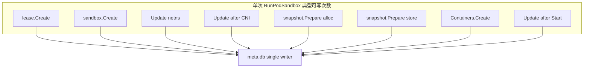

# 沙箱冷启动性能瓶颈分析

## 1. 文档概述

### 1.1 背景

在 AI Agent / 多租户场景下，Pod 沙箱冷启动延迟直接影响并发创建吞吐。本文基于一次高并发压测，按「**观测数据 → 瓶颈候选 → 逐项深挖**」的顺序，定位 containerd + bridge CNI 场景下的主要瓶颈。

### 1.2 分析路径

1. 汇总 profile / pprof / perf / resources 四类观测
2. 从耗时与热点交叉出若干瓶颈点
3. 对每个瓶颈点下钻到机制（用户态锁、内核锁、进程模型等）
4. 给出对照实验与复现命令

### 1.3 数据来源

| 类型 | 路径 | 说明 |
|------|------|------|
| 结果根目录 | `tmp/containerd-0-127_workers-cores-128-255_workers-nums-127_sandbox-0-255/` | 本次压测输出 |
| profile | `.../profile` | containerd TRACE 各阶段汇总 |
| pprof | `.../pprof/` | Go CPU / mutex / block / goroutine |
| perf | `.../perf/` | containerd CPU 1–4 on/off-CPU 火焰图 |
| resources | `.../resources/` | 系统资源时序与延迟关联报告 |

采集入口：`scripts/multi_single_cold_start.sh`（`--profile --pprof --perf --resources`）。

---

## 2. 压测配置与总体结果

### 2.1 环境与绑定

| 项 | 值 |
|----|-----|
| 主机 | HM70，aarch64，内核 5.10.229，2 × NUMA，256 核 |
| containerd | v2.3.0-100-g36696e157.m |
| Workers | **128**（绑定 CPU **128–255**，NUMA 1） |
| containerd CPU | **1–4**（仅 4 核） |
| 沙箱 CPU | `--cpuset-cpus 0-255`，`--cpuset-mems 0-1` |
| 时长 / 预配置 | `--duration 60`，`--preconfig 50` |
| CNI | bridge（基线 `ipMasq: true`；后续对照改为 `false`，见 §2.3 / §7.5） |

### 2.2 端到端延迟（resources，初始基线）

| 指标 | 数值 |
|------|------|
| 总沙箱数 | 747 |
| P50 / P95 / P99 | **11151 / 15617 / 17139 ms** |
| 资源瓶颈标记 | **`containerd_cpu_saturation`** |
| Spike（约 51s） | P95 ≈ 16.3s，同时约 616 个沙箱活跃 |

**宏观结论（初始基线）**：128 路并发下冷启动 P95 约 **15.6s**；系统标记 containerd CPU 饱和。后续优化后的当前工作点见 §2.3。

### 2.3 优化阶梯与当前工作点（同配置对照）

同配置除非另注：128 workers、containerd 绑核 1–4、`--duration 60`。数据目录在 `profile/`。

| 阶梯 | 吞吐（沙箱/s） | 端到端 P95 | `cri.sandbox.run` Avg | `cni.setup` Avg | 当前头号阶段 |
|------|----------------|------------|----------------------|-----------------|--------------|
| 初始基线（printk 开、`ipMasq: true`） | **~12.8** | **~15.6s** | ~11.7s | **~5.2–5.8s** | CNI ≈ NewTask |
| + 关 printk（`0d91342dba12`） | **~15.1** | **~13.1s** | 8.86s | **1.21s** | NewContainer ~30% |
| + `ipMasq: false`（目录较干净） | **~17.3** | **~10.7s** | 6.92s | **386ms** | **NewTask ~36%** |
| 同上 + host-local 预填 5000（无索引） | （以 profile 为主） | run P95 ~12.8s | 9.26s | **8.83s** | **CNI / bridge** |
| + host-local **旁路索引**（`by_id.idx`） | — | run P95 **~11.9s** | **7.49s** | **342ms** | **NewTask ~3.24s**；**端到端未见收益** |
| + runc：**跳过缺失 cgroup 控制器的 mountinfo**（misc） | — | run P95 **~9.4s** | **6.45s** | **245ms** | **NewContainer ~2.3s**（见 §8.4） |
| + 细粒度 TRACE 复测（同环境，2026-07-21） | — | run P95 **~12.8s** | **6.36s** | **303ms** | **NewTask ~3.77s**（见 §8.5） |

**当前工作点（2026-07-21）**：关 printk + `ipMasq: false` + misc 短路 + 最新 shim/runc TRACE（profile 复测，`cri.sandbox.run` Cnt≈473）：

| Span | Avg | 约占 `cri.sandbox.run` |
|------|-----|------------------------|
| `cri.sandbox.run` | **6.36s**（P95 **12.8s**） | 100% |
| **`container.NewTask`** | **3.77s** | **~59%** ← **头号** |
| `client.NewContainer` | **985ms** | ~15%（较 misc 刚短路后的 ~2.3s 已降） |
| `cni.setup_pod_network` | **303ms** | ~5% |
| `client.task.Start` | **345ms** | ~5% |
| `runc.create`（合并 TRACE） | **2.18s** | —（含 pause+业务等，Cnt=1023） |
| └ `runc.cgroup.apply` | **1.03s** | runc 内最大头（cpuset/devices/memory） |
| └ `runc.init.sync` | **693ms** | 几乎全是等子进程（§8.5） |
| `shim.cgroup.load` | **734ms** | NewTask 内新暴露次桶 |

host-local 旁路索引相对干净目录基线仍**未见端到端收益**（§7.5）。下一刀：**cgroup.apply / shim.cgroup.load / init.sync 等待**，以及贯穿全程的 **bbolt `.tx.wait`**（§8.5 / §9）。

---

# 第一部分：观测数据

以下各节只陈述事实与表面热点，机制分析放在第三部分。

---

## 3. Profile：阶段耗时

来源：`profile` 中 `cri.sandbox.run` 树（约 145 次完整 run）。

### 3.1 关键阶段

| Span | Count | Avg | P50 | P95 | P99 |
|------|-------|-----|-----|-----|-----|
| **cri.sandbox.run** | 145 | **11.73s** | 11.31s | 17.27s | 18.77s |
| **cni.setup_pod_network** | 297 | **5.77s** | 5.60s | 10.38s | 11.18s |
| └ cni.plugin.bridge | 297 | 5.77s | 5.60s | 10.38s | 11.18s |
| └ cni.plugin.loopback | 200 | 1.00s | 759ms | 2.39s | 3.04s |
| **container.NewTask** | 154 | **4.76s** | 4.67s | 7.76s | 8.16s |
| └ shim.task.create | 154 | 4.12s | 4.03s | 7.21s | 7.43s |
| └ shim.binary.exec | 227 | 576ms | 566ms | 1.39s | 2.14s |
| client.NewContainer | 226 | 565ms | 263ms | 2.95s | 3.19s |
| └ snapshotter.Prepare | 238 | 278ms | 110ms | 1.39s | 1.73s |
| client.task.Start | 153 | 327ms | 320ms | 585ms | 904ms |
| metadata.sandbox.Create | 203 | 225ms | 237ms | 323ms | 337ms |
| metadata.sandbox.Update | 558 | 258ms | 210ms | 677ms | 817ms |

### 3.2 占比（按 Avg）

```
cri.sandbox.run ≈ 11.73s
├── cni.setup_pod_network ≈ 5.77s   (~49%)
│     ├── cni.plugin.bridge   （主导）
│     └── cni.plugin.loopback （Avg ~1.0s）
├── container.NewTask     ≈ 4.76s   (~41%)
├── client.NewContainer   ≈ 0.57s   (~5%)
├── client.task.Start     ≈ 0.33s   (~3%)
└── metadata / status     分散多次（单次不高，Update 次数多）
```

**数据要点**：端到端时间几乎被 **CNI 配网** 与 **shim/NewTask** 平分；CNI 内 bridge 为主，loopback 单独也有约 1s 量级。

---

## 4. pprof：containerd 用户态

来源：`pprof/pprof_analysis.txt`、`pprof/svg/`。

### 4.1 CPU

| 热点 | flat% | 含义 |
|------|-------|------|
| `Syscall6` | **36.2%** | 大量系统调用 |
| `bbolt.(*Tx).write` | **12.5%** | metadata BoltDB 写盘 |
| runtime GC / malloc | 若干 | 高并发分配压力 |

### 4.2 Mutex（测试窗口增量）

| 热点 | 占比 | 调用链含义 |
|------|------|------------|
| `sync.(*Mutex).Unlock` 相关等待 | **~80%** | 等在 `metadata.(*DB).Update` |
| `RunPodSandbox` → `metadata.update` | ~80% cum | 128 路 gRPC 争用同一把 DB 锁 |
| `snapshotter.Prepare` | ~19% | 快照路径也争用 DB |
| `gcScheduler` / `GarbageCollect` | ~19% | GC 与创建路径争锁 |

### 4.3 Block / Goroutine

- Block：**~95%** `runtime.selectgo` → 大量 goroutine 在等外部工作（CNI / shim / gRPC 等）
- Goroutine 数：约 **1201 → 6226**，随沙箱数增长

**数据要点**：containerd 进程内可见的争用主要是 **metadata DB**；CNI/shim 耗时在 pprof 里更多表现为阻塞等待，而不是 Go 侧 CPU 热点。

---

## 5. perf：内核与 off-CPU

来源：`perf/on_cpu_1-4.svg`、`perf/off_cpu_1-4.svg`（仅 **containerd 绑定核 1–4**）。

### 5.1 On-CPU（显著符号）

| 符号 / 进程 | 相对显著 | 表面含义 |
|-------------|----------|----------|
| `bridge` / `loopback`（CNI 插件进程） | 高 | 配网插件在跑 |
| `netlink_*` / `rtnetlink_*` / `rtnl_*` | 高 | 内核 rtnetlink 路径活跃 |
| `rtnl_setlink` | **~7.3%** | `RTM_SETLINK` 改链路 |
| `rtnl_newlink` | ~0.3–0.5% | 新建链路 |
| `printk` / `pl011_console_write` | **~6.7%**（多在 `rtnetlink_rcv_msg` 之下） | bridge STP 状态日志打到串口（见 §7.5） |
| `loopback` / `loopback_net_init` | ~2.3% / ~0.5% | lo 相关 |
| `xtables-nft-multi` / `iptables` | 高 | 本配置下还有 netfilter 规则写入 |
| `runc` / `containerd-shim` | 高 | 启动 shim |
| `bbolt.(*Tx).write` | 中 | metadata 持久化 |

### 5.2 Off-CPU

| 热点 | 表面含义 |
|------|----------|
| `futex` / `__schedule` | 等锁、调度、睡眠 |
| `containerd-shim` / `runc` | shim 创建路径上的等待 |
| `bridge` | 配网过程中的阻塞 |
| `loopback_net_init` → `register_netdev` → `rtnl_lock_killable` | 建 netns 注册 `lo` 时卡在 RTNL 加锁 |

> 本次 perf **未覆盖** worker 核 128–255。分析沙箱侧 CPU 需加 `--perf_sandbox`。

**数据要点**：核 1–4 上配网（bridge/loopback/netlink）与 shim 都很热；`rtnetlink_rcv_msg` 栈上可见大量 `printk`→串口输出；off-CPU 大量 futex，且已能看到与 `rtnl_lock*` 相关的等待栈。

---

## 6. resources：系统资源

来源：`resources/report.md`、`resources/summary.json`。

| 指标 | 观察 | 解读 |
|------|------|------|
| `containerd_cpu_saturation` | 已标记 | containerd 4 核成为漏斗 |
| `k8s_io_cpu_pct` vs P95 | Pearson **r ≈ 0.59** | 延迟升高时 CRI 路径 CPU 也升高 |
| `io_iostat.util_pct` vs P95 | **r ≈ -0.66** | 磁盘利用率与延迟负相关，**非主因** |
| `io_iostat.w_await_ms` | P50 ≈ 0.17ms | 写延迟很低 |
| `load_1m` | 最高 ≈ 112 | 系统调度压力大 |
| `context_switches_per_s` | 最高 ≈ 547 万/s | 极高上下文切换 |
| 内存 / NUMA | 充足 | **排除**内存瓶颈 |

约 **51s** 处 Spike：P95 ≈ 16.3s，沙箱数 ≈ 616，伴随 high_containerd_cpu。符合「高并发叠加 → 各阶段更慢」的模式。

---

# 第二部分：瓶颈候选

由上述观测交叉，得到下列待深挖的瓶颈点（按对端到端时延的直接贡献排序）。

| # | 瓶颈点 | 主要依据 | 待回答的问题 |
|---|--------|----------|--------------|
| A | **CNI 网络配置时延高** | profile：`cni.setup` ~49%，P95 ~10s；含 bridge + loopback | 时间花在哪些内核/用户态路径？为何并发下急剧恶化？ |
| B | **shim / NewTask 创建慢** | profile：NewTask ~41%；perf：shim/runc + futex | 是 fork/exec、等就绪，还是别的？ |
| C | **metadata DB 争用** | pprof mutex ~80% 在 `DB.Update`；CPU 含 bbolt.write | 是否把 128 路 RunPodSandbox 串行化？ |
| D | **containerd 仅 4 核** | resources：`containerd_cpu_saturation` | 是否放大上述所有竞争？ |
| — | 磁盘 / 内存 | resources 负相关 / 充足 | **排除为主因** |

```
观测交叉示意：

profile:  CNI ~5.8s  +  NewTask ~4.8s  ≈  11.7s
              │                │
perf:     bridge/loopback   shim/runc/futex
          netlink/rtnl_*
              │                │
pprof:    selectgo 等待      mutex → DB.Update
              │                │
resources: containerd 4 核饱和；磁盘/内存非主因
```

---

# 第三部分：逐项深挖

---

## 7. 瓶颈 A：CNI 网络配置时延高

### 7.1 现象

- `cni.setup_pod_network` Avg **5.77s**，P95 **~10.4s**，约占 `cri.sandbox.run` 的一半。
- 子 span：`cni.plugin.bridge` 主导；`cni.plugin.loopback` Avg 仍约 **1.0s**（每个沙箱都会跑）。
- perf：核 1–4 上 `bridge`、`loopback`、`rtnetlink`/`rtnl_*` 显著；off-CPU 可见 `rtnl_lock_killable`。
- 火焰图中 **`rtnetlink_rcv_msg` 上方（子栈）出现大量 `printk` → `pl011_console_write`**，需单独解释（§7.5）。

结论先停留在：**配网阶段本身就是最大时间桶**；需要回答「配网内部卡在什么机制」。

### 7.2 下钻：rtnetlink 路径与全局锁 `rtnl_mutex`

对配网热点沿火焰图下钻，用户态 CNI 经 netlink `sendto` 进入内核：

```
CNI 插件（bridge / loopback）
  → sendto(netlink)
  → rtnetlink_rcv_msg
  → rtnl_lock() / rtnl_lock_killable()
  → doit（rtnl_newlink / rtnl_setlink / …）
```

内核中保护整条路径的是 **`rtnl_mutex`**（`net/core/rtnetlink.c`）：

| 项 | 说明 |
|----|------|
| 范围 | **主机全局一把**，不按 netns 分锁 |
| 入口 | `rtnl_lock()` / `rtnl_lock_killable()` |
| 持锁工作 | `rtnl_newlink`、`rtnl_setlink`、`register_netdev` 等链路与 netdev 注册 |
| 用户态 API | `vishvananda/netlink`：`LinkAdd`、`LinkSetMaster`、`LinkSetUp`、`LinkByName` 等 |

**这是从「CNI 时延高」推出的核心机制：高并发下大量配网操作在 `rtnl_mutex` 上串行。**

### 7.3 持锁 / 等锁时，CPU 会不会被让出？

`rtnl_mutex` 是 **sleeping mutex**（`mutex_lock` / `mutex_lock_killable`），**不是** spinlock。持锁与等锁对 CPU 的行为不同，需分开看：

| 角色 | 是否占用 CPU 跑临界区 | 会不会让出 CPU | 说明 |
|------|----------------------|----------------|------|
| **等锁者**（未拿到 `rtnl_mutex`） | 否（阻塞等待） | **会** | `mutex_lock*` 拿不到锁时进入睡眠，经 `schedule` 让出 CPU；其它线程/进程可在该核上运行 |
| **持锁者**（已拿到锁，正在跑 doit） | **通常会**（执行 `rtnl_setlink` / `newlink` / `register_netdev` 等） | **可以，但不等于「因持锁而主动让出」** | 临界区内是普通内核路径：可被抢占；也可能在持锁期间因内存分配等进入睡眠。睡眠时 **CPU 让出，但锁仍被占用** |

要点：

1. **等锁会让出 CPU**  
   等高并发 CNI 时，大量线程堵在 `rtnl_lock*` / `mutex_lock*` 上睡觉，对应 perf **off-CPU**（如 `loopback_net_init → register_netdev → rtnl_lock_killable`）。这些线程 **不空转占核**，但端到端延迟照样涨——在等唯一持锁者做完。

2. **持锁者主要在消耗 CPU 做配网工作**  
   拿到锁之后要跑完链路配置；火焰图 **on-CPU** 上 `rtnl_setlink` ~7% 等帧，就是持锁临界区在跑。mutex **不会**像 spinlock 那样关抢占死占核空转；但临界区本身往往是 CPU 密集的内核工作，表现为占核执行。

3. **「让出 CPU」≠「放开锁」**  
   - 等锁者：让出 CPU，且 **未持锁**。  
   - 持锁者若在临界区内 sleep：让出 CPU，但 **`rtnl_mutex` 仍被持有**，其它配网请求继续排队——这是 mutex 允许 sleep 带来的典型放大点（锁持有时间变长）。  
   - 因此：不能指望「持锁线程 sleep 了，别人就能配网」；全局串行仍然成立。

4. **和本压测的对应关系**

```
线程 A：持锁跑 rtnl_setlink / register_netdev …  →  on-CPU（占核做活）
线程 B/C/…：mutex_lock 失败 → schedule 睡眠     →  off-CPU（让出 CPU，等锁）
         ↑
    同一把 rtnl_mutex：A 做完才轮到下一个
```

对 containerd 绑定的 **4 核**而言：等锁线程让出 CPU 后，核可以被持锁配网、shim、其它工作使用；但配网吞吐仍被 **一把锁串行**卡住，多核帮不上「并行配网」。这与 resources 里的 CPU 饱和、以及「大量 futex/schedule 等待」可以同时成立。

### 7.4 谁在抢这把锁（不只是 bridge）

火焰图与内核/CNI 源码对照：凡改链路或注册 netdev 都会拿 RTNL。本压测至少包括：

| 调用方 | 典型操作 | 内核路径（示意） | 证据 |
|--------|----------|------------------|------|
| **建 netns** | 沙箱网络命名空间初始化 | `loopback_net_init` → `register_netdev` → `rtnl_lock_killable` | off-CPU 同栈 |
| **CNI loopback** | `netlink.LinkSetUp(lo)` | `RTM_SETLINK` → `rtnl_setlink` → `dev_change_flags` | profile loopback ~1s；on-CPU 进程 `loopback` ~2.3%；IPv6 `init_loopback` 有 `ASSERT_RTNL()` |
| **CNI bridge** | 建 veth、设 master、起停口 | `rtnl_newlink` / `rtnl_setlink` / `do_set_master` → `br_add_if` | on-CPU `rtnl_setlink` ~7.3% |
| 其它 | `getlink`、地址/路由 notifier | `rtnl_getlink`、`inetdev_event` / `fib_*` 等 | 火焰图可见 |

一次冷启动上的 RTNL 竞争示意：

```
RunPodSandbox
  └─ cni.setup_pod_network
       ├─ [netns 创建]  loopback_net_init → register_netdev ──┐
       ├─ cni.plugin.loopback  LinkSetUp(lo) ────────────────┼─ rtnl_mutex（全局串行）
       └─ cni.plugin.bridge    veth / setmaster / up ────────┘
```

要点：

- **loopback 与 bridge 共用同一把锁**；loopback 看似轻，但每沙箱必跑，会放大尾延迟。
- 关某一类用户态附加步骤（例如本配置里的 masquerade）**不能消除** RTNL；只要还有 netns/lo/veth/bridge 链路操作，锁仍在。

### 7.5 火焰图中的 `printk`：为何出现在 `rtnetlink_rcv_msg` 下

#### 现象

on-CPU 火焰图 / `perf report` call-graph 中，在 **`rtnetlink_rcv_msg` 之下**（不是之上；堆栈自下而上为调用者→被调用者）可见大段：

```
printk → vprintk_emit → console_unlock → pl011_console_write → …
```

定量：`printk` 相关 children 约 **6.7%**，几乎全部落在 **`pl011_console_write`（ARM UART 串口控制台）**。容易误解成「rtnetlink 协议栈在狂打日志」——实际不是。

#### 调用链（perf 还原）

```
rtnetlink_rcv_msg          ← 持 rtnl_mutex 处理 RTM_SETLINK
  → rtnl_setlink
  → do_setlink
  → do_set_master
  → br_add_slave / br_add_if   ← CNI bridge 把 veth 挂到网桥
  → br_init_port / br_stp_enable_port / …
  → br_set_state               ← 切换 STP 端口状态
  → br_info(…) → printk(…)
  → console_unlock → pl011_console_write   ← 同步写串口，极慢
```

即：**CNI bridge 加端口 → 内核 bridge STP 改状态 → 打 KERN_INFO → 当前 console_loglevel 允许打到串口 → CPU 耗在 UART。**

#### 结合代码

1. **STP 状态变更必打 info 日志**（`net/bridge/br_stp.c`）：

```c
void br_set_state(struct net_bridge_port *p, unsigned int state)
{
	/* ... */
	p->state = state;
	err = switchdev_port_attr_set(p->dev, &attr);
	if (err && err != -EOPNOTSUPP)
		br_warn(...);
	else
		br_info(p->br, "port %u(%s) entered %s state\n",
			(unsigned int) p->port_no, p->dev->name,
			br_port_state_names[p->state]);
	/* ... */
}
```

每个沙箱把 veth 加入 bridge 时，端口会经历 blocking / listening / learning / forwarding 等切换，**每次 `br_set_state` 成功路径都走 `br_info`**。高并发下日志条数随沙箱数 × 状态切换次数膨胀。

2. **`br_info` 就是带级别的 `printk`**（`net/bridge/br_private.h`）：

```c
#define br_printk(level, br, format, args...) \
	printk(level "%s: " format, (br)->dev->name, ##args)

#define br_info(__br, format, args...) \
	br_printk(KERN_INFO, __br, format, ##args)
```

`KERN_INFO` 对应级别 **6**。本机压测时 `/proc/sys/kernel/printk` 首项 **console_loglevel=7**，INFO 会输出到 console。

3. **为何 CPU 占比高**：`printk` 写入 ring buffer 后，若未按级别抑制，会走 `console_unlock` → 各 console 驱动。本机是 **PL011 串口**，按字符输出，远慢于内存日志；故火焰图热点在 `pl011_console_write`，而不是「格式化字符串」本身。

4. **与 `rtnl_mutex` 的关系**：上述路径发生在 **`rtnl_setlink` 持锁临界区内**。串口打印拉长持锁时间 → 其它等锁的配网请求排队更久。因此 `printk` 既是独立的 on-CPU 浪费，也是 RTNL 串行的放大器。

#### 调 `console_loglevel` 能否去掉？

| 手段 | 还会调用 `br_info`/`printk`？ | 还写 dmesg ring buffer？ | 还写串口（火焰图热点）？ |
|------|------------------------------|--------------------------|---------------------------|
| `dmesg -n 4` 或 `kernel.printk='4 4 1 7'` | **会** | **会** | **基本不会**（INFO 被 `suppress_message_printing` 跳过） |
| 去掉/不用串口 console | 会 | 会 | 不会 |
| 改内核去掉 `br_info` | 不会 | 不会 | 不会 |

内核逻辑（`level >= console_loglevel` 则不上 console）：把 console 调到 **4** 即可让 INFO 不上串口，**打掉火焰图里绝大部分 `pl011_*`**；但不会让 `br_set_state` 里的 `br_info` 调用消失。压测对照：

```bash
# 临时抑制 INFO 上串口（推荐压测时使用）
sudo dmesg -n 4
# 或: echo '4 4 1 7' | sudo tee /proc/sys/kernel/printk

# 恢复
sudo dmesg -n 7
```

#### 对照实验：内核去掉 netlink/`br_info` 路径上的 `printk`（已完成）

内核 commit **`0d91342dba12`**（`disable netlink printk`）：注释 `br_stp.c` 中 `br_set_state` 成功路径的 `br_info`，并一并关掉 `net/core/dev.c`、`net/ipv6/addrconf.c` 等配网热路径上的相关 `printk`。数据目录：

| 场景 | 路径 |
|------|------|
| 基线（含 printk） | `profile/containerd-0-127_workers-cores-128-255_workers-nums-127_sandbox-0-255` |
| 关 printk | `profile/..._disable-printk` |

同配置：128 workers、containerd 绑核 1–4、`--duration 60`。

| 指标 | 基线 | 关 printk | 变化 |
|------|------|-----------|------|
| 吞吐（沙箱/s，总沙箱÷采样窗） | **~12.8**（747 / 58.4s） | **~15.1**（895 / 59.1s） | **+18%**（约 11→15 量级） |
| 端到端 P50 / P95 / P99 | 11.2 / **15.6** / 17.1 s | 9.5 / **13.1** / 14.3 s | P95 **−16%** |
| `cni.setup_pod_network` Avg / P95 | **5.15s** / 6.77s | **1.21s** / 2.41s | Avg **约 −77%** |
| `cri.sandbox.run` Avg / P95 | 13.1s / 19.4s | 8.9s / 12.2s | 明显下降 |
| on-CPU `printk` / `pl011_console_write` | 有（约 1.8%） | **消失** | 串口路径被打掉 |
| on-CPU `rtnl_setlink` / `br_add_if` | **~7.3%** | **~0.4%** | 持锁临界区 CPU 占比大降 |
| containerd 核 mpstat **idle**（mean / p50） | **12.0% / 5.9%** | **1.1% / 0.8%** | idle 几乎被吃光 |
| containerd 核 mpstat **usr**（mean） | 22.6% | **32.6%** | 用户态更忙；sys ≈65% 两边相近 |
| 在飞沙箱数 mean / 上下文切换 | 356 / ~4.1M/s | **491** / **~6.0M/s** | 并发态与调度更密 |
| containerd RSS mean | 369 MB | **501 MB** | 更多并发态占用 |

**阶段占比变化**（相对 `cri.sandbox.run` Avg；同窗口 profile）：

| 阶段 | 基线 Avg（约占 run） | 关 printk Avg（约占 run） |
|------|----------------------|---------------------------|
| `cni.setup_pod_network` | 5.15s（~39%） | 1.21s（~14%） |
| `container.NewTask` | 6.32s（~48%） | 1.71s（~19%） |
| `client.NewContainer` | 0.53s（~4%） | **2.69s（~30%）← 新的第一大项** |
| `client.snapshotter.Prepare` | 0.23s | **1.06s（约 +3.5×）** |
| `metadata.sandbox.Update` | 0.15s | **0.63s（约 +3.3×）** |
| `runc.cgroup.apply` | 3.09s | **0.32s（约 −90%）** |

**解读**：

1. 关 `printk` 后 **CNI 不再是第一大阶段**；按占比 **`client.NewContainer`（含 snapshotter / metadata）成为新的头号阶段**。
2. 这直接验证了 §7.5 的因果：`br_info`→串口不是旁路噪音，而是 **RTNL 持锁放大器**；去掉后配网墙钟与 `rtnl_setlink` 帧同步下降。
3. **CPU 利用率上升、idle 下降是预期现象，不是回退**：基线里大量线程堵在 `rtnl_lock*` 上等锁睡觉（§7.3），holder 在串口上慢慢打日志，4 个 containerd 核上仍能看到可观 idle；关 `printk` 后持锁变短、排队变短，同一批核更多地在跑有效工作（usr↑），idle 从 ~12% 降到 ~1%。**更高利用率对应更高吞吐**，原先 idle 是「等锁空转」。
4. **连带变快：NewTask / cgroup**：`container.NewTask`、`runc.cgroup.apply` 也大幅下降。串口不再占满 4 核持锁路径后，shim/runc 少受队头阻塞，属于共享核上的「松绑」，不只是 CNI 自己变快。
5. **连带变慢并被暴露：NewContainer / metadata / snapshotter**：在飞沙箱更多，工作更早堆到 bbolt 与 snapshot 路径，Avg 升约 3–4×。关 printk 等于把下一层瓶颈推到台前（与瓶颈 C 一致）。
6. **火焰图相对结构变化**：bridge on-CPU 份额下降（~19%→~11%），**iptables / xtables 相对更显眼**（~21%→~25%）——配网主路径轻了之后，本配置 `ipMasq` 的成本更容易看见。
7. 吞吐仍受 `rtnl_mutex`、metadata、4 核漏斗等约束，故不是线性翻倍；但 **~+18% 吞吐、CNI Avg 降到约 1/4** 已说明串口日志是高杠杆项。下一轮对照宜优先：**bbolt/snapshot 争用**、以及 **关 `ipMasq`**（见下节，已完成）。
8. 生产侧更稳妥的等价手段仍是 **`dmesg -n 4` / 调低 console_loglevel** 或不用串口 console；内核注释 `br_info` 适合对照实验，不宜长期作为唯一修复。

#### 对照实验：`ipMasq: false`（关 printk 之上，已完成）

在 **`0d91342dba12` 关 printk** 不变的前提下，仅将 CNI 配置改为 `"ipMasq": false`（`scripts/setup.sh --cni-type bridge --ip-masq false`），去掉每沙箱 `SetupIPMasq` → `iptables`/`nft` 写 NAT。数据目录：

| 场景 | 路径 |
|------|------|
| 关 printk + `ipMasq: true` | `profile/..._disable-printk` |
| 关 printk + `ipMasq: false` | `profile/..._disable-printk_ip-masq-false` |

同配置：128 workers、containerd 绑核 1–4、`--duration 60`。

| 指标 | 关 printk（ipMasq true） | + ipMasq false | 变化 |
|------|-------------------------|----------------|------|
| 吞吐（沙箱/s） | **~15.1**（895 / 59.1s） | **~17.3**（1023 / 59.1s） | **+14%** |
| 端到端 P50 / P95 / P99 | 9.5 / **13.1** / 14.3 s | 7.7 / **10.7** / 11.8 s | P95 **−18%** |
| `cni.setup_pod_network` Avg / P95 | **1.21s** / 2.41s | **386ms** / 835ms | Avg **约 −68%** |
| `cni.plugin.bridge` Avg | 1.20s | **381ms** | 与 setup 同步下降 |
| `cni.plugin.loopback` Avg | 174ms | 166ms | **基本不变**（无 masq 路径） |
| `cri.sandbox.run` Avg / P95 | 8.86s / 12.2s | 6.92s / 10.3s | 明显下降 |
| on-CPU **`iptables`**（核 1–4） | **~24.9%** | **消失（~0%）** | 直接验证去掉 masq |
| on-CPU `bridge` | ~11.5% | ~8.3% | 略降 |
| on-CPU `runc` / `containerd` / shim | 19% / 18% / 16% | **31% / 23% / 22%** | 配网变轻后份额上移 |
| containerd 核 idle（mean） | 1.1% | 7.3% | 去掉 iptables 占核后略有空闲；报告另标 `disk_saturation` |
| 在飞沙箱 mean | 491 | **598** | 并发态更高 |

**阶段占比变化**（相对 `cri.sandbox.run` Avg）：

| 阶段 | 关 printk Avg（约占 run） | + ipMasq false Avg（约占 run） |
|------|---------------------------|--------------------------------|
| `cni.setup_pod_network` | 1.21s（~14%） | **386ms（~6%）** |
| `client.NewContainer` | 2.69s（~30%） | 1.95s（~28%） |
| `container.NewTask` | 1.71s（~19%） | **2.48s（~36%）← 新的第一大项** |
| `client.snapshotter.Prepare` | 1.06s | 764ms |
| `metadata.sandbox.Update` | 630ms | 459ms |
| `runc.cgroup.apply` | 321ms | 420ms |

**解读**：

1. **关 `ipMasq` 在关 printk 之上仍有可观收益**：吞吐再 **+14%**，`cni.setup` Avg 再降到约 **1/3**（1.21s→386ms），说明关 printk 后露出的 **xtables/`iptables` 开销是真实墙钟成本**，不是火焰图错觉。
2. **因果干净**：`loopback` span 几乎不动；`bridge` span 与 `cni.setup` 同幅度下降；perf 上 **`iptables` 从 ~25% 归零**——对准的就是 masq 写 NAT，而不是 RTNL 主路径被误伤。
3. **阶段再次换位**：CNI 只剩 ~6%；**`container.NewTask` / shim / runc 成为新的头号阶段**（Avg 1.71s→2.48s，占比 ~36%）。配网更快后，更多工作更早堆到 task 创建与 cgroup，与关 printk 后 NewContainer 被暴露是同一类「松绑→下一层冒头」。
4. **NewContainer / metadata / snapshotter 这次变快**（与关 printk 对照时它们变慢不同）：去掉占满 4 核的 iptables 后，bbolt/snapshot 路径少受队头阻塞，Avg 下降。说明这些阶段对「谁在占核」敏感，对照之间不可只看绝对毫秒、还要看争用对象。
5. **RTNL 仍在**：`bridge`/`loopback`/`host-local` 仍有可观 on-CPU；关 masq **不取消** `rtnl_mutex`。若要继续压 CNI，需换形态（ipvlan / hostNetwork）或接受 bridge+veth 的结构性串行。
6. **出网规则迁移（已写入 `setup.sh`）**：关 `ipMasq` 后冷启动不再写 per-sandbox NAT，出网改由**节点级一条** MASQUERADE 承担（见下）。下一轮优先：**NewTask / shim / runc.cgroup** 与 **bbolt/snapshot**。

**原规则 vs 节点级规则**

`ipMasq: true` 时，每个沙箱 ADD 写一套（iptables 后端示例）：

```text
-A POSTROUTING -s <pod-ip>/32 -m comment --comment "name: \"mynet\" id: \"...\"" -j CNI-<hash>
-A CNI-<hash> -d 10.0.0.0/12 ... -j ACCEPT          # 池内不伪装
-A CNI-<hash> ! -d 224.0.0.0/4 ... -j MASQUERADE   # 出网（非组播）伪装
```

N 个沙箱 → N 条 POSTROUTING 跳转 + N 条 `CNI-*` 链；DEL 时拆除。这是冷启动路径上 xtables/nft 开销的来源。

`ipMasq: false` 时 CNI 不再写上述规则。出网改为节点级一条（与 per-sandbox 出网效果对齐，冷启动不碰 iptables）：

```text
-A POSTROUTING -s 10.0.0.0/12 ! -o cni0 -j MASQUERADE
```

| | 原 CNI per-sandbox | 节点级一条 |
|--|--|--|
| 粒度 | 每沙箱 `/32` + 专用链 | 整池 `10.0.0.0/12` |
| 谁写 | bridge ADD/DEL | `setup.sh` 一次 ensure |
| 冷启动 | 每次改 nat | 不碰 |
| 出网 SNAT | 有 | 有（本场景等价） |
| 池内互访 | 链内 `-d 池 ACCEPT` | 走 `cni0`，不命中 `! -o cni0` |

复现 / 日常配置：

```bash
bash scripts/setup.sh --cni-type bridge --snapshotter overlayfs --ip-masq false
```

脚本会：① 把 `/etc/cni/net.d/10-mynet.conf` 的 `"ipMasq"` 设为 `false`；② 若不存在则添加上述节点级规则；③ 若改回 `--ip-masq true` 则删除该节点级规则，改由 CNI 维护。重启后 iptables 可能丢失，需重跑 `setup.sh` 或自行做 iptables 持久化。

#### 对照实验：host-local 目录预填（量化 `GetByID` Walk）

关 printk + `ipMasq: false` 后，`cni.setup` Avg 可降到 **~386ms**，CNI 不再是头号阶段。但本机 IPAM 是 **host-local**：自动分配时在目录 flock 内对 `/var/lib/cni/networks/mynet/` 做 **`GetByID` → `filepath.Walk` + 逐文件 `ReadFile`**（防重复分配），复杂度随**已占用 IP 文件数**增长（详见 `doc/cni-bridge-network-analysis.md` §9）。

用 `scripts/hostlocal_prefill.sh` 预填占位文件，使 Walk 基数固定，与「目录较干净」的关 masq 基线对照：

| 场景 | 路径 |
|------|------|
| 关 printk + ipMasq false（目录未刻意预填） | `profile/..._disable-printk_ip-masq-false` |
| 同上 + **预填 5000** IP 文件 | `profile/..._disable-printk_ip-masq-false_hostlocal-prefill5000` |

同配置：128 workers、containerd 绑核 1–4、`--duration 60`。预填后压测结束时目录约 **5311** 个 IP 占位；prefill 轮目前以 TRACE `profile` 为主（无完整 resources）。

| 指标 | 关 masq 基线 | + prefill 5000 | 变化 |
|------|--------------|----------------|------|
| `cri.sandbox.run` Avg / P95 | 6.92s / 10.3s | **9.26s / 12.8s** | 端到端变慢 |
| `cni.setup_pod_network` Avg / P95 | **386ms** / 835ms | **8.83s** / 12.6s | Avg **约 ×23** |
| `cni.plugin.bridge` Avg | 381ms | **8.83s** | 与 setup 同步暴涨（IPAM 叠在 bridge 插件内） |
| `cni.plugin.loopback` Avg | 166ms | 38ms | 略降（被 bridge 挡住） |
| `client.NewContainer` Avg | 1.95s | 24.5ms | 「变快」：队头在 CNI |
| `container.NewTask` Avg | 2.48s | 167ms | 同上 |

**解读**：

1. **目录有数千文件时，host-local 扫盘是高杠杆真实成本**：`cni.setup` / `cni.plugin.bridge` 从约 **0.4s 拉到约 9s**，再次占满 `cri.sandbox.run`。
2. 与 RTNL / printk / ipMasq **正交**：本对照未改内核与 masq；变的是 IPAM 数据目录规模。关 masq 后「CNI 变轻」的结论在**干净目录**下成立；**脏目录**下 CNI 会再次成为头号阶段。
3. NewContainer / NewTask Avg 骤降是**队头阻塞换位**，不能解读为这两段变快；工作堵在 host-local flock + Walk 上。
4. 复现：

```bash
# 空目录对照（建议补跑并带 --resources 算吞吐）
bash scripts/hostlocal_prefill.sh clear
# … 再跑 multi_single_cold_start …

# 预填 5000
bash scripts/hostlocal_prefill.sh clear
bash scripts/hostlocal_prefill.sh prefill 5000
# … 同配置压测，结果目录带 hostlocal-prefill5000 …
```

5. 优化方向：运维上压测前后 `clear`、避免占位泄漏导致目录只增不减。空目录时下一刀仍可看 NewTask；**长期跑满或泄漏后必须正视 Walk**。曾尝试 fork host-local 加旁路索引，见下节（**端到端未见效果**）。

#### 对照实验：host-local 旁路索引（`by_id.idx`）——**未见端到端效果**

针对预填对照暴露的 `GetByID` Walk，在 `/home/nathan/plugins` 的 host-local disk backend 增加旁路索引：`/var/lib/cni/networks/mynet/by_id.idx`（`ID+ifname → IP`），`GetByID` 读索引而非全目录 Walk；`Reserve`/`Release` 同步更新。可通过 `HOSTLOCAL_DISABLE_ID_INDEX=1` 关闭。二进制曾安装到 `/opt/cni/bin/host-local`（备份如 `host-local.bak.20260717164403`）。

同配置压测后 profile（用户复测）：

| Span | Avg | P50 | P95 |
|------|-----|-----|-----|
| `cri.sandbox.run` | **7.49s** | 7.64s | **11.85s** |
| `cni.setup_pod_network` | **342ms** | 329ms | 661ms |
| └ `cni.plugin.bridge` | 322ms | — | — |
| `client.NewContainer` | **1.82s** | — | — |
| `container.NewTask` | **3.24s** | — | — |

与关 masq、目录较干净的基线对照：

| 指标 | 关 masq 基线（无索引） | + 旁路索引复测 | 结论 |
|------|------------------------|----------------|------|
| `cni.setup` Avg | **386ms** | **342ms** | 同量级，无数量级变化 |
| `cri.sandbox.run` Avg | 6.92s | 7.49s | **端到端未变好** |
| 头号阶段 | NewTask ~2.48s | NewTask **~3.24s** | 仍被 task 创建主导 |

**解读（为何判「没有效果」）**：

1. **相对干净目录基线，改 host-local 未见收益**：`cni.setup` 本已在 ~0.4s，索引后仍 ~0.3s；run 仍是秒级，由 NewTask / NewContainer 决定。
2. 索引只能缩短 **脏目录下的 GetByID 扫盘**；在目录不脏、CNI 已非头号时，**动 IPAM 不会拉动端到端**——本次复测符合这一点。
3. 本次未做「同一 prefill 5000 × 有/无索引」的铁证对照；预填 5000 无索引的 ×23 恶化仍成立，但 **旁路索引作为当前冷启动优化手段，实测未体现端到端价值**，不以有效优化记入阶梯。

### 7.6 火焰图中与 RTNL 相关的量化线索

| 符号 | 约占比（on-CPU 核 1–4） | 含义 |
|------|-------------------------|------|
| `rtnl_setlink` | **~7.3%** | **持锁**改链路（含 `br_add_if`；其下嵌套 `printk`） |
| `printk` / `pl011_console_write` | **~6.7%** | bridge STP `br_info` → 串口（§7.5） |
| `rtnl_newlink` | ~0.3–0.5% | 新建链路（持锁路径） |
| `rtnl_lock` / `rtnl_lock_killable` | 分散累计 | 加锁入口；争用剧烈时与等锁相关 |
| `loopback` / `loopback_net_init` | ~2.3% / ~0.5% | lo：CNI 插件 + netns 内注册 |

off-CPU 上 `loopback_net_init → register_netdev → rtnl_lock_killable` 对应 **等锁睡眠（已让出 CPU）**，这部分时间仍计入端到端延迟（见 §7.3）。

### 7.7 同属 CNI 桶内的其它开销（次要、与配置相关）

本次 CNI 配置曾开启 `ipMasq: true`，perf 中能看到 `xtables-nft-multi` / `iptables`：每沙箱写 `CNI-*` MASQUERADE 链会额外引入 **xtables 全局锁**与大量 nft dump/validate 开销。

**关 `ipMasq` 对照已完成**（§7.5 末）：on-CPU `iptables` **~25%→0%**，`cni.setup` Avg **1.21s→386ms**，吞吐 **15.1→17.3/s**。出网改由节点级 `-s 10.0.0.0/12 ! -o cni0 -j MASQUERADE`（`setup.sh --ip-masq false` 自动 ensure）。这是 **CNI 桶内、与配置相关的叠加因素**，不是「配网慢」的唯一定义，也与 `rtnl_mutex` 不是同一把锁：

| 机制 | 触发 | 与「CNI 时延」关系 |
|------|------|-------------------|
| **`rtnl_mutex`** | 链路/netdev 配置（bridge、loopback、netns lo） | **配网主路径上的结构性串行**；换 CNI 形态也常仍存在 |
| **串口 `printk`**（本机） | bridge `br_set_state` → `br_info` | 拉长 RTNL 持锁；对照已验证（§7.5） |
| **xtables**（本配置） | `ipMasq` 写 nat | 对照已验证：`ipMasq: false` 可去掉（§7.5），**但不取消 RTNL** |
| **host-local Walk** | `GetByID` 全目录 `ReadFile` | 对照已验证：预填 5000 后 `cni.setup` **386ms→8.83s**（§7.5）；与 RTNL 正交 |

对照实验时需分开看：关 masquerade 验证 xtables；`dmesg -n 4` / 关 printk 验证串口日志；`hostlocal_prefill` 验证 IPAM 扫盘；减 veth/bridge 或跳过 CNI（如 ipvlan / hostNetwork）才更直接打到 RTNL 竞争。

### 7.8 小结（瓶颈 A）

**CNI 配网是最大时间阶段；下钻后主因是全局 `rtnl_mutex` 把 netns/lo/bridge/veth 等操作串行化。** 等锁者会让出 CPU，持锁者主要在占核做临界区工作（亦可在持锁期间 sleep，但锁不释放）。持锁路径上 bridge STP 的 **`br_info`→串口 `printk`** 会额外占 CPU 并拉长持锁（§7.5）；**关掉该 `printk` 后，`cni.setup` Avg 从 ~5.2s 降到 ~1.2s、吞吐约 +18%**。其上再关 **`ipMasq`**，`cni.setup` 再降到 **~386ms**、吞吐约 **+14%**，perf 上 iptables 归零——验证 xtables 为同桶叠加项。关 masq 且目录较干净时阶段换位到 **NewTask/shim/runc**；**host-local 预填 5000** 后 `cni.setup` 又升到 **~8.8s**（约 ×23）。随后 fork 的 **旁路索引（`by_id.idx`）相对干净目录基线端到端未见效果**（`cni.setup` 仍 ~0.3s，NewTask 仍主导）。RTNL 与 loopback 仍在。
---

## 8. 瓶颈 B：shim / NewTask 创建慢

### 8.1 现象

**初始基线**（CNI 仍很重时）：

- `container.NewTask` Avg **4.76s**（~41%）；其中 `shim.task.create` Avg **4.12s**。
- perf：`runc` / `containerd-shim` on-CPU 高；off-CPU 大量 futex / schedule。

**关 printk + `ipMasq: false` 后**（目录较干净）：

| Span | Avg（关 masq 基线） | 约占 run |
|------|---------------------|----------|
| `container.NewTask` | **2.48s** | **~36%** ← 端到端头号 |
| `client.NewContainer` | 1.95s | ~28% |
| `cni.setup_pod_network` | 386ms | ~6% |

关 masq 后 NewTask 从 1.71s（关 printk）升到 **2.48s**：配网变轻后更多工作堆到 task 创建，**瓶颈 B 曾是主战场**。host-local 旁路索引复测里 NewTask 仍约 **3.2s**。进一步用 runc TRACE 下钻后，发现 `runc.create` 内 **`manager.new` 几乎全是 `subsys.misc`**（§8.4）；短路优化后 NewTask/`runc.create` 明显下降，端到端头号换到 **NewContainer**。

### 8.2 机制（当前深度）与下钻方式

每沙箱需 fork/exec shim、完成 task 创建握手。高并发下：

- 进程创建与就绪等待叠加；
- 与 CNI、metadata 争用同一批 containerd 核时，等待被进一步拉长。

**`shim.task.create` 只覆盖 containerd 等 ttrpc Create 返回的墙钟时间。** 要拆内部，需使用带细粒度 span 的 shim（`/home/nathan/containerd` 已在 Create 路径增加）：

| Span | 位置 | 含义 |
|------|------|------|
| `shim.container.create` | shim `task.Create` | server 侧整段 Create |
| `shim.container.new` | `NewContainer` | 应包裹 mount/init/cgroup.load |
| `shim.rootfs.mount` | `mount.All` | 挂 rootfs |
| `shim.init.create` | `Init.Create` | 准备并创建 init |
| `shim.runc.create` | `go-runc Create` | 真正 `runc create` |
| `shim.cgroup.load` | create 后 `loadProcessCgroup` | 按 init pid 加载 cgroup 句柄 |
| `shim.manager.start` / `binary.exec.*` | 启 shim 进程 | `exec.start` + **`exec.wait`**（等就绪） |

进一步可在 `/home/nathan/runc` 打同格式 TRACE，拆开 `runc.create` 内部（见 §13）。安装带 TRACE 的 **shim + runc** 后，`--profile` 会合并 journal 与 `/tmp/runc-trace.log`，再用 `scripts/trace_analyzer.py --summary-tree` 看子阶段。亦可继续用 `--perf_sandbox` 交叉验证。

### 8.3 小结（瓶颈 B）

基线下 NewTask 是与 CNI 并列的大桶；关 printk + 关 ipMasq 后曾升为端到端头号。**runc TRACE 暴露 `manager.new`←`subsys.misc` 扫 mountinfo**（§8.4）并已短路。**2026-07-21 复测**（§8.5）里端到端仍约 **6.4s**，但阶段换位：**NewTask ~3.8s 再成头号**（NewContainer 降至 ~1s）；主因是 **`runc.cgroup.apply` + `shim.cgroup.load` + `init.sync` 等待子进程**。

### 8.4 对照实验：cgroup v1 `misc` 假路径（mountinfo）——已优化

#### 现象（优化前）

关 printk + `ipMasq: false`、带 runc 细粒度 TRACE 时，`runc.create` Avg 约 **1.9s**，其中：

| Span | Avg | 说明 |
|------|-----|------|
| `runc.cgroup.manager.new` / `initPaths` | **~870ms** | 几乎整段 `container.new` |
| `…subsys.cpuset` … `name=systemd` | 各 **&lt;1ms** | `tryDefaultPath` 命中 |
| **`…subsys.misc`** | **~866ms** | **占满 initPaths**；随压测变慢（前 50 次 ~288ms → 后 50 次 ~2.7s） |
| `runc.cgroup.apply` | ~480ms | 真实写 cgroup；`cpuset` 最大 |
| `runc.init.sync` | ~360ms | 多为 `sync.wait` |

`apply` 树中**没有** `apply.misc` → misc 在 `initPaths` 已 NotFound 并 skip，却仍付了查找成本。

#### 机制

1. **runc 无「关闭 misc」配置**：`fs.Manager` 的 `subsystems` 写死含 `&NameGroup{GroupName: "misc", Join: true}`（OCI/`SkipDevices` 等均管不到 misc）。
2. CRI 的 `cgroupsPath` 为**绝对路径**（如 `/k8s.io/<id>`）→ `subsysPath` 对每个控制器调 `FindCgroupMountpoint`。
3. 已有控制器：`tryDefaultPath` → `/sys/fs/cgroup/<name>` 命中，很快。
4. **misc**：本机无该挂载 → `tryDefaultPath` miss → **读并解析整份 `/proc/.../mountinfo`**（过滤 `fstype=cgroup`），再线性查 `VFSOptions` → NotFound。
5. **每个 `runc create` 新进程**：`sync.Once` 仅进程内有效；128 并发下反复扫 mountinfo，且沙箱增多后表变大、与 CNI mount 争用 → 延迟恶化。

**「读 mountinfo 全表」要点**：`GetMounts(FSTypeFilter("cgroup"))` 仍对文件**逐行完整 parse**，过滤器只决定是否放入结果、且不提前 `stop`；贵的是整表读+parse，不是最后那次字符串比较。

#### 内核侧（本机 5.10.229）

| 项 | 结论 |
|----|------|
| `/home/nathan/linux`（5.10） | **无** `kernel/cgroup/misc.c`，**无** `SUBSYS(misc)` |
| 运行中 | `/proc/cgroups` 无 misc；`/sys/fs/cgroup/misc` 不存在 |
| 上游 ≥5.13 + `CONFIG_CGROUP_MISC` | 文档在 cgroup-v2；实现可同时有 `legacy_cftypes` / `dfl_cftypes`，v1 上也可能出现 |
| 对本机 | **没有 misc；每次 Find 都是无效工作** |

一般不能说「凡 cgroup v1 都永远没有 misc」；对本机 5.10 可以确定没有。

#### 优化（已做）

改 `/home/nathan/runc` → `vendor/.../cgroups/v1_utils.go` 的 `FindCgroupMountpoint`（commit `944c5b07`，分支 `profile_cgroup-misc`）：

1. 进程内缓存 `/proc/cgroups` 中 `enabled!=0` 的控制器集合。
2. `tryDefaultPath` miss 后：若**不是** `name=*` 且集合中**没有**该名 → 直接 `NotFound`，**不扫 mountinfo**。
3. `name=systemd` 等命名层级不在 `/proc/cgroups`，仍走 mountinfo 兜底。
4. 读 `/proc/cgroups` 失败则退回旧逻辑（安全）。

无独立配置项可关 misc；必须改代码（或换不含该探测的 runc）。

#### 优化后对照（同配置 profile）

| 指标 | 优化前（约） | 优化后 | 变化 |
|------|--------------|--------|------|
| `cri.sandbox.run` Avg / P95 | ~7.5s / ~11.9s | **6.45s / 9.42s** | 端到端下降 |
| `runc.create` Avg | ~1.9s | **694ms** | **约 −63%** |
| `manager.new` / `initPaths` | ~870ms | **~28ms** | 数量级下降 |
| `subsys.misc` Avg / P50 | ~866ms / ~500ms | **23ms / 0.13ms** | 主路径已短路；Avg 受少数慢尾拉高 |
| `cni.setup` | ~340ms | **245ms** | 略降 |
| 端到端头号 | NewTask | **NewContainer ~2.30s** | 阶段换位 |

优化后 `runc.create` 内：`apply` ~293ms（`cpuset` ~123ms）、`init.sync` ~219ms（多为 wait）；misc 不再主导。

**解读**：misc 短路对准的是 runc 内无效 mountinfo 成本，已验证有效；端到端下一层当时是 **NewContainer**（`snapshotter.Prepare` ~874ms、`WithLease` / Containers.Create 等）与仍占 ~1.6s 的 **NewTask/shim**。后续细粒度 TRACE 复测见 **§8.5**（NewTask 再次主导）。

### 8.5 细粒度 TRACE 复测（2026-07-21）：NewTask 再成头号

同配置（关 printk + `ipMasq: false` + misc 短路），安装最新 containerd/shim/runc TRACE 后 `--summary-tree` 复测（`cri.sandbox.run` Cnt≈473）。

#### 8.5.1 端到端结构

| 阶段 | Avg | 约占 run | 角色 |
|------|-----|----------|------|
| **`container.NewTask`** | **3.77s** | **~59%** | **头号** |
| **`client.NewContainer`** | **985ms** | ~15% | 第二（较 §8.4 的 ~2.3s 已降） |
| `metadata.sandbox.Update`（多次） | 单次 ~0.2–0.35s，Cnt≫run | 合计可观 | 几乎全是 `.tx.wait` |
| `cni.setup_pod_network` | 303ms | ~5% | 次要（bridge ~268ms） |
| `client.task.Start` | 345ms | ~5% | 次要 |
| `metadata.sandbox.Create` / 顶层 `lease.Create` | ~180–230ms | 各 ~3% | 多为 `.tx.wait` |

P95/P99（~12.8s / ~14.0s）远高于 Avg → 高并发**锁/争用尾部**仍显著。

相对 §8.4 工作点：端到端仍约 **6.3–6.5s**；**NewContainer 已从 ~2.3s 降到 ~1s**，瓶颈明确转回 **NewTask**。

#### 8.5.2 NewTask / `Task/Create` 分解

```text
container.NewTask                 ~3.77s
  client.task_service.create        ~3.76s
  └─ Task/Create 森林               ~3.13s
       shim.container.new             ~3.12s
         shim.runc.create             ~1.91s   ← 真 runc create
         shim.cgroup.load             ~734ms   ← 新暴露次桶
         shim.rootfs.mount             ~46ms
       （另）shim.manager.start       ~300ms   ← binary.exec.wait ~240ms
```

**`shim.cgroup.load`（Avg ~734ms，P50 ~883ms）**：runc create 成功后，shim 对 init pid 做 `loadProcessCgroup`。量级已接近 `runc.create` 的一半，值得单独用 `--perf_sandbox` / 再拆 span 下钻（cgroupfs 读路径 / 争用）。

**shim 冷启动**：`shim.binary.exec` ≈ `exec.start`(~60ms) + **`exec.wait`(~240ms)**（等 shim 就绪），小于 apply/load，但仍是固定税。

#### 8.5.3 `runc.create` 内部（Cnt=1023，含多类 create）

| 子阶段 | Avg | 解读 |
|--------|-----|------|
| **`runc.cgroup.apply`** | **1.03s** | **runc 内最大头**；v1 多 controller mkdir + 写 `cgroup.procs` |
| └ cpuset / devices / memory | 328 / 172 / 116ms | 争用型；P95 可达 0.5–1s+ |
| **`runc.init.sync`** | **693ms** | 父进程同步管道；几乎全是 **wait**（见下） |
| `runc.container.new` | 161ms | misc 短路后可接受；`subsys.misc` 仍 Avg ~54ms（P50 ~22ms） |
| `exists_check.stat` | Avg 76ms / **P50 0.29ms** | **争用尾**：多数很快，少数卡在 cgroupfs Stat |
| `runc.init.mounts`（独立林） | 152ms | 跨进程，不挂在 sync 下 |

#### 8.5.4 `runc.init.sync` 到底在等什么？

`runc.init.sync` 是**父进程**（`runc create`）在 sync pipe 上阻塞读；等的是子进程 **`runc init`** 发来的阶段信号，不是父进程自己在算。

```text
父: runc.init.sync
  ├─ wait.for_hooks   ← 阻塞，直到子发 procHooks
  ├─ sync.hooks       ← 父本地：cgroup.set + prestart hooks，回 procHooksDone
  ├─ wait.for_ready   ← 再阻塞，直到子发 procReady
  ├─ sync.ready       ← 父本地：rlimit / 写 state，回 procRun
  └─ wait.for_eof     ← 等到子关掉 sync pipe
```

| 父进程 wait | 子进程这段时间在干什么 |
|-------------|------------------------|
| **`wait.for_hooks`** | `prepareRoot` → **`mounts`** → `setupDev` → `syncParentHooks` |
| **`wait.for_ready`** | 收到 `procHooksDone` 后：pivot / finalize 等 → `syncParentReady` |
| **`wait.for_eof`** | 子继续 exec 前收尾并关 pipe（通常很短） |

**本轮 profile 对照**：

| Span | Avg | 说明 |
|------|-----|------|
| `wait.for_hooks` | **336ms** | 等子进程 rootfs 准备+挂载 |
| `sync.hooks` | 7.6ms | 父做 `cgroup.set`，可忽略 |
| `wait.for_ready` | **339ms** | 等子进程 pivot/收尾 |
| `sync.ready` / `wait.for_eof` | 2ms / 5ms | 收尾 |

子侧对应工作在**另一棵林**（跨进程 `traceutil` 栈空，挂不进 `init.sync`）：

| Span | Avg | 对应哪次 wait |
|------|-----|----------------|
| `runc.init.prepareRoot` | 59ms | ⊆ `wait.for_hooks` |
| **`runc.init.mounts`** | **152ms** | ⊆ `wait.for_hooks`（主头） |
| 各 `mount.*` | 各 ~17–23ms | 同上 |
| `setupDev` / `syncParentHooks` | ~2ms / ~10ms | hooks 前后 |

**结论**：trace **已经呈现**「在等什么」——两个 ~330ms 的 wait；子进程具体干了啥在 `runc.init.mounts` / `prepareRoot` 里，只是缩进上不在 `init.sync` 下。要优化 sync，应打**子进程**（尤其 mounts / prepareRoot / pivot），而不是父进程 wait 本身。

#### 8.5.5 NewContainer（~985ms）与 bbolt

| 子阶段 | Avg | 说明 |
|--------|-----|------|
| `opt (#2)` → `snapshotter.Prepare` | 310–334ms | 几乎全是 **`alloc/store.tx.wait`** |
| `Containers.Create` | 230ms | 客户端等 RPC；本地 `metadata.containers.Create` 仅 ~0.06ms |
| `WithLease.create` | 110ms | 同样是 `lease.Create.tx.wait` |

顶层还有 `metadata.lease.Create` ~184ms、多次 `sandbox.Update`：所有 `*.tx.exec` 亚毫秒，**`*.tx.wait` 占 90%+** → 可写事务排队（与 §9 同源）。

#### 8.5.6 展示噪声（分析时打折）

- `Task/State`、`Events/Forward` 下仍可能误挂 `runtime.*` / `shim.*` / 少量 CNI → 以 **`Task/Create` 与 `runc.create` 两棵林为准**（`trace_analyzer` 已加强折叠/重挂，旧日志仍可能脏）。
- `tasks.create` / `shim.task.create` Cnt 常少于 `NewTask`（跨进程断链）→ 不要用偏小 Cnt 当全量。
- `runc.create` Cnt=1023 ≫ sandbox run → 含 pause 容器等，解读吞吐时注意。

#### 8.5.7 优先优化顺序（本轮）

1. **`runc.cgroup.apply`**（尤其 cpuset / devices / memory）— cgroup v1 争用  
2. **`shim.cgroup.load`**（~734ms）— create 后读 cgroup 路径  
3. **`runc.init.sync` 等待** — 优化子进程 mounts/prepare/pivot  
4. **bbolt 写锁** — 减少 Update/lease/snapshot 排队  
5. shim `binary.exec.wait`、CNI、Start — 次要  

---

## 9. 瓶颈 C：metadata DB 争用

### 9.1 现象

- pprof mutex：**~80%** 落在 `metadata.(*DB).Update`。
- CPU：`bbolt.(*Tx).write` **~12.5%**。
- profile：单次 Create/Update 不高（百毫秒级），但 Update **次数多**（采样窗口内数百次）。
- **2026-07-21 细粒度 TRACE**（§8.5）：`lease.Create` / `sandbox.Create|Update` / `snapshot.Prepare` 的 `*.tx.exec` 均亚毫秒，**`*.tx.wait` 占 90%+**（例如 Update.tx.wait Avg ~331ms、lease.tx.wait ~174ms、Prepare store.tx.wait ~188ms）→ 确认是**可写事务排队**，不是回调逻辑慢。

### 9.2 机制

128 路 `RunPodSandbox` 共享 metadata 的全局更新路径；持锁期间还有 bbolt 写盘。结果是用户态侧的另一道串行化，与内核 RTNL 独立，但同样抬高尾延迟。

### 9.3 小结（瓶颈 C）

**containerd 内部主要可见锁是 metadata DB（bbolt 写锁）**；单次占比低于 NewTask，但 Update/lease/snapshot **次数多、全链路共享一把写锁**，是 P95 放大器，且与 pprof / TRACE `.tx.wait` 证据一致。优化分层（`no_sync` / Batch / 减少 Update / Prepare 双 tx）见 **§17**。

---

## 10. 瓶颈 D：containerd 4 核漏斗

### 10.1 现象

- resources 标记 **`containerd_cpu_saturation`**。
- 配网插件、shim、bbolt、大量 syscall 都挤在 CPU **1–4**。
- `load` / 上下文切换极高；延迟与 CRI 路径 CPU 正相关。

### 10.2 机制

上述 A/B/C 的竞争与工作都汇总到少量核上：持锁线程占核、其它线程在 futex 上睡，形成「锁等待 + CPU 饱和」正反馈。扩核不一定消掉 RTNL/DB 锁，但能缓解调度与 syscall 拥堵。

### 10.3 小结（瓶颈 D）

**4 核是放大器**，不是单独的「业务阶段」，但会让所有瓶颈看起来更严重。

---

## 11. 已排除：磁盘与内存

- 磁盘 util 与 P95 **负相关**，`w_await` 极低 → 不像 IO 等待主导。
- 内存 / NUMA 充足 → 排除容量型瓶颈。

---

# 第四部分：建议与复现

---

## 12. 优化与对照实验

建议按「先验证瓶颈 A 的 RTNL，再拆配置叠加项，再动 B/C/D」设计实验。

| 实验 | 对准 | 预期 |
|------|------|------|
| A. hostNetwork 对照 | 整段跳过 CNI | `cni.setup` 接近消失 → 量化配网（含 RTNL）上限 |
| B. CNI 改为 ipvlan | 减少 veth/bridge 类链路操作 | `cni.setup` 与 `rtnl_*` 帧下降 |
| C. **仅关 `ipMasq`**（已做） | 去掉本配置的 xtables 叠加；出网改节点级 MASQ | 在关 printk 上：吞吐 **15.1→17.3/s**；`cni.setup` **1.21s→386ms**；iptables on-CPU **~25%→0%**；`setup.sh --ip-masq false` 自动加 `-s 10.0.0.0/12 ! -o cni0`（见 §7.5） |
| C2. `dmesg -n 4`（压测前） | 抑制 bridge STP INFO 上串口 | `pl011_console_write` / `printk` 帧大降；`br_info` 仍执行，RTNL 仍在 |
| C3. **内核关 netlink/`br_info` printk**（`0d91342dba12`，已做） | 从源码去掉配网热路径 `printk` | 吞吐 **~12.8→15.1/s**；`cni.setup` Avg **5.15→1.21s**；`rtnl_setlink` **~7.3%→0.4%**（见 §7.5） |
| C4. **host-local 预填 5000**（已做） | 量化 `GetByID` Walk | 关 masq 上：`cni.setup` **386ms→8.83s**（约 ×23）；`scripts/hostlocal_prefill.sh`（见 §7.5） |
| C5. **host-local 旁路索引 `by_id.idx`**（已做） | 去掉/缩短脏目录 Walk | **相对干净目录基线端到端未见效果**：run ~7.5s、`cni.setup` ~342ms vs 基线 386ms；NewTask 仍主导（见 §7.5） |
| C6. **runc：缺失控制器跳过 mountinfo**（已做） | `subsys.misc` 扫 mountinfo | `initPaths` **~870ms→~28ms**；`runc.create` **~1.9s→~694ms**；run ~6.45s；当时头号换 **NewContainer**（见 §8.4） |
| C7. **细粒度 TRACE 复测**（已做，2026-07-21） | 拆 NewTask / runc / bbolt | run ~6.36s；**NewTask ~3.77s 再成头号**；暴露 `cgroup.apply` / `shim.cgroup.load` / `init.sync` wait（见 §8.5） |
| D. workers 32 / 64 / 128 | 锁竞争曲线 | P95 非线性上升 → 确认全局锁/漏斗 |
| E. containerd 核 4 → 16+ | 瓶颈 D | 饱和缓解；锁等待可能仍在 |
| F. 同配置 `--profile` + perf 对比 | 量化 | 分开看 bridge/loopback span 与 `rtnl_*` vs xtables |
| G. **`--perf_sandbox` 打 `shim.cgroup.load` / `cgroup.apply`** | 瓶颈 B 下一刀 | 确认 cgroupfs / kernfs 争用符号 |
| H. **换内核 5.10→7.0（同用户态配置）** | 量化纯换核 | 见 §16.8；预期 apply/CNI 不会数量级下降 |
| I. **bbolt：`no_sync` / 合并 sandbox Update** | 瓶颈 C | 见 §17.7；盯 `.tx.wait` / Update Cnt |

中期：减少 `metadata.sandbox.Update` 持锁（§17）；snapshotter 预热；**优先 `runc.cgroup.apply`、`shim.cgroup.load`、子进程 mounts（降 `init.sync` wait）与 bbolt `.tx.wait`**（§8.5 / §17）。misc mountinfo 短路已落地（§8.4）。**换上游 7.0 内核的预期与边界见 §16**（不能替代 cgroup 路径改造）。host-local 旁路索引在干净目录工作点 **未拉到端到端**；脏目录 Walk 仍可用运维 `clear` 或换 IPAM。

不建议优先：只加内存/换盘；未上 K8s 就为「减创建路径配网锁」去部署 Cilium/Calico；指望「关掉 loopback 插件」消除 RTNL（netns 仍会注册 lo，且 CRI 默认仍挂 loopback）；**在目录已干净时继续改 host-local 索引指望端到端加速**；指望 runc/OCI **配置项**关闭 misc（无此开关，须改代码）。

---

## 13. 带 TRACE / debug 符号的组件编译与安装

本节同时覆盖两类需求：

1. **`[TRACE]` 时延分解**（`--profile` / `trace_analyzer.py`）——containerd / shim / runc
2. **保留 DWARF/Go 符号**，便于 `perf` 火焰图看到函数名（而不是 `elf` / 地址）——以上三者 + CNI

源码与安装路径（本机）：

| 组件 | 源码目录 | 系统安装路径（常见） |
|------|----------|----------------------|
| containerd | `/home/nathan/containerd` | `/usr/local/bin/containerd`（及 `/usr/bin`） |
| containerd-shim-runc-v2 | 同上 | `/usr/local/bin`、`/usr/bin` |
| runc | `/home/nathan/runc` | `/usr/local/sbin/runc`（及 `/usr/sbin`、`/usr/bin`） |
| CNI 插件 | `/home/nathan/plugins` | `/opt/cni/bin/`（bridge、loopback、host-local 等） |

安装前请备份现网二进制。新起的 sandbox 才用新 shim/runc/CNI；替换 **containerd** 后需 `systemctl restart containerd`。

### 13.0 本机构建注意（必读）

发行版 / 默认 `make` 常带 **`-ldflags '-s -w'`**，会剥掉符号表与 DWARF。分析用构建应：

| 做法 | 作用 |
|------|------|
| **不要** `-s -w` | 保留符号表与 DWARF |
| `-gcflags 'all=-N -l'` | 关闭优化与内联，栈更可读（二进制更慢，仅分析用） |
| 不要依赖会覆盖 `-N -l` 的其它 `-gcflags` | 见下方 Makefile 坑 |
| `file` + `go version -m` 自检 | 确认 `not stripped` 且含 `all=-N -l` |

**本机（arm64）链接坑：`undefined reference to res_search`**

| 组件 | 处理 |
|------|------|
| containerd / shim / CNI | **`CGO_ENABLED=0`** |
| runc | 保留 CGO（seccomp），加 build tag **`netgo`** |

**不要盲目信 `make ... GODEBUG=1`：**

1. **containerd**：`GODEBUG=1` 会加 `-gcflags=all="-N -l"`，但 Makefile 还会再传 `-gcflags=-trimpath=...`；多个 `-gcflags` 时后者会盖掉前者，`go version -m` 可能只剩 trimpath、**没有** `-N -l`。
2. **shim**：`bin/containerd-shim-runc-v2` 规则**根本不引用** `DEBUG_GO_GCFLAGS`，`GODEBUG=1` 对 `-N -l` **无效**。

因此分析构建一律用下文的 **显式 `go build`**（已在本机验证通过）。

通用自检：

```bash
file /path/to/binary | grep -Ei 'not stripped|with debug_info'
go version -m /path/to/binary | grep gcflags   # 应含 all=-N -l
```

> **注意**：`-N -l` 会明显降低性能，只用于瓶颈分析；测吞吐时请改回优化构建。

---

### 13.1 containerd（daemon）

daemon 侧 `[TRACE]` 由 `pkg/tracing` 写到 stderr → `journalctl -u containerd`。源码树已带 TRACE，无需额外 build tag。

```bash
cd /home/nathan/containerd
TS=$(date +%Y%m%d%H%M%S)

# 显式 go build：CGO=0 + -N -l；勿用 make GODEBUG=1（见 §13.0）
VER=$(git describe --tags --always)
REV=$(git rev-parse HEAD)
CGO_ENABLED=0 go build -buildmode=pie -gcflags 'all=-N -l' \
  -o bin/containerd \
  -ldflags "-X github.com/containerd/containerd/v2/version.Version=${VER} -X github.com/containerd/containerd/v2/version.Revision=${REV} -X github.com/containerd/containerd/v2/version.Package=github.com/containerd/containerd/v2" \
  -tags "urfave_cli_no_docs static_build" \
  ./cmd/containerd

for p in /usr/local/bin/containerd /usr/bin/containerd; do
  [ -e "$p" ] || continue
  sudo cp -a "$p" "${p}.bak.${TS}"
  sudo install -m 0755 bin/containerd "$p"
done
file "$(command -v containerd)"
go version -m "$(command -v containerd)" | grep gcflags
sudo systemctl restart containerd
containerd --version
```

确认 TRACE：创建沙箱后  
`journalctl -u containerd --since '5 min ago' | grep '\[TRACE\]' | head`。

---

### 13.2 containerd-shim-runc-v2

当前树已默认启用 TRACE（`EnsureTracerProvider` + Create 子 span），**不必** `-tags shim_tracing`。

```bash
cd /home/nathan/containerd
TS=$(date +%Y%m%d%H%M%S)

# Makefile 的 GODEBUG 对 shim 无效；必须显式 -gcflags
VER=$(git describe --tags --always)
REV=$(git rev-parse HEAD)
CGO_ENABLED=0 go build -gcflags 'all=-N -l' \
  -o bin/containerd-shim-runc-v2 \
  -ldflags "-X github.com/containerd/containerd/v2/version.Version=${VER} -X github.com/containerd/containerd/v2/version.Revision=${REV} -X github.com/containerd/containerd/v2/version.Package=github.com/containerd/containerd/v2 -extldflags \"-static\"" \
  -tags "urfave_cli_no_docs static_build no_grpc" \
  ./cmd/containerd-shim-runc-v2

for p in /usr/local/bin/containerd-shim-runc-v2 /usr/bin/containerd-shim-runc-v2; do
  [ -e "$p" ] || continue
  sudo cp -a "$p" "${p}.bak.${TS}"
  sudo install -m 0755 bin/containerd-shim-runc-v2 "$p"
done
file "$(command -v containerd-shim-runc-v2)"
go version -m "$(command -v containerd-shim-runc-v2)" | grep gcflags
containerd-shim-runc-v2 -v
```

Create 相关 TRACE span：

| Span | 含义 |
|------|------|
| `shim.container.create` | shim 侧整段 Create |
| `shim.rootfs.mount` | 挂 rootfs |
| `shim.init.create` | 准备 init |
| `shim.runc.create` | 调用 `runc create`（墙钟） |

shim `[TRACE]` 经 log fifo 进入 containerd stderr / journal。

---

### 13.3 runc

runc 使用 `internal/traceutil` 打 `[TRACE]`。因 shim 常重定向 stderr，TRACE **同时写入** `/tmp/runc-trace.log`（`RUNC_TRACE_FILE` 可改；`RUNC_TRACE=0` 关闭）。源码树已带 TRACE。

分析构建：加 `-gcflags 'all=-N -l'`，**不要** `-s -w`；本机需 **`netgo`**（否则易 `res_search` 链接失败）。runc 保留 CGO 以链接 libseccomp。

```bash
cd /home/nathan/runc
TS=$(date +%Y%m%d%H%M%S)

go build -buildmode=pie \
  -gcflags 'all=-N -l' \
  -tags "seccomp urfave_cli_no_docs netgo" \
  -o runc .

for p in /usr/local/sbin/runc /usr/sbin/runc /usr/bin/runc; do
  [ -e "$p" ] || continue
  sudo cp -a "$p" "${p}.bak.${TS}"
  sudo install -m 0755 runc "$p"
done
file "$(command -v runc)"
go version -m "$(command -v runc)" | grep gcflags
runc --version
```

Create 内部 TRACE span：

| Span | 含义 |
|------|------|
| `runc.create` | 整次 `runc create` |
| `runc.spec.load` | 读 OCI config |
| `runc.container.new` | libcontainer Create |
| `runc.cgroup.manager.new` | 创建 cgroup Manager |
| └ `…manager.new.initPaths` | v1：解析各子系统绝对路径（常见热点） |
| └ `…manager.new.rootPath` / `inner` | cgroup 根与 inner path |
| └ `…manager.new.subsys.<name>` | 单控制器路径解析 |
| `runc.cgroup.exists_check` | 已有 cgroup 是否非空 |
| `runc.container.start` | `Container.Start` |
| `runc.init.start` | 拉起 / 等待 init |
| `runc.cgroup.apply` / `…apply.<ctrl>` | 写 cgroup（按控制器） |
| `runc.init.sync` | 父进程与 init 同步总墙钟 |
| └ `…sync.wait` | 父进程阻塞读 sync pipe（等子进程） |
| └ `…sync.hooks` / `ready` / `mount` / `seccomp` | 父侧处理对应消息 |
| └ `runc.cgroup.set` / `…set.<ctrl>` | hooks 内写资源限制 |
| **子进程（同 `/tmp/runc-trace.log`）** | |
| `runc.init.prepareRootfs` | init 配 rootfs 总段 |
| └ `…prepareRoot` / `mounts` / `setupDev` / `pivotRoot` | 子步骤 |
| └ `…syncParentHooks` | 子进程等父进程跑 hooks |
| `runc.init.finalizeRootfs` | pivot 后收尾 |
| `runc.init.syncParentReady` | 子进程 ready ↔ 父进程 procRun |

关 `ipMasq` 后若 `manager.new` / `init.sync` 仍大：优先看 `initPaths`/`subsys.*` 与 `sync.wait` + 子侧 `prepareRootfs`/`mounts`。

**本机已优化（§8.4）**：`FindCgroupMountpoint` 在 `tryDefaultPath` miss 后查 `/proc/cgroups`；内核未启用的控制器（如无 `CONFIG_CGROUP_MISC` 时的 `misc`）直接 `NotFound`，不再扫 mountinfo。验证：`subsys.misc` P50 ~0.13ms，`initPaths` ~28ms。

---

### 13.4 CNI 插件（`/home/nathan/plugins`）

压测常用 `bridge`、`loopback`、`host-local` 等，安装在 **`/opt/cni/bin`**。`build_linux.sh` 默认不 strip；分析请显式加 debug gcflags，且**不要**自行加 `-ldflags '-s -w'`。本机需 **`CGO_ENABLED=0`**。

```bash
cd /home/nathan/plugins
TS=$(date +%Y%m%d%H%M%S)

# 构建全部插件到 ./bin（带 debug；CGO=0 避免 res_search）
CGO_ENABLED=0 ./build_linux.sh -gcflags 'all=-N -l'

# 或只编关心的插件：
# CGO_ENABLED=0 go build -mod=vendor -gcflags 'all=-N -l' -o bin/bridge ./plugins/main/bridge
# CGO_ENABLED=0 go build -mod=vendor -gcflags 'all=-N -l' -o bin/loopback ./plugins/main/loopback
# CGO_ENABLED=0 go build -mod=vendor -gcflags 'all=-N -l' -o bin/host-local ./plugins/ipam/host-local

sudo cp -a /opt/cni/bin "/opt/cni/bin.bak.${TS}"
sudo mkdir -p /opt/cni/bin
sudo install -m 0755 bin/* /opt/cni/bin/
file /opt/cni/bin/bridge /opt/cni/bin/loopback /opt/cni/bin/host-local
go version -m /opt/cni/bin/bridge | grep gcflags
```

确认 CNI 配置指向该目录（`/etc/cni/net.d`，以及 containerd CRI 的 `bin_dir`）。无需重启 containerd；下一轮 CNI ADD 即用新二进制。

---

### 13.5 一键核对（安装后）

```bash
for b in /usr/local/bin/containerd \
         /usr/local/bin/containerd-shim-runc-v2 \
         /usr/local/sbin/runc \
         /opt/cni/bin/bridge; do
  echo "== $b =="
  file "$b"
  go version -m "$b" | grep -E 'gcflags|CGO_ENABLED'
done
# 期望：with debug_info, not stripped；gcflags 含 all=-N -l
```

---

### 13.6 用 `--profile` / `--perf` 验证

**TRACE：**

```bash
cd /home/nathan/sandbox-tests
./scripts/multi_single_cold_start.sh 128-131 4 1 --profile -- \
  --duration 15 --preconfig 5 --cleanup
```

脚本会清空并合并 `/tmp/runc-trace.log`，预期同时看到 `shim.*` 与 `runc.*`。

**perf 符号：**

二进制需保留 DWARF（§13.0，勿 `-s -w`）。抓取默认仍是 **fp**（`-g`）；Go/aarch64 用户态若大量 `[unknown]`，对 **on-CPU** 改用 dwarf（off-CPU 仍为 fp）：

```bash
# 直接抓取
sudo ./scripts/containerd_perf.sh capture \
  --output-dir /tmp/perf-dwarf --duration 30 --call-graph dwarf,65528

# 压测入口
./scripts/multi_single_cold_start.sh 128-131 4 1 \
  --profile --perf --perf-call-graph dwarf,65528 --perf_sandbox -- \
  --duration 30 --cpuset-cpus 128-131 --cleanup
```

（本机 `perf` 的 dwarf `record_size` **上限为 65528**；写 `65536` 会直接失败。脚本会对超限 SIZE 自动钳制。）
打开 `RESULT/perf/*.svg` 或 `perf report`：应能看到  
`github.com/containernetworking/plugins/...`、`github.com/opencontainers/runc/...`、  
`github.com/containerd/containerd/...` 等符号，而不是大量 `[unknown]` / 无名 `elf`。

若仍无符号：确认安装的是刚编的二进制（`file` 显示 not stripped）、`readlink /proc/<pid>/exe` 指向该路径、且 perf 能读该文件。

---

### 13.7 回滚

用安装时的 `.bak.<时间戳>` 覆盖对应路径（CNI 整目录备份为 `/opt/cni/bin.bak.<TS>`）；回滚 containerd 后执行 `sudo systemctl restart containerd`。CNI 回滚后无需重启 daemon。

---

## 14. 复现与分析命令

```bash
RESULT=tmp/containerd-0-127_workers-cores-128-255_workers-nums-127_sandbox-0-255

cat "$RESULT/profile"
cat "$RESULT/resources/report.md"
python3 scripts/resource_analyzer.py "$RESULT"

less "$RESULT/pprof/pprof_analysis.txt"
scripts/containerd_pprof.sh analyze "$RESULT/pprof"
go tool pprof -http=:8080 "$RESULT/pprof/cpu.pprof"

ls "$RESULT/perf"/*.svg
```

```bash
./scripts/multi_single_cold_start.sh 128-255 128 1 \
  --profile --pprof --perf --resources \
  -- --duration 60 --cpuset-cpus 0-255 --cpuset-mems 0-1 --preconfig 50
```

带 TRACE / debug 符号的编译安装见 **§13**（含 CNI `/home/nathan/plugins`）。

---

## 15. 总结

| 层次 | 结论 |
|------|------|
| 端到端（基线） | 128 并发 P95 ≈ **15.6s**，吞吐约 **12.8** 沙箱/s |
| 端到端（关 printk，`0d91342dba12`） | P95 ≈ **13.1s**，吞吐约 **15.1** 沙箱/s；`cni.setup` Avg **5.15→1.21s** |
| 端到端（关 printk + `ipMasq: false`） | P95 ≈ **10.7s**，吞吐约 **17.3** 沙箱/s；`cni.setup` Avg **1.21s→386ms**；iptables on-CPU **~25%→0%** |
| 端到端（同上 + host-local 预填 5000） | `cni.setup` Avg **386ms→8.83s**（约 ×23）；CNI 再次主导 `cri.sandbox.run` |
| **host-local 旁路索引**（`by_id.idx`） | **端到端未见效果**：相对关 masq 干净目录，`cni.setup` 386→342ms（同量级），run ~7.5s 仍由 NewTask 主导 |
| **runc：misc / 缺失控制器跳过 mountinfo**（已做） | `initPaths` **~870ms→~28ms**；`runc.create` **~1.9s→~694ms**；`subsys.misc` P50 **~0.13ms**（见 §8.4） |
| **当前工作点**（2026-07-21 TRACE 复测） | `cri.sandbox.run` Avg **~6.36s** / P95 **~12.8s**；`cni.setup` ~**303ms**；**NewTask ~3.77s（~59%）**；NewContainer ~**985ms** |
| 最大阶段（基线 profile） | **CNI 配网** 与 **shim/NewTask** 为主 |
| 关 printk 后主阶段 | **`client.NewContainer` ~30%**；CNI 降至 ~14%；NewTask/cgroup 也大幅变快 |
| 再关 ipMasq 后主阶段（目录较干净） | **`container.NewTask` ~2.5s / ~36%**；CNI 仅 ~6%；iptables 消失 |
| misc 短路后主阶段（§8.4） | **`client.NewContainer` ~2.3s**；NewTask ~1.6s；CNI ~4%；`runc.create` ~0.7s |
| **细粒度 TRACE 复测后主阶段（§8.5）** | **`container.NewTask` ~3.8s**；NewContainer ~1s；`runc.cgroup.apply` ~1.0s；`shim.cgroup.load` ~0.7s；`init.sync` wait ~0.7s |
| 预填 5000 后主阶段 | **`cni.setup` / bridge ~8.8s**；NewTask/NewContainer Avg 骤降（队头在 IPAM） |
| 关 printk 副作用 | metadata/snapshotter Avg **升约 3–4×**（被暴露）；iptables 相对更显眼；idle↓/usr↑ |
| 瓶颈 A 深挖 | CNI 高时延 → **全局 `rtnl_mutex`**（bridge / loopback / netns 共用） |
| 瓶颈 A 持锁放大 | bridge `br_set_state` → `br_info` → **串口 `printk`**（对照实验已验证，见 §7.5） |
| 瓶颈 A 配置叠加 | **`ipMasq`→xtables**；出网改节点级 MASQ；**host-local Walk**（预填对照已验证）；旁路索引**未拉到端到端** |
| 瓶颈 B 深挖 | shim/NewTask；**`misc` mountinfo 已短路**（§8.4）；当前主因 **`cgroup.apply` + `cgroup.load` + `init.sync` 等子进程**（§8.5） |
| 瓶颈 B / C / D（当前） | **主战场：NewTask（runc cgroup / shim load / sync wait）+ bbolt `.tx.wait`**；containerd 4 核放大 |
| 非主因 | 磁盘、内存；本机无效的 misc mountinfo（已修） |

**一句话**：基线下 CNI 最重（RTNL / printk / ipMasq / 脏目录 Walk 已对照）。runc **`misc` 扫 mountinfo** 已用 `/proc/cgroups` 短路。**当前工作点**下端到端仍约 **6.4s**，由 **NewTask ~3.8s** 主导（`cgroup.apply`、`shim.cgroup.load`、`init.sync` 等待子进程 mounts）；NewContainer 已降至 ~1s；bbolt 写锁贯穿各阶段抬高 P95（优化见 **§17**）。下一刀优先 cgroup 路径与 sync 子进程侧；bbolt 可并行试 `no_sync` / 减 Update。**换内核（5.10→7.0）的预期收益见 §16**——不能指望单独解决秒级 NewTask。

---

## 16. 换新内核（5.10.229 → 7.0）对本场景冷启动的预期收益

对照源码树：

| 树 | 路径 | 版本 |
|----|------|------|
| 现网 / 分析用 | `/home/nathan/linux` | **v5.10.229**（含关 netlink printk：`0d91342dba12`） |
| 上游对照 | `/home/nathan/linux-upstream-v1` | **v7.0** |

前提：当前工作点已关 printk、关 `ipMasq`、misc mountinfo 用户态短路（§2.3 / §8.5）。分析只回答：**换到 v7.0 能砍哪几段墙钟、砍不动哪几段**。

公开资料交叉：LPC/LWN per-netns RTNL；LKML cgroup pool RFC（未合入）；cgroup_file_notify 细锁系列（偏 reclaim 通知，非 mkdir 热路径）；EEVDF（6.6+）。

### 16.1 收益总表（按对本场景墙钟的相关度）

| 档位 | 主题 | 映射 TRACE | 换到 v7.0 预期 | 依赖条件 |
|------|------|------------|----------------|----------|
| **基本无收益** | bbolt 写锁 | `*.tx.wait`、lease/snapshot | **不动** | — |
| **基本无收益** | containerd 绑 4 核 | 端到端 P95 放大器 | **不动**（调度略有间接） | — |
| **基本无收益** | misc mountinfo | `subsys.misc` | 已用户态修；v7.0 若误开 `CONFIG_CGROUP_MISC` 反可能多成本 | 保持 misc 关或保留短路 |
| **低 / 条件** | per-netns RTNL | `cni.plugin.*` ~300ms | **默认构建几乎无并行收益**；转换未完成 | 见 §16.5 |
| **低** | STP `br_info` printk | 历史 CNI 持锁放大 | **上游仍在**；本机补丁仍有价值 | 需继续关 printk 或上游安静化 |
| **中等（读侧）** | kernfs 全局锁→per-root rwsem | `exists_check.stat`、部分 cgroup 读 | 减轻与 **sysfs 等其它 kernfs 根** 的交叉争用；**同层级 mkdir 仍串行** | 见 §16.3 |
| **中等（条件）** | favordynmods / 更细 threadgroup 锁 | attach vs fork/exit | 减轻 attach 与无关进程 fork 的争用；**不消掉 cgroup_mutex** | 偏 cgroup v2 + 配置 |
| **中等** | mount ns RB 树等 | `runc.init.mounts` / `wait.for_hooks` | 大 ns 内查找/簿记更好；**全局 `namespace_sem` 仍在** | 见 §16.4 |
| **中等（放大器）** | EEVDF 调度 | `exec.wait`、等锁 sleep 尾延迟 | 可能改善唤醒尾延迟，**不砍秒级 apply** | 见 §16.6 |
| **高相关但换核不够** | `cgroup_mutex` 串行 mkdir/procs | **`runc.cgroup.apply` ~1s** | **v7.0 仍是全局 `cgroup_mutex`**；无 cgroup pool | 真要大降：减 controller / 切 v2 / 用户态策略 |
| **待验证** | 切 cgroup v2（unified） | apply 次数、单层级 | **可能**显著降 apply（非「默默升内核」） | CRI/runc/systemd 全路径验证 |

### 16.2 L0 — 换核几乎帮不上的边界

1. **`metadata.*.tx.wait` / lease / snapshot Prepare**：containerd 进程内 bbolt 可写事务排队（§9），与内核版本无关。  
2. **containerd CPU 1–4**：绑核与并发度问题（§10）；新调度器最多略改尾延迟形态。  
3. **misc 扫 mountinfo**：本机 5.10 无 `CONFIG_CGROUP_MISC`；已在 runc 用 `/proc/cgroups` 短路（§8.4）。v7.0 提供可选 `CONFIG_CGROUP_MISC`（`init/Kconfig`，default **n**）——若误开且用户态未短路，mkdir 可能**多付** CSS 成本。

### 16.3 L1 — cgroup / kernfs（对准 NewTask 最大头）

**映射**：`runc.cgroup.apply` ~1.03s（cpuset/devices/memory）、`shim.cgroup.load` ~734ms、`exists_check.stat`（Avg 高 / P50 低）。

#### 16.3.1 `cgroup_mutex`：两边仍是全局主锁

| | 5.10.229 | 7.0 |
|--|----------|-----|
| 定义 | `kernel/cgroup/cgroup.c`：`DEFINE_MUTEX(cgroup_mutex)` | 同左（约 L89）；封装为 `cgroup_lock()` |
| mkdir | `cgroup_mkdir` → `cgroup_kn_lock_live` → 持 `cgroup_mutex` | 同模式 |
| 写 `cgroup.procs` | attach 路径同样持 `cgroup_mutex` | 同模式 |
| cgroup pool / mkdir 快路径 | 无 | **无**（LKML 上 v1 pool RFC 未合入；社区倾向用 v2） |

**对本场景**：高并发下每个沙箱对 **多个 v1 子系统** 做 mkdir + 写 procs，全部挤在同一把全局锁上——这与 TRACE 里 `apply.*` 的争用形态一致。**升到 7.0 若不改用户态路径，无法指望 apply 从 ~1s 掉一个数量级。**

近期 LKML 上 `cgroup_file_notify` 细锁化（全局 `cgroup_file_kn_lock` → per-file）主要服务 **memory 事件通知 / reclaim**，不是 mkdir 冷启动热路径。

#### 16.3.2 kernfs：全局 mutex → per-root rwsem（读侧有帮助）

| | 5.10.229 | 7.0 |
|--|----------|-----|
| 锁 | **全局** `DEFINE_MUTEX(kernfs_mutex)`（`fs/kernfs/dir.c:20`） | **每 kernfs_root** `struct rw_semaphore kernfs_rwsem`（`fs/kernfs/kernfs-internal.h`） |
| 演进 | — | v5.15 改 rwsem；v5.17 改为 per-fs/per-root |

**对本场景**：

- **`exists_check.stat` / 部分 cgroup 读**：可与 sysfs 等其它 kernfs 根解耦，读侧可共享持锁 → **中等、偏尾延迟**收益。  
- **`runc.cgroup.apply` mkdir**：同一 cgroup 层级上仍要过 **`cgroup_mutex`**；per-root kernfs **不能**让同层级并发 mkdir 真正并行。

#### 16.3.3 cgroup v2 / favordynmods（条件收益，不是默认白嫖）

7.0 仍默认 default hierarchy 为 cgroup2 根，但控制器不自动全开。新增/强化：

- mount 选项 **`favordynmods`** / `CONFIG_CGROUP_FAVOR_DYNMODS`：减轻 **attach 与无关 threadgroup 的 fork/exit** 对全局 `cgroup_threadgroup_rwsem` 的争用。  
- 文档亦注明：纯「建 cgroup + enable + `CLONE_INTO_CGROUP`」模式未必吃到 favordynmods。

**对本场景（当前 cgroup v1 + 多子系统 apply）**：

- **原地升内核、继续 v1**：apply 大头仍在。  
- **顺带切 unified cgroup v2**：单层级、更少「每 controller 一次 mkdir」，**才是**可能显著砍 `apply` 的方向——属产品/CRI 变更，需单独对照压测，不能算进「只换内核包」。

#### 16.3.4 `shim.cgroup.load`

主要走 `/proc` + css 查找，不是 mkdir 临界区。换核可能因 kernfs/调度略好而间接下降，**不宜预期从 ~700ms 主因级消失**；优先仍应用户态/调用次数下钻。

### 16.4 L2 — mount / namespace（对准 `init.sync` wait）

**映射**：父 `wait.for_hooks` ~336ms + `wait.for_ready` ~339ms；子 `runc.init.mounts` ~152ms、`prepareRoot` ~59ms（跨进程林，§8.5.4）。

| | 5.10.229 | 7.0 |
|--|----------|-----|
| 命名空间写锁 | 全局 `DECLARE_RWSEM(namespace_sem)`（`fs/namespace.c`） | **仍全局** |
| mount 集合 | 链表 | **RB 树**等（大 ns 查找/迭代更好） |
| 其它 | — | 空 mount ns、`OPEN_TREE_NAMESPACE` 等 API 演进 |

**对本场景**：并发沙箱的子进程同时 `CLONE_NEWNS` + 多 mount，仍抢 **同一把 `namespace_sem`**。7.0 的数据结构改进可能略减单次 mounts 成本，从而略缩父 wait，但 **不是**「多容器 mount 完全并行」。优化 sync 仍应优先打用户态 mount 集合/次数（§8.5.7）。

### 16.5 L3 — 网络 / RTNL（对准剩余 CNI ~300ms）

**映射**：`cni.setup` ~303ms（bridge/loopback）；历史 RTNL + printk（§7）。

| | 5.10.229 | 7.0 |
|--|----------|-----|
| 全局 `rtnl_mutex` | 唯一主锁（`net/core/rtnetlink.c`） | **仍在** |
| `rtnl_net_lock` / per-netns | 无 | 有 API + `net->rtnl_mutex`，但挂在 **`CONFIG_DEBUG_NET_SMALL_RTNL`（default n）** |
| 默认行为 | 全局锁 | **默认 `rtnl_net_lock` ≡ `rtnl_lock()`**；debug 开启时是 **全局 + 每 netns 嵌套**（转换期更慢） |
| 真实进展 | — | `RTNL_FLAG_DUMP_UNLOCKED`、`exit_rtnl` 批量拆 netns、部分 dump/地址路径减压 |
| bridge STP `br_info` | 本机 **已注释**（`0d91342dba12`） | **上游仍 printk**（`net/bridge/br_stp.c` `br_set_state`） |

LPC / LWN：per-netns RTNL 目标是容器化配置可扩展；**完整拿掉全局锁仍在进行中**（Kconfig 帮助文本写明转换完成后才有真正 per-netns 可扩展性）。

**对本场景（已关 printk、已关 ipMasq）**：

1. CNI 只剩 ~5% 端到端 → 即便将来 per-netns 完成，端到端也多半是 **几十～一百多 ms** 量级，不是 NewTask 秒级。  
2. **当前 v7.0 默认构建**：veth/bridge/`RTM_NEWLINK` 仍实质全局串行 → **不要预期 CNI 再腰斩**。  
3. 换上游内核时 **务必保留** 关 STP/`br_info` printk（或等价），否则可能部分回到 §7.5 的持锁放大。

### 16.6 L4 — 调度 / 进程创建（放大器）

| | 5.10 | 7.0 |
|--|------|-----|
| fair 类调度 | CFS | **EEVDF**（自 6.6） |

**映射**：`shim.binary.exec.wait`、等 `cgroup_mutex`/`rtnl` sleep 后的唤醒尾延迟、P95。

公开评价不一：部分延迟敏感负载尾延迟改善，也有回归报告。对本场景应视为 **放大器微调**，验证时看 P95/P99，不把它当成砍掉 `cgroup.apply` 的手段。

### 16.7 换内核后仍在的用户态主因（提醒）

升到 7.0 之后，若配置与今日相同（cgroup v1、关 masq、关 printk），预期仍看到：

1. **`runc.cgroup.apply` 量级争用**（全局 `cgroup_mutex`）  
2. **`shim.cgroup.load` / `init.sync` wait**（mount `namespace_sem` + 子进程工作量）  
3. **bbolt `.tx.wait`**  
4. 残余 **CNI ~百毫秒级**（全局 RTNL 未真正拆完）

### 16.8 建议验证矩阵

| 实验 | 目的 | 盯的 span / 指标 |
|------|------|------------------|
| A. 同配置仅换 v7.0（保留关 printk） | 量化「纯换核」 | `cri.sandbox.run`、`cgroup.apply`、`exists_check.stat`、`cni.setup`、P95 |
| B. v7.0 + 确认 `CONFIG_CGROUP_MISC=n` | 避免 misc 回退 | `manager.new.subsys.misc` |
| C. v7.0 + cgroup v2（单独变量） | 验证 apply 是否大降 | `runc.cgroup.apply.*` Cnt/Avg |
| D. v7.0 默认 vs 开 `DEBUG_NET_SMALL_RTNL` | 证明转换期 debug 无生产收益 | `cni.setup`（预期持平或变差） |
| E. `--perf_sandbox` 对比 `cgroup_mutex` / `kernfs_rwsem` / `rtnl_lock` | 锁符号是否从全局 kernfs_mutex 变为 per-root | 火焰图 |

**一句话（§16）**：从 **5.10.229 升到 7.0**，对本冷启动场景的**确定收益偏「旁路」**（kernfs 读侧、dump/拆 netns、可能的调度尾延迟）；**NewTask 秒级主因（`cgroup_mutex` 串行的多子系统 apply、全局 `namespace_sem`、未完成的全局 RTNL）不会因换核自动消失**。若目标是砍 `cgroup.apply`，应把 **cgroup v2 / 减少 controller 操作** 与换核分开立项验证；网络侧则继续保留 **关 printk**，并等待 per-netns RTNL 转换完成后再预期 CNI 并行度跃迁。

---

## 17. bbolt（metadata）优化方法（对本场景）

对照：`go.etcd.io/bbolt`（[`vendor/.../bbolt`](file:///home/nathan/containerd/vendor/go.etcd.io/bbolt)）+ containerd [`core/metadata`](file:///home/nathan/containerd/core/metadata) + [`plugins/metadata/plugin.go`](file:///home/nathan/containerd/plugins/metadata/plugin.go)。公开资料：bbolt 文档（单写者 / `Batch` / `NoSync`）、containerd [PR #10745](https://github.com/containerd/containerd/pull/10745)（`no_sync`）、[#13721](https://github.com/containerd/containerd/pull/13721)（`NoStatistics`）。

### 17.1 本场景证据与机制

TRACE（§8.5）：`lease.Create` / `sandbox.Create|Update` / `snapshot.Prepare` 的 **`*.tx.exec` 亚毫秒，`*.tx.wait` 占 90%+**；`.tx.commit` 多为数～数十 ms。

对应代码：[`updateTraced`](file:///home/nathan/containerd/core/metadata/bolt.go) 把一次 `db.Update` 拆成 wait / exec / commit。bbolt 侧：

| 阶段 | bbolt | TRACE |
|------|-------|-------|
| 获写锁 | `DB.Begin(true)` → `rwlock.Lock()`（全局单写者） | `.tx.wait` |
| 回调 | 用户 `fn(tx)` | `.tx.exec` |
| 提交 | `Tx.Commit`：写脏页 + **fdatasync**，再写 meta + **再 sync**（`NoSync` 时跳过） | `.tx.commit`（含在 Update 返回前） |

**结论**：本场景不是「业务写太重」，而是 **128 路并发下大量短写抢一把 `rwlock`，持锁时间被 fsync 拉长 → 后来者 wait 爆掉**。



### 17.2 收益总表

| 档位 | 手段 | 对准 | 本树状态 | 风险 |
|------|------|------|----------|------|
| **配置可试** | `no_sync = true` | 缩短 commit/持锁 → 间接降 wait | 已有 TOML，默认 **false** | 掉电丢最近提交 |
| **已开** | `NoFreelistSync` | 略减 commit | 插件默认 **true** | 恢复扫 freelist |
| **上游可跟** | `NoStatistics` | 减事务内开销 | **本 vendor 无此选项** | 低 |
| **中等/改代码** | `DB.Batch` | 合并并发写、少 fsync | **全仓库未用 Batch** | 回调须幂等 |
| **高（应用层）** | 减少 sandbox Update 次数 | Cnt≫run | Create + 最多 3 次 Update（见下） | 行为/兼容 |
| **高（应用层）** | Prepare alloc+store 合并为一 tx | 两次 wait | 现为两段 `updateTraced` | 与 backend 调用顺序耦合 |
| **中** | 同请求复用可写 tx / lease 复用 | 少次 `Update` | 有 `boltutil.Transaction` 钩子，热路径多用独立 Update | 改调用栈 |
| **低/长期** | 拆库、换引擎 | 交叉排队 | snapshot metastore 已部分独立 | 大改 |

### 17.3 L1 — 引擎参数

[`plugins/metadata/plugin.go`](file:///home/nathan/containerd/plugins/metadata/plugin.go)：

```toml
[plugins.'io.containerd.metadata.v1.bolt']
  no_sync = true   # 同时设 NoSync + NoGrowSync；打 Warn 日志
```

- **默认已开**：`NoFreelistSync = true`（避免 freelist 损坏；见 etcd-io/bbolt 相关 PR）。  
- **`no_sync`**：跳过 Commit 路径上的 `fdatasync`（见 vendor `tx.go`：`if !tx.db.NoSync`）。持锁临界区变短 → **后来者 `.tx.wait` 下降**；对 ephemeral / 可重建沙箱场景上游明确推荐过。  
- **`NoStatistics`**：上游较新 PR，**当前 vendor bbolt 无该字段**，本树暂不可配。  
- Freelist 类型 / `InitialMmapSize`：次要，需单独基准，不作为本场景首选。

**建议验证**：同压测开 `no_sync`，对比 `*.tx.commit` Avg 与 `*.tx.wait` P95；接受崩溃一致性风险后再谈生产。

### 17.4 L2 — `DB.Batch`

bbolt `Batch`：多 goroutine 机会性合并进一次事务，减少 fsync 次数；**函数可能被多次调用，必须幂等**。

本仓库 **`rg` 无任何 `db.Batch` 调用**；metadata 一律 `Update`。

| 候选 | 是否适合 Batch | 原因 |
|------|----------------|------|
| 高频小 `sandbox.Update`（extensions） | **理论上可以** | 写小、并发高；需幂等（同一 ID 写同一扩展） |
| `lease.Create`（随机 ID） | **难** | 重入会生成多个 ID / 副作用 |
| `snapshot.Prepare` store | **难** | 与 backend 状态交织，失败回滚语义复杂 |
| `sandbox.Create` | **谨慎** | AlreadyExists 等错误路径要清晰 |

**预期**：Batch 主要砍 **commit/fsync 次数**，不能消灭单写者模型；在已开 `no_sync` 后边际变小。优先仍是 **少调用**（§17.5）。

### 17.5 L3 — 应用层：写次数与临界区（对本场景最重要）

#### 17.5.1 单次 `RunPodSandbox` 打到 `meta.db` 的可写点

摘自 [`sandbox_run.go`](file:///home/nathan/containerd/internal/cri/server/sandbox_run.go)（非 hostNetwork 典型路径）+ NewContainer：

| # | 调用 | 说明 |
|---|------|------|
| 1 | `leaseSvc.Create` | 沙箱名 lease |
| 2 | `SandboxStore().Create` | 初始 sandbox 元数据 |
| 3 | `SandboxStore().Update(..., "extensions")` | 写入 NetNSPath（建 netns 后） |
| 4 | `SandboxStore().Update(..., "extensions")` | CNI 后再写 extensions |
| 5–6 | `snapshot.Prepare`：**alloc** + **store** 两 tx | NewContainer 内 |
| 7 | `Containers.Create` / 另可能 `WithLease.create` | 容器元数据 / 临时 lease |
| 8 | `SandboxStore().Update(..., "extensions","spec","labels")` | StartSandbox 之后 |

这与 TRACE 中 `metadata.sandbox.Update` Cnt ≈ 1.5–2× `cri.sandbox.run`、再叠加 lease/snapshot **一致**。

**优化方向（按收益/难度）：**

1. **合并 Update #3+#4**：netns + CNI 结果可攒一次再写 extensions（或 Start 前只写一次）。直接减少 1 次全局写锁排队。  
2. **延迟非关键 Update**：能放到 Start 后的字段与最终 Update 合并（已有一次大 Update，可审视中间两次是否必要）。  
3. **`snapshot.Prepare` 双 tx**：[`snapshot.go`](file:///home/nathan/containerd/core/metadata/snapshot.go) 先 `alloc`（占 key/parent），中间调 **backend**，再 `store`。中间必须释放 bolt 锁才能做可能较慢的 snapshotter IO——**不能简单合成一次 tx**。可探索：缩短两次 tx 之间持有的其它锁、或减少并发 Prepare 风暴（镜像预热）。  
4. **lease**：CRI 顶层已 Create lease；NewContainer 内 `WithLease` 在已有 lease 时应 **reuse**（见 `lease.go`）。确认热路径未重复 Create。  
5. **tx 回调内禁止 IO**：当前 `.exec` 已极短，保持即可；勿在 `Update(fn)` 内做网络/磁盘。

#### 17.5.2 事务复用

`boltutil.Transaction` + `update()` 支持「ctx 已带可写 tx 则复用」。热路径多数仍各自 `db.Update`。把同一次 RPC 内相邻的 Create/Update 收进**一个**外层 `DB.Update` 可少多次 wait+fsync，但要改 CRI→metadata 调用边界，回归面大于「合并两次 Update 字段」。

### 17.6 L4 — 架构级边界

| 手段 | 说明 | 本场景建议 |
|------|------|------------|
| 多 bolt 文件 | mount manager / erofs 等已有独立 db；主 `meta.db` 仍聚合 sandbox/container/lease/content 索引 | 拆主库成本高；非首选 |
| 换 SQLite WAL / 其它 KV | 可多写或更好批量 | 超出 containerd 默认架构 |
| 第三方多进程 bbolt fork | 与单进程 daemon 模型不符 | 不建议 |
| 纯内存 + 异步落盘 | 极端 ephemeral | 近似 `no_sync` + 接受丢数据 |

### 17.7 建议验证矩阵

| 实验 | 目的 | 盯的指标 |
|------|------|----------|
| A. 仅开 `no_sync` | 量化 fsync 占比 | `.tx.commit` Avg、`.tx.wait` P95、`cri.sandbox.run` |
| B. 合并 sandbox Update（补丁） | 少 1–2 次写/run | `metadata.sandbox.Update` Cnt、`.tx.wait` |
| C. 确认 WithLease reuse | 少 lease.Create | `metadata.lease.Create` Cnt vs run |
| D. 镜像/snapshot 预热 | 降并发 Prepare 风暴 | `snapshot.Prepare.*.tx.wait` |
| E. pprof mutex | 与 TRACE 交叉 | `metadata.(*DB).Update` 占比是否下降 |

### 17.8 小结（§17）

1. **机制**：单写者 + 每事务（默认同步）fsync；TRACE 已证明 wait≫exec。  
2. **最快可试**：`no_sync`（接受一致性风险）。  
3. **最值得改代码**：减少 `RunPodSandbox` 路径上 **sandbox.Update 次数**；Prepare 双 tx 不宜强行合并。  
4. **Batch**：本树未用，可作中期试验，次于「少写」。  
5. **换内核（§16）对 bbolt 无直接帮助**；bbolt 与 cgroup/RTNL 是独立串行轴，需并行治理。

---

## 修订记录

| 日期 | 说明 |
|------|------|
| 2026-07-16 | 基于四类数据初稿 |
| 2026-07-16 | 补充 `rtnl_mutex` 分析 |
| 2026-07-16 | **重构结构**：观测 → 瓶颈候选 → 逐项深挖；以 CNI 时延引出 RTNL，弱化与 iptables 的捆绑叙述 |
| 2026-07-16 | §7.3 补充：`rtnl_mutex` 等锁让出 CPU、持锁跑临界区；让出 CPU ≠ 释放锁 |
| 2026-07-16 | §7.5 补充：火焰图 `printk` 来自 bridge `br_set_state`/`br_info`，经 PL011 串口放大 RTNL 持锁 |
| 2026-07-16 | §8.2：shim Create 子 span 下钻说明（`shim.runc.create` 等） |
| 2026-07-16 | **§13**：补充 containerd / shim / runc 带 TRACE 的编译安装与验证 |
| 2026-07-16 | **§13**：补充 debug 符号构建（`GODEBUG=1` / `-N -l`、禁 `-s -w`）及 CNI（`/home/nathan/plugins` → `/opt/cni/bin`），便于 perf 解析符号 |
| 2026-07-16 | **§13**：按本机实测改写：显式 `go build` + `-N -l`；`CGO_ENABLED=0` / runc `netgo`；注明 Makefile `GODEBUG` 对 containerd/shim 的坑 |
| 2026-07-17 | §7.5：写入内核 `0d91342dba12` 关 printk 对照（吞吐 ~12.8→15.1/s，`cni.setup` 5.15→1.21s） |
| 2026-07-17 | §7.5：补充关 printk 后 containerd 核 idle ~12%→1%、usr↑——等锁空闲被有效工作吃掉 |
| 2026-07-17 | §7.5：补充关 printk 后阶段换位（NewContainer 成头号）、NewTask/cgroup 连带变快、metadata/snapshotter 变慢、iptables 相对更显眼 |
| 2026-07-17 | §7.5：写入 `ipMasq: false` 对照（吞吐 15.1→17.3/s，`cni.setup` 1.21s→386ms，iptables on-CPU ~25%→0%；NewTask 成新头号） |
| 2026-07-17 | §7.5：补充原 CNI per-sandbox 规则 vs 节点级 MASQ；`setup.sh --ip-masq false` 自动 ensure 出网规则 |
| 2026-07-17 | §13：补充 on-CPU `--call-graph dwarf`（默认仍 fp；仅影响 on-CPU）以减少 Go `[unknown]` |
| 2026-07-17 | §7.5：写入 host-local 预填 5000 对照（`cni.setup` 386ms→8.83s；`hostlocal_prefill.sh`） |
| 2026-07-17 | §2.3 / §7.5 / §12 / §15：记录 host-local 旁路索引（`by_id.idx`）改动后**端到端未见效果** |
| 2026-07-20 | §13.3：补充 `manager.new.initPaths` / `init.sync.wait|hooks|…` / 子进程 `prepareRootfs` 等细粒度 TRACE |
| 2026-07-20 | §2.3 / §8.4 / §12 / §15：记录 cgroup `misc` 扫 mountinfo 根因、内核确认、`/proc/cgroups` 短路优化与对照数据 |
| 2026-07-21 | §2.3 / §8.3 / **§8.5** / §9 / §12 / §15：写入细粒度 TRACE 复测——NewTask 再成头号；拆解 `cgroup.apply` / `shim.cgroup.load`；说明 `runc.init.sync` 在等子进程及与 `mounts` 的对应关系 |
| 2026-07-21 | **§16**：对照 `/home/nathan/linux`（5.10.229）与 `/home/nathan/linux-upstream-v1`（7.0），按 TRACE 桶评估换核对冷启动的收益与边界 |
| 2026-07-21 | **§17**：bbolt 单写者机制 + `no_sync`/Batch/减少 Update/Prepare 双 tx 等优化分层与验证矩阵 |
